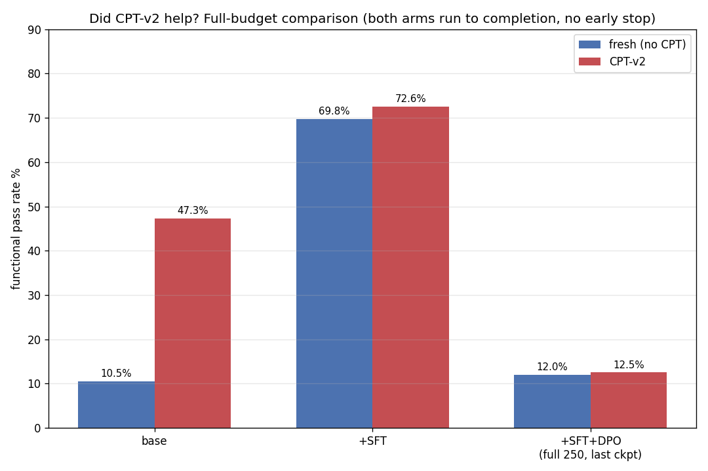
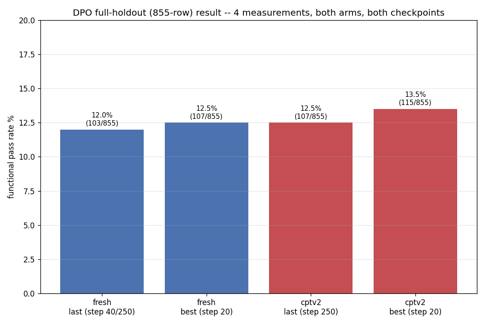

# 04-cpt-sft — Consolidated Results

> **Five arms, one index:** `docs/five-arms-overview.md` maps all five
> CPT × layer-selection combinations this phase has run (stock vs Spectrum
> layer selection, with/without CPT-v2, plus the in-progress "CPT itself on
> Spectrum" arm) to their results and full reports in one place — read that
> first if you're resuming this work cold.

**Question this whole phase answers:** once real task-specific training (SFT, then DPO) lands on top of a base model, does a prior CPT-v2 continual-pretraining stage still matter? Two arms — `sft_cptv2_probe/` (CPT-v2 adapter under the hood) and `sft_fresh_probe/` (unmodified base) — were trained with the byte-identical SFT/DPO recipe and dataset/holdout, differing in exactly that one variable.

**Bottom line:** CPT-v2 gives the raw base model a real, large head start (+37pp functional pass rate before any training) — but that advantage does not survive as a statistically confirmed edge once SFT trains on top (+2.8pp, p≈0.20). **A fresh base put through the identical SFT recipe performs indistinguishably from the CPT-v2 arm at every post-training stage.**

> **DPO numbers below (the ~12% "collapse") were a measurement bug, now fixed — see `docs/reports/2026-07-cpt-vs-fresh-comparison.md` §3.** `mlx_lm.fuse` was silently destroying the SFT LoRA delta when re-quantizing to int4, so every DPO run below trained on top of an effectively un-SFT'd base — nothing to do with DPO itself, β, lr, or the data. Corrected (fuse-free, `--resume-adapter-file`-seeded) reruns show DPO does **not** collapse: fresh arm best 69.8% (597/855, ties SFT exactly), cptv2 arm best 71.7% (613/855, ~1pp below SFT) — both at the earliest checkpoint (step 20-40), with the full 250-iter budget regressing ~8pp past that peak in both arms. Net: DPO at this recipe (β=0.1, lr=1e-6, 654 pairs) caps out at SFT parity, not below it — a materially different (and much less alarming) result than the numbers immediately below.

> **Structural addendum (see §4 of the comparison report):** even though SFT erases CPT-v2's *behavioral* edge, a q_proj LoRA singular-value probe (`lora_svd_qproj.py`) shows the CPT-v2-base SFT adapter's rank-concentration and dominant-direction magnitude both still track the standalone CPT-v2 adapter far more closely than they track the fresh-base SFT adapter — CPT-v2's fingerprint survives SFT structurally, just not functionally.

> **Spectrum layer-selection probe (2026-08-03, DONE):** does *which* 16 of 48 blocks carry
> the LoRA matter, independent of CPT lineage? `docs/reports/2026-08-spectrum-vs-stock-comparison.md`
> — Arcee's SNR-based Spectrum picks significantly beat `mlx_lm`'s default trailing-16
> selection on the fresh arm at every stage (SFT +4.9pp p=0.023, DPO-best +4.3pp p=0.046,
> DPO-final +10.6pp p<0.0001), but showed no significant difference on the CPT-v2 arm (SFT
> −2.1pp p=0.34, DPO-best an exact tie, DPO-final +4.1pp p=0.07). Also documents two real
> engineering incidents: an MLX in-place-safetensors-merge bug that silently zeroed trained
> weights (root-caused and fixed), and a DPO out-of-memory resolved via a shorter max
> sequence length.

---

## 1. How this phase is organized

```
04-cpt-sft/
├── docs/                    design docs (spec/workflow/dpo-plan), datagen spec, final reports
├── dataset/                 shared datagen corpus + frozen holdout (both arms train/eval on identical data)
├── jacgen/                  cross-arm comparison scripts (compare_arms.jac, phase2_charts.jac)
├── results/                 cross-arm comparison outputs (deltas json, images)
├── sft_cptv2_probe/         ARM 1 — CPT-v2 adapter → SFT → DPO (v1, v2, v3)
└── sft_fresh_probe/         ARM 2 — unmodified base → SFT → DPO
```

The dataset (`dataset/fresh/releases/{sft_train,dpo_train}.jsonl`) was generated once and **frozen** — both arms train on byte-identical copies (MD5-verified), and both eval on the identical 1428-row holdout (855 code-graded rows), so every functional-pass-rate number below is directly comparable across arms.

Design background: `docs/spec.md` (architecture), `docs/workflow.md` (three-arm protocol), `docs/dpo-plan.md` (preference-pair design), `docs/datagen/{spec,workflow}.md` (task catalog + pipeline), `docs/reports/2026-07-task18-full-run-report.md` (the datagen build itself — 9608 SFT rows / 826 DPO pairs, 0% contamination).

---

## 2. Arm 1 — CPT-v2 base (`sft_cptv2_probe/`)

| Stage | Functional pass rate | n |
|---|---|---|
| CPT-v2 base (no SFT) | **47.3%** (404/855) | 855 |
| +SFT (final, 8200 iters) | **72.6%** (621/855) | 855 |
| +SFT+DPO v1 (250 iters, β=0.1, lr=1e-6) | **12.3%** (105/855) | 855 |
| +SFT+DPO v2 (β=0.4, lr=5e-7, stopped @15/150) | **13.2%** (113/855) | 855 |
| +SFT+DPO v3 (β=0.1, lr=1e-6, same as v1, full instrumentation, last @250) | **12.5%** (107/855) | 855 |
| +SFT+DPO v3 (best snapshot, step 20) | **13.5%** (115/855) | 855 |

**SFT works, large and real** (47.3%→72.6%). The v1/v2/v3 DPO rows above all collapsed to ~12-13% — **but this was the `mlx_lm.fuse` measurement bug (see the callout at the top of this file and §3 of the comparison report), not a real DPO failure.** Corrected (fuse-free) DPO for this arm: best 71.7% (613/855, step 40), ties SFT within noise; full 250-iter budget regresses to 64.9% (555/855). The v1/v2/v3 rows above are kept verbatim as the historical record of what the bug produced — do not read them as DPO's real behavior.

Detail: `sft_cptv2_probe/results/FULL-RESULTS.md` (SFT + DPO v1/v2 full writeup, pre-fix), `sft_cptv2_probe/results/sft-results.md` (SFT-stage deep dive), `docs/reports/2026-07-cpt-vs-fresh-comparison.md` §3 (the fix + corrected numbers).

---

## 3. Arm 2 — fresh base, no CPT (`sft_fresh_probe/`)

| Stage | Functional pass rate | n |
|---|---|---|
| base (no CPT, no SFT) | **10.5%** (90/855) | 855 |
| +SFT (final, 8200 iters) | **69.8%** (597/855) | 855 |
| +SFT+DPO (250 iters, β=0.1, lr=1e-6, full curve, last @250) | **12.0%** (103/855) | 855 |
| +SFT+DPO (best snapshot, step 20) | **12.5%** (107/855) | 855 |

Same story as Arm 1: **SFT works** (10.5%→69.8%). The DPO row above (~12%, "collapses permanently") is the **pre-fix, `mlx_lm.fuse`-bugged measurement** — see the top-of-file callout. Corrected (fuse-free) DPO for this arm: best 69.8% (597/855, step 20), ties SFT exactly; full 250-iter budget regresses to 62.1% (531/855). The early-stop gate description and engineering-incident list below are accurate history of the pre-fix run and are kept as-is.

Real engineering incidents hit and fixed on this arm, in order: a segmented-training design that would have silently defeated the LR schedule (caught in code review before any real run); a macOS bash-3.2 empty-array crash (hit live on the first real launch, fixed, then proactively backported to Arm 1's DPO script before it could hit there too); a DPO collapse-gate bug that picked a noisy interim row instead of the true final SFT baseline (caught in code review); a systemic stale-venv-shim issue affecting 51 console scripts across the whole project (hit live, fixed in one pass, no version changes); a 14GB gitignore gap for per-segment DPO snapshots (hit live while committing, fixed generally).

---

## 4. Cross-arm comparison — did CPT-v2 help?

> **§4.1/4.3/4.4's DPO rows (the ~12-13% band) are all pre-fix, `mlx_lm.fuse`-bugged measurements** — kept verbatim as the historical record of Phase 1/2 (which is what these sections document), not because DPO actually behaves this way. Corrected numbers: fresh best 69.8% (597/855, ties SFT), cptv2 best 71.7% (613/855); see the top-of-file callout and `docs/reports/2026-07-cpt-vs-fresh-comparison.md` §3.

### 4.1 — Headline (full training budget, no early stopping, either arm)



| Stage | fresh (no CPT) | CPT-v2 | Δ (cptv2 − fresh) | Statistically significant? |
|---|---|---|---|---|
| base | 10.5% (90/855) | 47.3% (404/855) | **+37.0pp** | Yes — obviously (z≈16.75) |
| +SFT | 69.8% (597/855) | 72.6% (621/855) | +2.8pp | **No** — z≈1.28, p≈0.20 |
| +SFT+DPO (full budget, last ckpt) | 12.0% (103/855) | 12.5% (107/855) | +0.5pp | **No** — z≈0.29, p≈0.77 |
| +SFT+DPO (best snapshot) | 12.5% (107/855) | 13.5% (115/855) | +0.9pp | **No** — z≈0.58, p≈0.57 |

### 4.2 — SFT sweet-spot search (was the final checkpoint actually the best one?)


Fresh peaks 72% at step 4100, **tying** its own final (8200). CPT-v2 peaks 79% at step 7380, **tying** its own final (8200). Neither arm's SFT run would have benefited from stopping early — full training already reaches (or matches) its own optimum in both arms.

### 4.3 — DPO full-curve search (was there a recovery point past the collapse?)


Both arms run to the full 250-iter budget with per-20-iter snapshot+eval and no early stop: **13 checkpoints, tied exactly** within each arm (2% fresh, 1% cptv2), for the entire run. No dip-and-recover, no late rescue — the collapse is total from the earliest checkpoint tested and never moves again.

### 4.4 — DPO full-holdout confirmation (4 independent measurements)



Four full 855-row holdout evaluations (both arms × last/best checkpoint) land in a tight **12.0–13.5%** band. The largest cross-arm z-score across any of these comparisons is 0.58 (p≈0.57) — weaker signal than even the SFT-stage gap, which itself wasn't significant.

**Full statistical write-up, honest caveats, and the verbatim final-verdict sentence:** `docs/reports/2026-07-cpt-vs-fresh-comparison.md` (Phase 1: base/SFT/DPO headline + significance tests; Phase 2 addendum: full curves, sweet-spot search, final holdout confirmation).

---

## 5. What's NOT in this repo (cleaned up)

The following were removed as genuine leftover/duplicate artifacts — not real results, and either regeneratable (dry-run sanity checks) or byte-identical duplicates of files still present elsewhere:

- Dry-run/pre-flight adapter checkpoints (`adapters/{dry,dpo-dry,dpo-dry-v2,dpo-dry-verify,dpo-v3-dry}/` across both arms) — throwaway 8-iter sanity-check runs the `run_*.sh` scripts regenerate automatically on their next dry-run pass, never referenced by any real result.
- `sft_fresh_probe/adapters/sft-on-fresh/checkpoints/` — a full duplicate (verified byte-identical, same filenames) of the 10 numbered SFT checkpoints already present one level up; this arm's SFT run never needed to resume, so its true-global-step archive coincided exactly with the flat mlx_lm-native files.
- `dataset/fresh/releases/dpo_train_llm.jsonl.pre-regate-backup` — a pre-regeneration backup of a dataset file, superseded by the current (larger, regenerated) `dpo_train_llm.jsonl`, unreferenced anywhere.
- `sft_cptv2_probe/results/results.md` — an early results doc whose content (numbers + both comparison images) was folded into and extended by `FULL-RESULTS.md` when the DPO-v2 follow-up was added.

Everything else — every named checkpoint with real trained weights, every `results/{sft,dpo,dpo-v2,dpo-v3}/` subdirectory, every doc, every jacgen script, every dotfile state marker (`.best_step`, `.dpo_progress_steps`, `WOULD_HAVE_STOPPED.md`, etc.) — is a real artifact backing a number in this document and was kept.

---

## 6. Artifact index

**Cross-arm:**
- `docs/reports/2026-07-cpt-vs-fresh-comparison.md` — full statistical write-up + final verdict
- `jacgen/compare_arms.jac` / `jacgen/phase2_charts.jac` — the scripts that produced every chart in this document
- `results/cpt_vs_fresh_deltas.json` — raw computed deltas
- `results/images/{cpt_vs_fresh_overall,cpt_vs_fresh_full_budget,sft_sweetspot_curves,dpo_full_curve_both_arms,dpo_fullholdout_4bar}.png`

**Arm 1 (CPT-v2):** `sft_cptv2_probe/results/{FULL-RESULTS.md, sft-results.md, sft/, dpo/, dpo-v2/, dpo-v3/, images/}`

**Arm 2 (fresh):** `sft_fresh_probe/results/{sft/, dpo/, images/}`

**Source data (both arms share the same holdout):** `dataset/shared/holdouts/`, `sft_{cptv2,fresh}_probe/dataset/{sft,dpo}/{train,valid}.jsonl`
