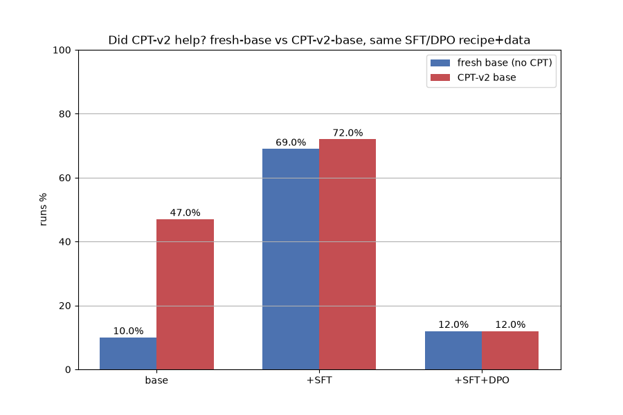

# Cross-Arm Comparison — Does CPT-v2 Help Once SFT/DPO Trains On Top Of It?

**Question:** Two arms were trained with the identical SFT+DPO recipe and byte-identical dataset/holdout, differing in exactly one variable: whether a CPT-v2 LoRA adapter sits underneath the base Qwen model before SFT/DPO trains on top. Does that pre-existing CPT-v2 adapter still matter once real task-specific training (SFT, then DPO) lands on top of it?

**Method:** functional pass rate ("runs" = generated code jac-compiles-and-executes) on the identical 855-row code-graded holdout at every stage, same eval harness (`eval_functional.jac`), same jaclang version, for both arms. `sft_cptv2_probe/` (base already carries the CPT-v2 adapter) vs. `sft_fresh_probe/` (base is the unmodified pretrained model) — everything else (dataset, split, SFT hyperparameters, DPO v1 hyperparameters) held identical.

---

## Headline result

| Stage | fresh (no CPT) | CPT-v2 | Δ (cptv2 − fresh) |
|---|---|---|---|
| base (no SFT) | **10.5%** (90/855) | **47.3%** (404/855) | **+37.0 pp** |
| +SFT (final, 8200 iters) | **69.8%** (597/855) | **72.6%** (621/855) | **+2.8 pp** |
| +SFT+DPO v1 (last checkpoint)¹ | **12.0%** (103/855) | **12.3%** (105/855) | **+0.2 pp** |

¹ Iteration counts differ: fresh ran only 40/250 iters (the early-stop collapse gate fired after 2 consecutive failing snapshots); cptv2 ran the full 250. See "DPO stage" below — this doesn't change the reading (both floors are ~12% regardless of how far each got), but the row isn't a like-for-like iteration count.



**Computed deltas (from `compare_arms.jac`, rounded `runs_pct` values as printed):**

```json
{
  "base_delta_cptv2_minus_fresh": 37.0,
  "sft_delta_cptv2_minus_fresh": 3.0,
  "dpo_delta_cptv2_minus_fresh": 0.0,
  "fresh_base_pct": 10.0,
  "cptv2_base_pct": 47.0,
  "fresh_sft_pct": 69.0,
  "cptv2_sft_pct": 72.0,
  "fresh_dpo_pct": 12.0,
  "cptv2_dpo_pct": 12.0
}
```

(Note: the fresh-arm DPO number picked here — 103/855, 12.0% — is the DPO run's *last checkpoint*, selected by the same "max step wins" logic used for every other stage in this comparison. The fresh arm's *best* snapshot during that run reached 107/855 (12.5%), which would make the DPO delta −0.2 pp instead of +0.2 pp — either way, effectively zero.)

---

## Reading the three deltas honestly

These three numbers are not the same kind of fact, and conflating them would misstate the result:

**1. Base stage: +37.0 pp — real, large, and not remotely close to noise.** 404/855 vs 90/855 on an identical holdout is an enormous, obvious gap. CPT-v2 continued-pretraining clearly did teach the base model *something* that shows up directly in raw functional generation ability, before any task-specific SFT/DPO training touches it. This is the one place in this whole experiment where CPT-v2's own standalone value is undeniable.

**2. SFT stage: +2.8 pp (621/855 = 72.63% vs 597/855 = 69.82%) — real-looking, but does not clear conventional statistical significance at this sample size.** A two-proportion z-test on n=855 vs n=855 gives z ≈ 1.28, two-tailed p ≈ 0.20. That is well short of the conventional p < 0.05 threshold — this gap is consistent with sampling noise on a holdout of this size. It is *directionally* in CPT-v2's favor (both the raw count and the base-stage advantage point the same way), but it would be dishonest to call a p ≈ 0.20 gap a confirmed win. The huge 37-point base-stage gap does **not** survive into a statistically distinguishable post-SFT gap — SFT appears to close nearly all of the pre-training gap by itself, leaving at most a small, statistically unconfirmed residual.

**3. DPO stage: ~0 pp (105/855 vs 103/855, or 105 vs 107 using fresh's best snapshot) — both arms collapsed to the same catastrophic floor, independent of CPT-v2.** Both DPO runs wrecked the SFT model's functional capability (as documented separately in each arm's own results — `sft_cptv2_probe/results/FULL-RESULTS.md` and the fresh-probe's own report). Whatever CPT-v2 contributed upstream is fully swamped by DPO's collapse in both arms; there is no CPT-related signal left to read at this stage.

---

## Verdict

**CPT-v2's contribution is statistically indistinguishable from a fresh base once SFT lands on top of it.** The base-model gap between the two arms is real and large (+37.0 pp, 47.3% vs 10.5%) — CPT-v2 clearly does *something* to the raw pretrained model. But that advantage does not survive as a confirmed post-SFT edge: the +2.8 pp gap after SFT (72.6% vs 69.8%) fails a two-proportion significance test at n=855 (z ≈ 1.28, p ≈ 0.20), and by the DPO stage both arms have collapsed to the same catastrophic floor with a ~0 pp difference between them. Practically: if the downstream product is "base model → SFT (→ DPO)", CPT-v2 is not earning its keep — a fresh base put through the identical SFT recipe lands within noise of the CPT-v2 arm's final functional pass rate, at a fraction of the upstream training cost.

---

## Caveats / limits of this comparison

- The SFT-stage +2.8 pp gap is a single holdout measurement per arm, not a repeated-seed estimate — the significance test above says it's *consistent with* noise, not that it's *proven* to be noise. A genuinely small real advantage that happens to fall short of p<0.05 at n=855 cannot be fully ruled out from this single run each; only a repeated-seed comparison could tighten that further, and that was explicitly out of scope for this experiment.
- Both arms' DPO runs are independently documented as catastrophic collapses (see each arm's own DPO section) — this comparison's DPO-stage delta is a comparison of two failure floors, not a meaningful measure of CPT-v2's marginal value at that stage.
- This comparison is functional-pass-rate only (`runs_pct` on the 855 code-graded rows); it does not re-examine category-level breakdowns or the 573 prose/lexical rows excluded from grading in either arm's original reports.

## Artifacts

- Script: `model-experiments/04-cpt-sft/jacgen/compare_arms.jac`
- Image: `model-experiments/04-cpt-sft/results/images/cpt_vs_fresh_overall.png`
- Raw deltas: `model-experiments/04-cpt-sft/results/cpt_vs_fresh_deltas.json`
- Source data: `sft_cptv2_probe/results/{sft,dpo}/metrics_functional.jsonl`, `sft_fresh_probe/results/{sft,dpo}/metrics_functional.jsonl`
