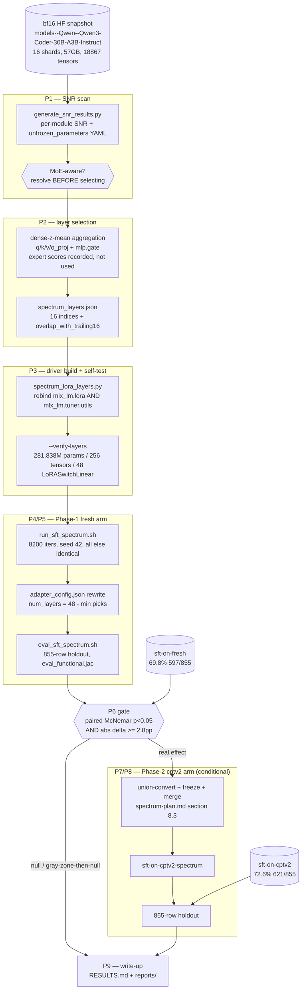

# spectrum-workflow.md — Spectrum Layer-Selection Probe Runbook

**Status: DONE (2026-08-03).** All phases below completed for both arms.
Results: `reports/2026-08-spectrum-vs-stock-comparison.md`.

Companion to `spectrum-plan.md` (the probe's umbrella spec — every design
decision, rationale, and number cited below lives there) and sibling to
`workflow.md` (the phase's three-arm protocol, whose §6 significance standard
this probe reuses unchanged). This file is the mechanical run order: nine phases,
each with inputs, outputs, and a checklist that must be fully ticked before the
next phase starts.

Nothing here re-derives `spec.md`'s architecture, `datagen/spec.md`'s catalog, or
the frozen dataset/holdout. The dataset, the harness, and every hyperparameter are
already fixed; this runbook changes one thing and measures it.

## 0. Flow

Phases 1-3 are cheap and reversible. Phase 4 is the first multi-hour commitment
and is gated on Phase 3's self-test passing. Phases 7-8 are gated on Phase 6.

---

## Phase 1 — SNR scan

**Inputs**
- `~/.cache/huggingface/hub/models--Qwen--Qwen3-Coder-30B-A3B-Instruct/snapshots/b2cff646eb4bb1d68355c01b18ae02e7cf42d120/` — 16 shards, 57GB, `model.safetensors.index.json` listing 18,867 tensors. Present locally; no download.
- `cognitivecomputations/spectrum`, checked out to a recorded git SHA.

**Outputs** → `sft_fresh_probe/spectrum/snr/`
- `snr_raw.<ext>` — Spectrum's ranking output, verbatim, unedited.
- `unfrozen_parameters.<ext>` — Spectrum's YAML, kept for provenance only; never used to drive an unfreeze (`spectrum-plan.md` §4.2).
- `scan.log` — full stdout, plus wall-clock and peak RSS.
- `SELECTION.md` — started here: the MoE finding below, in writing.

**Checklist**
- [ ] **Read `generate_snr_results.py` before running it.** Record: exact CLI flags, exact output filenames, whether it emits a numeric per-module ranking or only a top-N% name list, and its model-load path.
- [ ] **Resolve the MoE question** (`spectrum-plan.md` §4.3) and write the answer into `SELECTION.md`: does the script document or implement any MoE-aware handling — per-expert grouping, activation-frequency weighting, an exclusion rule for switched experts — or does it treat every 2-D matrix identically? This gates Phase 2's aggregation rule. If the answer is "no MoE handling," say so plainly; do not soften it.
- [ ] Check the load path against the 48GB constraint. If the script materializes the full 57GB bf16 model, do **not** run it as-is — switch to per-tensor streaming via `safetensors.safe_open` (largest single tensor is `model.embed_tokens.weight`, 151936×2048 bf16 ≈ 622MB; every matrix §5.1 needs is ≤17MB).
- [ ] Confirm no competing resident model before starting (`pgrep -f "jac start|mlx_lm"`), same preflight as `run_sft.sh:54-59`.
- [ ] Scan runs against the **bf16 snapshot**, never `models/qwen-q4`.
- [ ] Record wall-clock and peak RSS in `scan.log` — both are TBD until this phase runs, and both belong in the write-up.
- [ ] Record the Spectrum git SHA.

**Exit condition:** a per-layer-resolvable SNR artifact exists on disk, and the MoE question is answered in writing (including "unresolved after reading the script," if that is the honest answer).

---

## Phase 2 — layer selection

**Inputs:** Phase 1's outputs.

**Outputs**
- `sft_fresh_probe/spectrum/snr/layer_scores.json` — per-layer dense score **and** per-layer expert mean/median, both recorded.
- `sft_fresh_probe/spectrum/configs/spectrum_layers.json` — the frozen selection (`spectrum-plan.md` §5.3).
- `SELECTION.md` — completed: rule used, why, ties, overlap.

**Checklist**
- [ ] Apply the HF→MLX name mapping: all 128 `layers.L.mlp.experts.<E>.<proj>` matrices map to the single MLX `layers.L.mlp.switch_mlp.<proj>` (`spectrum-plan.md` §4.3).
- [ ] Aggregate by the **primary rule**: z-score each of `self_attn.{q,k,v,o}_proj` and `mlp.gate` across its own 48 layers, mean the five z-scores per layer, rank descending, take 16. Use the `q_proj`-only fallback **only** if Phase 1 showed the primary rule is not supportable by the output format — and record which was used and why.
- [ ] Record expert-matrix scores alongside without using them for selection. If the dense and expert rankings disagree sharply, note it — that is a reportable finding about Spectrum-on-MoE (`spectrum-plan.md` §9.3).
- [ ] Break exact ties by lower layer index; note any tie-break.
- [ ] Compute and record `overlap_with_trailing16` against `{32..47}`.
- [ ] **Early exit:** if the picks equal `{32..47}`, the probe is answered — Spectrum independently endorses the existing default. Skip Phases 3-8, go to Phase 9, write it up as a null-by-construction.
- [ ] Freeze `spectrum_layers.json`. It is not edited again after Phase 4 starts, for any reason.

**Exit condition:** 16 validated indices in `[0, 47]`, committed, with the rule and its rationale recorded before any training result is visible.

---

## Phase 3 — driver build and self-test

**Inputs:** `spectrum_layers.json`; `mlx_lm/tuner/utils.py` (mlx-lm 0.31.3) as the composition target; `sft_fresh_probe/dpo_fixed_train.py` as the pattern.

**Outputs**
- `sft_fresh_probe/spectrum/spectrum_lora_layers.py`
- `sft_fresh_probe/spectrum/configs/sft_spectrum.yaml` — `sft.yaml` verbatim with `adapter_path` retargeted to `adapters/sft-on-fresh-spectrum`; `num_layers` stays `16`.
- `sft_fresh_probe/run_sft_spectrum.sh`, `sft_fresh_probe/eval_sft_spectrum.sh` — `run_sft.sh` / `eval_sft_sweep.sh` with `CFG` / `ADAPTER` / `RDIR` / `HOLDOUT` retargeted and nothing else changed.
- `results/sft-spectrum/verify_layers.txt` — the self-test transcript.

**Checklist**
- [ ] Copy `linear_to_lora_layers`'s body verbatim except the `for l in model.layers[-max(num_layers, 0):]` loop (`mlx_lm/tuner/utils.py:103`). `to_lora`'s full type dispatch — including the `SwitchLinear`/`QuantizedSwitchLinear` → `LoRASwitchLinear` branch — and the `keys`/`get_keys_for_lora` handling are reused unchanged.
- [ ] Rebind **both** `mlx_lm.lora.linear_to_lora_layers` and `mlx_lm.tuner.utils.linear_to_lora_layers` (`spectrum-plan.md` §6.2). Rebinding only the latter leaves the training path stock while looking patched.
- [ ] Assert `num_layers == len(LAYER_IDS)` at call time.
- [ ] Implement `_assert_upstream_still_matches()` with all five checks from `spectrum-plan.md` §6.3, including the pinned whitespace-stripped source sha256 against mlx-lm 0.31.3. Raise and exit non-zero; never warn-and-continue.
- [ ] Delegate to `mlx_lm.lora.main()` after the rebind — no argument re-parsing of our own.
- [ ] Run `--verify-layers` and confirm every assertion in `spectrum-plan.md` §6.4:
  - [ ] LoRA'd block indices == `spectrum_layers.json`'s `layers`
  - [ ] 256 LoRA tensors
  - [ ] **281.838M trainable params, 0.923% of 30532.123M** — identical to the trailing-16 runs' `train.log`
  - [ ] the 8 expected module suffixes per selected layer
  - [ ] 48 `LoRASwitchLinear` instances (3 per layer) — proves the MoE branch fired
  - [ ] rebind-disabled control reproduces `{32..47}`
- [ ] Dry-run through `run_sft_spectrum.sh`'s existing `DRY_ITERS` path (30 iters, `adapters/dry-spectrum`) and confirm it starts, reports a loss, and writes a checkpoint.

**Exit condition:** the self-test passes with a trainable-parameter count bit-identical to the incumbent arms. A different count means capacity changed, not placement — stop and fix before spending compute.

---

## Phase 4 — Phase-1 training (fresh arm)

**Inputs:** driver + `sft_spectrum.yaml`; `sft_fresh_probe/dataset/sft/{train,valid}.jsonl` (8100 / 1428 rows, MD5 `a85b9ed2cec29686abb6491c7a7065eb` on train); `models/qwen-q4`.

**Outputs**
- `sft_fresh_probe/adapters/sft-on-fresh-spectrum/` — `adapters.safetensors` (expect 1127MB F32), `adapter_config.json`, `checkpoints/` (10 true-global-step files at `save_every: 820`).
- `results/sft-spectrum/train.log` + the `plot_metrics.jac` PNG set.

**Checklist**
- [ ] Preflight: no competing `jac start` / `mlx_lm` process (48GB machine; training peaked at 27.857GB).
- [ ] Verify the training dataset MD5 matches the incumbent run's before launching.
- [ ] Launch as **one continuous process** via the watchdog loop; do not chunk into segments. `run_sft.sh`'s header documents why: relaunching resets the LR schedule, and with `warmup: 820 == save_every`, segmenting would trap the whole run inside warmup and silently break comparability with `sft-on-fresh`.
- [ ] `CONFIRM_FULL_RUN=1` gate respected.
- [ ] Confirm `train.log`'s first `Trainable parameters:` line reads 0.923% (281.838M/30532.123M). If it does not, kill the run — the rebind did not take.
- [ ] Track it/sec and peak mem against the incumbent (0.889-1.521 it/s, peak 27.857GB). A large deviation means something other than layer indices changed.
- [ ] Run to the full 8200 iters. No early stopping — comparison report §2.1 showed both arms' SFT peaks tie their own final checkpoint, so there is no sweet spot to chase and stopping early would only break comparability.

**Exit condition:** 8200/8200 iters, final adapter written, 10 checkpoints archived under true global step names.

---

## Phase 5 — Phase-1 eval

**Inputs:** `adapters/sft-on-fresh-spectrum/`; `dataset/sft/valid.jsonl`; `sft_cptv2_probe/jacgen/eval_functional.jac`.

**Outputs**
- `results/sft-spectrum/metrics_functional.jsonl`, `base.txt`, `final.txt`
- `results/sft-spectrum/mcnemar.json` — the item-level paired table vs `sft-on-fresh`.

**Checklist**
- [ ] **Before any eval:** rewrite `adapters/sft-on-fresh-spectrum/adapter_config.json` per `spectrum-plan.md` §7 — `num_layers := 48 - min(picks)`, plus a `spectrum_layers` provenance key. Without this, `load_adapters` rebuilds LoRA on layers 32-47 and `load_weights(strict=False)` **silently drops** every out-of-slice layer. Same failure class as the `mlx_lm.fuse` bug in comparison report §3.
- [ ] **Assert loaded-key count == 256** against the model's parameter tree before scoring. `strict=False` will not tell you. This check fails the eval; it does not warn.
- [ ] Sanity-check the zero-delta claim once, numerically: an adapter covering layers with no saved weights must produce byte-identical generations to the base on a handful of prompts (`lora_b` initializes to zeros in both `LoRALinear` and `LoRASwitchLinear`, `mlx_lm/tuner/lora.py`).
- [ ] Record the extra eval-time memory from the covered-but-untrained layers (17.615M params ≈ 70MB per layer beyond the 16 trained).
- [ ] Per-checkpoint subset sweep (`SUBSET=100`) over `checkpoints/*_adapters.safetensors`, exactly as `eval_sft_sweep.sh` does — filenames are true global steps, no offset correction.
- [ ] Full 855-row holdout eval at the final (8200) checkpoint.
- [ ] Read a handful of raw generations, not just pass/fail. Comparison report §3.2 found the fuse bug only by reading output and noticing the model was emitting React/JSX instead of Jac.

**Exit condition:** one full-holdout number for `sft-on-fresh-spectrum`, directly comparable to `sft-on-fresh`'s 69.8% (597/855), plus the paired item-level table.

---

## Phase 6 — gate decision

**Inputs:** Phase 5's outputs; `sft-on-fresh` = 69.8% (597/855).

**Outputs:** a written decision in `results/sft-spectrum/GATE.md` — the numbers, the test, the call, and the date — recorded *before* any Phase-7 work starts.

**Checklist**
- [ ] Paired **McNemar** over the identical 855 items (`workflow.md` §6's pre-registered standard: both arms answer the same items, so pair them).
- [ ] Report the unpaired two-proportion z alongside, for continuity with RESULTS.md §4.1's table format.
- [ ] Apply the gate: Phase 2 opens **only** if McNemar clears p < 0.05 **and** |Δ| ≥ 2.8pp — the gap this project already looked at (CPT-v2's SFT-stage +2.8pp, z≈1.28, p≈0.20) and declined to call real. No new significance bar is invented.
- [ ] Report the delta next to `overlap_with_trailing16`. A null at 15/16 overlap says much less than a null at 4/16, and the write-up must not conflate them.
- [ ] Calibration to state explicitly: at n=855 near 70%, the unpaired SE is ≈0.0222, so an unpaired-significant difference needs ≈4.3pp; pairing brings the practical floor toward 2.8pp.
- [ ] **Gray zone** (significant but < 4.3pp): run one additional seed on the spectrum arm before deciding. Only here — not by default. The phase has no seed repeats anywhere else (comparison report, caveat 1), and adding one everywhere would change the phase's cost profile for no gain.
- [ ] **On a null: stop.** Go to Phase 9. Do not build Phase 2 "to be sure" — comparison report §3.5 tested the β lever once, ruled it out, and did not re-run it blind.

**Exit condition:** an explicit, dated, written open-or-close call.

---

## Phase 7 — Phase-2 training (cptv2 arm) — conditional

Only if Phase 6 opened the gate.

**Inputs:** `sft_cptv2_probe/configs/sft.yaml`; `03-cpt-only/adapters/cpt-v2/adapters.safetensors` (256 tensors, layers 32-47, rank 16 / scale 2.0); the same picks.

**Outputs:** `sft_cptv2_probe/spectrum/`, `adapters/sft-on-cptv2-spectrum/`, `results/sft-spectrum/`.

**Checklist**
- [ ] **Resolve the base-composition problem first** (`spectrum-plan.md` §8.3). `resume_adapter_file` applies `load_weights(strict=False)` after conversion, so any CPT-v2 layer outside the picks is silently dropped and the arm would train on a base that has lost part of its CPT-v2 delta — not the treatment `sft-on-cptv2` received.
- [ ] Convert the **union** `picks ∪ {32..47}`.
- [ ] Load CPT-v2 weights; assert all 256 keys landed.
- [ ] Freeze the LoRA modules in `{32..47} \ picks`; assert trainable params are still exactly 281.838M.
- [ ] Post-training, **merge the frozen CPT-v2 keys back into the saved adapter** — `mlx_lm/tuner/trainer.py:372,385` saves only `model.trainable_parameters()`, so the frozen keys would otherwise vanish and the delta would be lost at eval for the second time.
- [ ] Set `num_layers` to cover the union in the eval-time `adapter_config.json` (§7 rewrite, union edition).
- [ ] Everything else identical to Phase 4: one continuous process, 8200 iters, seed 42, no early stop.

**Exit condition:** `sft-on-cptv2-spectrum` trained, with the CPT-v2 delta provably present in the artifact that gets evaluated.

---

## Phase 8 — Phase-2 eval — conditional

**Inputs:** `adapters/sft-on-cptv2-spectrum/`; the same holdout and harness.

**Checklist**
- [ ] Same `adapter_config.json` rewrite and the same 256-key (or union-count) load assertion as Phase 5.
- [ ] Full 855-row holdout at the final checkpoint; compare against `sft-on-cptv2` = 72.6% (621/855).
- [ ] Paired McNemar vs `sft-on-cptv2`, and the unpaired z alongside.
- [ ] Report the four-way table: fresh trailing (69.8%), fresh spectrum, cptv2 trailing (72.6%), cptv2 spectrum. The interesting quantity is whether the spectrum effect is the same size in both arms, or whether it interacts with CPT-v2 lineage.

**Exit condition:** all four cells populated on the same holdout with the same harness.

---

## Phase 9 — write-up

**Inputs:** everything above.

**Outputs**
- `docs/reports/2026-08-spectrum-layer-selection.md` — the probe's own report, matching `reports/2026-07-cpt-vs-fresh-comparison.md`'s structure: question, method, headline table, honest reading of the delta, verdict, caveats, artifacts.
- `RESULTS.md` — a new section, and a one-line addendum near the top pointing to it, matching how the DPO fuse-bug and q_proj SVD findings were folded in.
- `docs/README.md` — status-update block, same convention as the 2026-07-20 / 07-22 / 08-02 entries.

**Checklist**
- [ ] State the MoE-SNR caveat (`spectrum-plan.md` §11 risk 1) **regardless of outcome**. A positive result is worth less if the ranking that produced it may be meaningless on an MoE model; a null is worth less for the same reason.
- [ ] State `overlap_with_trailing16` next to every delta.
- [ ] State that Spectrum's own published wins are for full-parameter unfreezing, not LoRA on selected layers (`spectrum-plan.md` §2, §11 risk 6). A null here does not refute Spectrum's published results, and the write-up must not claim it does.
- [ ] State the single-run caveat, and whether a second seed was run.
- [ ] Report the SNR scan's real wall-clock and peak RSS — the first measurement anyone in this repo will have of that cost.
- [ ] Run `lora_svd_qproj.py` on the spectrum adapter and add it as a fourth arm to comparison report §4's table, comparing only on layers present in both samples (existing sample: 32/38/44/47) and saying so rather than aligning by rank position.
- [ ] Every number traceable to a committed artifact under `results/sft-spectrum/` or `spectrum/snr/`.
