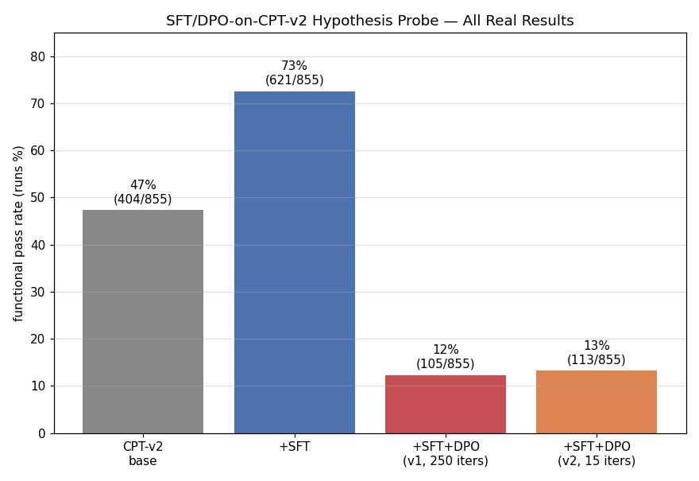
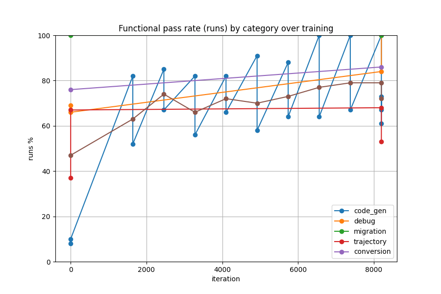
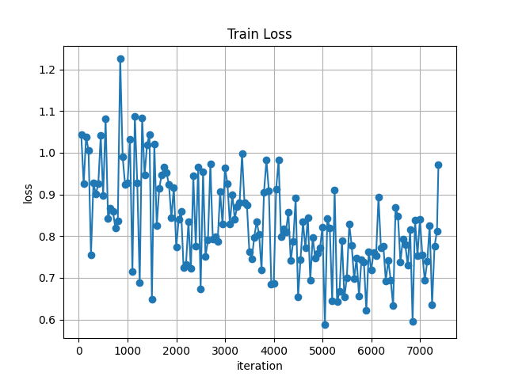
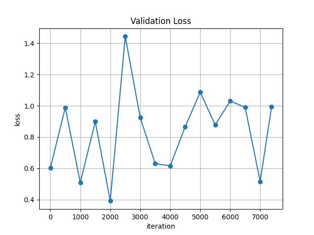
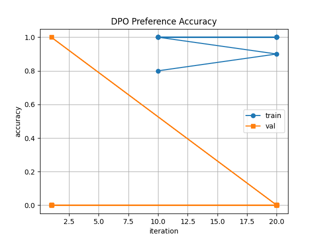
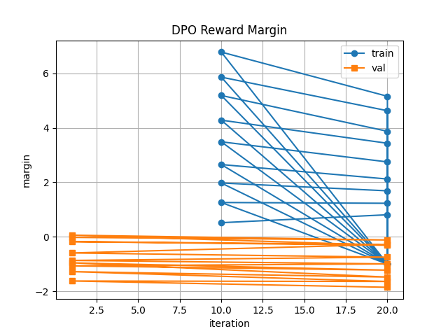
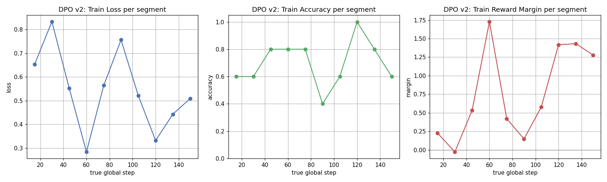

# SFT→DPO on CPT-v2 — Full Hypothesis Probe Results

**Question:** Does CPT-v2 (rejected on its own Track A/B eval — see `model-experiments/03-cpt-only/results/cpt-v2/results.md`) provide real downstream value once SFT/DPO trains on top of it?

**Method throughout:** functional pass rate ("runs" = generated code jac-compiles-and-executes) on the same 1428-row holdout at every stage (855 code-graded rows; 573 rows are `prose_lexical` — explanation/documentation categories with no code to grade), using the same batched-generation harness (`eval_functional.jac`, `mlx_lm.batch_generate`, batch_size=32) and the same jaclang 0.16.1 compiler throughout, so every number below is directly comparable.

---

## Headline result

| Stage | Functional pass rate | n |
|---|---|---|
| CPT-v2 base (no SFT) | **47.3%** (404/855) | 855 |
| +SFT (final, 8200 iters) | **72.6%** (621/855) | 855 |
| +SFT+DPO v1 (250 iters, β=0.1, lr=1e-6) | **12.3%** (105/855) | 855 |
| +SFT+DPO v2 (15 iters, β=0.4, lr=5e-7) | **13.2%** (113/855) | 855 |

**SFT works. DPO — across two independently-tuned configurations — does not.**

---

## Stage 1: SFT on CPT-v2

**Setup:** `models/qwen-q4` + CPT-v2 adapter (rank16/layers16, resumed via `--resume-adapter-file`) → SFT LoRA, fresh 85/15 split of `sft_train.jsonl` (8100 train / 1428 holdout after filtering out-of-range-length rows), 8200 iters (~1 epoch), `max_seq_length: 3072`, `grad_checkpoint: true`, batch_size 1.

**Result: 47.3% → 72.6%, a real +25.3-point absolute improvement.**

| Category | base | +SFT | Δ |
|---|---|---|---|
| code_gen | 9.6% | 64.5% | +54.9 |
| conversion | 76.4% | 86.6% | +10.2 |
| debug | 69.4% | 86.1% | +16.7 |
| migration | 100.0% | 100.0% | 0.0 (already saturated — only 11 real examples exist) |
| trajectory | 55.7% | 59.0% | +3.3 |

Training was clean once the real config was tuned (two real incidents along the way, both root-caused and fixed: an OOM at the first eval→train transition, and a NaN loss from `mask_prompt` truncation colliding with long-tail examples — full incident detail in `.superpowers/sdd/progress.md`). No overfitting signal — train and val loss tracked together the whole run.

**Graphs:** `sft/images/{train_loss,val_loss,learning_rate,tokens_per_sec,iters_per_sec,trained_tokens,peak_mem,functional_pass_rate}.png`

**Verdict:** CPT-v2, despite being rejected on its own convergence eval, is not dead weight — SFT on top of it produces a substantially better model, concentrated exactly in `code_gen` (the category CPT-v2 most directly targets). This answers the underlying hypothesis question on its own.

---

## Stage 2: DPO v1 (original config)

**Setup:** fuse SFT adapter into base → fresh rank16/layers16 LoRA via `mlx-lm-lora` (mlx_lm has no native DPO), 85/15 split of `dpo_train.jsonl` (654 train / 115 valid after length filtering), 250 iters (~0.38 epoch), β=0.1, lr=1e-6, `max_seq_length: 512`.

**Result: 72.6% → 12.3% — a catastrophic regression, below even the untrained CPT-v2 base.**

| Category | +SFT | +SFT+DPO v1 |
|---|---|---|
| code_gen | 64.5% | 0.3% |
| conversion | 86.6% | 0.9% |
| debug | 86.1% | 66.7% |
| migration | 100.0% | 0.0% |
| trajectory | 59.0% | 42.1% |

The collapse is not uniform — it wipes out `code_gen`, `conversion`, and `migration` almost entirely, while `debug` and `trajectory` degrade but don't fully collapse. `code_gen` (313/855) and `conversion` (322/855) together are ~74% of the graded set, which is why the overall number craters so hard.

**Training diagnostics — textbook overoptimization:** train accuracy pinned at **1.000** with train loss collapsing toward ~0 almost immediately, while validation loss rose monotonically the entire run (0.705 → 2.000). The policy memorized the training pairs' ordering perfectly while losing all ability to generalize.

**Graphs:** `dpo/images/{dpo_loss,dpo_accuracy,dpo_margin,dpo_rewards}.png`

---

## Stage 3: DPO v2 (corrected config, follow-up)

Given v1's overoptimization signature, the natural fix attempt: **much stronger regularization** (β 0.1→0.4 — beta controls the KL pull back toward the SFT reference model, so a bigger beta should mean less reward-hacking room) and **smaller steps** (lr 1e-6→5e-7), plus **checkpoint snapshotting every 15 iters** (10 snapshots, steps 15→150) so the best stopping point could be picked empirically instead of committing to a fixed iteration count in advance.

**Result: the earliest snapshot (step 15) scores 13.2% (113/855) — statistically identical to v1's 12.3% at 250 iters, despite 94% fewer iterations and 4× stronger regularization.**

### The real finding: DPO breaks this model almost immediately, not gradually

The v1 narrative was "DPO overfits given enough iterations." The v2 result overturns that: even the very first checkpoint we could evaluate (15 iterations, ~0.02 epoch) already matches v1's functional floor. There is no "good window" to stop into — the collapse has essentially already happened by the earliest point tested.

**Train-side metrics tell a more nuanced story than v1's** (stronger β genuinely reduced raw memorization — accuracy never fully pins at 1.0, margin never exceeds ~1.7 vs v1's ~5-7):

| True global step | Train loss | Train acc | Train margin |
|---|---|---|---|
| 15 | 0.653 | 0.600 | 0.225 |
| 30 | 0.833 | 0.600 | -0.028 |
| 45 | 0.553 | 0.800 | 0.535 |
| 60 | 0.284 | 0.800 | 1.729 |
| 75 | 0.564 | 0.800 | 0.420 |
| 90 | 0.756 | 0.400 | 0.147 |
| 105 | 0.521 | 0.600 | 0.578 |
| 120 | 0.332 | 1.000 | 1.418 |
| 135 | 0.443 | 0.800 | 1.432 |
| 150 | 0.509 | 0.600 | 1.277 |

Yet despite training-side memorization being visibly milder than v1's, the one real functional measurement we have (step 15, n=855) shows the same downstream collapse. **This means the problem isn't really "overfitting" in the classic training-curve sense — even gentle, non-saturating training on this dataset still wrecks code-generation validity.** That's a stronger, more structural negative result than v1 alone suggested.

### An honest methodological limitation, found while building this report

`val_batches=1` (inherited unchanged from the original bakeoff's DPO recipe) means every **validation** reading during training is a **single random example** — re-evaluating the *same* checkpoint from two different segment boundaries gave visibly different "margin" numbers (e.g. one read of the step-15 checkpoint as -0.299, another read of the same checkpoint as +0.417) purely from which one example got sampled. The earlier real-time narration of "step 15 had the best validation signal, then it diverged" was reading noise, not a real trend — with n=1, no individual validation reading is trustworthy enough to rank checkpoints against each other. The **train**-side metrics above are reliable (aggregated over real batches within each segment); the **functional eval on the full 855-row holdout** is reliable (large n); the per-segment **validation-split** numbers during training are not, and should not be used for checkpoint selection in any future attempt without raising `val_batches` to something like 10-20.

**Graphs:** `dpo-v2/images/{dpo_loss,dpo_accuracy,dpo_margin,dpo_rewards,dpo_v2_true_step_trend}.png`

---

## Overall verdict

1. **SFT-on-CPT-v2 is a real, large, reproducible win** (47.3%→72.6%). This is the answer to the original hypothesis question, independent of anything that happens afterward.
2. **DPO, as attempted here (two independent configurations, one tuned specifically to fix the first one's failure mode), consistently and immediately breaks the SFT model's functional capability.** This is not a config-tuning problem — a 4× stronger regularizer and 94% fewer iterations produced the same outcome.
3. **The likely real cause is the DPO dataset itself**, not the training recipe: 654 training pairs spanning 5 heterogeneous, LLM-generated preference axes (idiomatic-vs-Python-shaped, graph-native, correct-vs-subtly-wrong, secure-vs-leaky, typed-vs-loose) is small and noisy compared to the single-axis, corpus-backed conversion preference set that DPO successfully improved on in the earlier `01-sft-dpo` bakeoff (graph behavioral 46%→61%, idiom score 0.457→0.338, no functional regression). Fixing DPO here would mean addressing dataset scale/quality/homogeneity at the source, not adjusting β/lr/iters further.

**Recommendation: ship SFT-only. Do not pursue DPO on this dataset without first improving data quality/scale/focus at the source.**

---

## All graphs, indexed

- `sft/images/` — training curves + functional-pass-rate learning curve for the SFT stage
- `dpo/images/` — training curves for DPO v1 (loss, accuracy, margin, rewards)
- `dpo-v2/images/` — training curves for DPO v2, plus the true-global-step trend chart built specifically for this report
- `images/comparison_overall.png`, `images/comparison_by_category.png` — 3-way (base/SFT/DPO-v1) comparison from the original results.md
- `images/comparison_all_four.png` — **the 4-way comparison built for this report**, all real results side by side

## Full incident log

Every real bug hit and fixed along the way (OOMs, a NaN bug, checkpoint-numbering bookkeeping bugs, a broken venv shim, memory contention from other processes on this shared machine, a mid-session system restart, 2 bash-quirk bugs) is logged in detail in `.superpowers/sdd/progress.md`, including exact timestamps and root-cause writeups for each.
