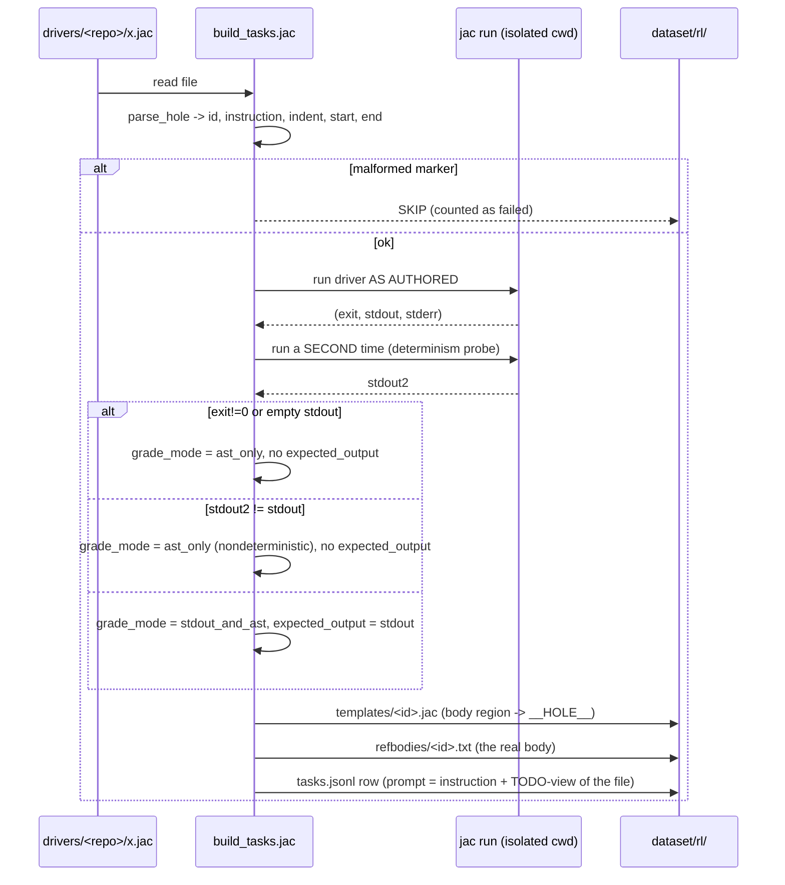

# dataset/workflow.md — Corpus Mining Runbook

Operational runbook for building 05's multi-source RL corpus once, end to end. Design of
record is [`spec.md`](spec.md); the phase that consumes this corpus is
[`../workflow.md`](../workflow.md).

**Harness code lives in `02-rl-grpo/rl/`, not here** (`../spec.md` §3). Every command
below is a *future* invocation of a file in that directory, extended in place. Nothing in
this phase runs.

```mermaid
---
config:
  flowchart:
    nodeSpacing: 55
    rankSpacing: 70
  themeVariables:
    fontSize: 16px
---
flowchart TD
    subgraph P1["Phase 1 — reuse the pinned corpus"]
        MAN["03-cpt-only/dataset/cpt/manifest.json\n18 pinned repos, 17 with code"]
        CLONE["Clone/verify each repo at its SHA\n+ read LICENSE"]
        MAN --> CLONE
    end

    subgraph P2["Phase 2 — inventory"]
        SCAN["Walk *.jac per repo\n741 files seen / 707 parse-gated in the CPT build"]
        RANK["Rank candidate files:\nself-contained? deterministic?\nnon-trivial unit bodies?"]
        SCAN --> RANK
    end

    subgraph P3["Phase 3 — author drivers"]
        DRV["rl/drivers/<repo>/*.jac\n# >>>HOLE id= instruction=  /  # <<<HOLE\n# Origin: <repo>/<path>.jac"]
        MODE["Tag grade_mode:\nstdout_and_ast | ast_only"]
        DRV --> MODE
    end

    subgraph P4["Phase 4 — build tasks"]
        BT["build_tasks.jac (extended)\nparse markers, capture stdout,\ndeterminism probe, emit template+refbody"]
        ART["dataset/rl/{tasks.jsonl,\ntemplates/<id>.jac, refbodies/<id>.txt}"]
        BT --> ART
    end

    subgraph P5["Phase 5 — splits"]
        SPL["build_rl_splits.jac (extended)\nfile-disjoint holdout, per-file + per-repo cap,\n(repo x family) round-robin interleave,\nvalid from trainpool tail"]
        DEC["decontam: 14-gram shingle >=0.5\n+ difflib >=0.85 body pass"]
        SPL --> DEC
    end

    subgraph P6["Phase 6 — validate + freeze"]
        SELF["Grader self-test:\ngold body scores 1.0 vs itself, every task"]
        MFT["dataset/rl/manifest.json\nyield, families, splits, decontam, grader, jaclang version"]
        SELF --> MFT
    end

    CLONE --> SCAN
    RANK --> DRV
    MODE --> BT
    ART --> SPL
    DEC --> SELF
    MFT --> DONE["corpus frozen\n-> ../workflow.md Phase 4"]
```



---

## Phase 1 — Reuse the pinned 17-repo corpus

**Does:** re-materializes exactly the code corpus CPT-v1 built, at the same commits. No
new orgs, no new scraping (`spec.md` §8).

**Inputs:** `03-cpt-only/dataset/cpt/manifest.json` — `repos` (18 repo → SHA pairs) and
`code_gate` (17 repos with `.jac` files; `jaseci-llmdocs` has no entry and is docs-only).

**Outputs:** local clones at pinned SHAs; a `licenses` map (repo → SPDX id or
`"unverified"`), read from each repo's `LICENSE` **at that SHA**.

**Notes:**
- Reuse `03-cpt-only`'s existing clone/manifest-SHA path (`build_cpt.py`), which
  `04-cpt-sft`'s `seed_scrape.jac` already reuses — do not write a third cloner.
- A SHA that no longer resolves (force-push, deleted repo) is a **hard stop**, not a
  "grab HEAD instead": the whole provenance argument in `spec.md` §8 rests on mining the
  same commits CPT-v1 vetted. Re-pin deliberately, record the new SHA and the reason.

**Checklist:**
- [ ] All 17 code repos present at their manifest SHAs (`git rev-parse HEAD` matches)
- [ ] `LICENSE` read per repo; `licenses` map written, `"unverified"` where absent
- [ ] Any re-pin recorded with old SHA, new SHA, and reason

---

## Phase 2 — Inventory and rank candidate files

**Does:** decides *which* files are worth turning into drivers. This is where Phase 3's
effort budget is set.

**Inputs:** the clones; the CPT manifest's per-repo `code_gate` counts as the expected
scale (741 `.jac` files seen / 707 parse-gated across all 17; 669 / 635 excluding
`this_is_jac`).

**Outputs:** a ranked candidate list per repo, each row: path, parse-gate result, unit
count, whether the file has a deterministic entry point, and a proposed `grade_mode`.

**Ranking signals (cheap first):**
1. Parses (`jac check -p` exit 0). Non-parsing files are out — `inr-codelabs` was 0/4 in
   the CPT gate and should be expected to yield nothing.
2. Number of self-contained unit bodies of non-trivial size (`spec.md` §3.3).
3. Runnability: does the file, or a small authored wrapper around it, produce
   deterministic stdout? Drives `stdout_and_ast` vs `ast_only`.
4. Idiom coverage: does the file contain OSP constructs (`walker`/`node`/`edge`/`visit`/
   `-->`/`spawn`)? These are Jac's differentiator and the tasks the model is worst at;
   weight them up.
5. Duplication: is this file a near-copy of one in another repo? (`raylib_shooter` and
   `littleX`/`littlex` frontends exist in ≥2 repos — CPT's own decontam dropped 7 such
   files.) Mine one copy, not three.

**Checklist:**
- [ ] Every repo walked; per-repo `files_seen` / `files_parsed` recorded
- [ ] Candidate list ranked, with proposed `grade_mode` per file
- [ ] Cross-repo duplicate clusters identified and a canonical copy chosen per cluster
- [ ] Per-repo yield expectation written down **before** authoring starts, so a
      shortfall is visible as a shortfall rather than absorbed silently

---

## Phase 3 — Author HOLE-marker drivers, per repo

**Does:** converts ranked candidate files into runnable (or at least parseable)
self-contained drivers with exactly one sentinel-wrapped unit body.

**Inputs:** the ranked candidate list.

**Outputs:** `02-rl-grpo/rl/drivers/<repo>/*.jac`.

**Convention** (from `build_tasks.jac`, unchanged — `spec.md` §2):

```
# Origin: <repo>/<path>.jac
…file preamble, inlined imports, deterministic entry point…

# >>>HOLE id="<repo-prefix>_<unit>" instruction="<one-line task statement>"
<the real body>
# <<<HOLE
```

**Rules:**
- Exactly one marker pair per file. `parse_hole` takes the first pair; a second is a
  silent trap.
- `id` prefix before the first `_` becomes the **family** (`build_rl_splits.jac:family_of`)
  and is the interleave axis — choose it deliberately (`algo_`, `shadcn_`, `walker_`, …),
  not incidentally.
- `instruction` is what the model sees. It must specify the task without leaking the
  gold body's exact form.
- The `# Origin:` line is mandatory: it is what makes the file-disjoint holdout possible.
  Missing it yields `source: "unknown"` — 32 of the current 116 tasks are in that state
  and are effectively unholdout-able.
- No network, no filesystem outside the temp cwd, no `by llm()` (`spec.md` §3.4).

**The effort question, stated rather than dodged:** 635 gate-passing new files cannot all
be hand-authored. Pick and record a per-repo sampling strategy before starting — e.g. a
fixed budget of N drivers per repo, weighted by ranking signal 4 (idiom coverage), with
big repos capped so no single repo can dominate the corpus the way
`littlex/social_graph.jac` dominates the current one (32 of 116 tasks from one file).
Whatever is chosen, write it into the manifest's `yield` block so the corpus's shape is a
recorded decision, not an accident.

**Checklist:**
- [ ] Sampling strategy per repo recorded before authoring
- [ ] Every driver: one marker pair, valid `id`/`instruction`, `# Origin:` line
- [ ] Family prefixes assigned from a deliberate, documented set
- [ ] Each driver manually run once (or parse-checked, for `ast_only`) by the author
- [ ] Per-repo driver counts recorded

---

## Phase 4 — Build tasks

**Does:** turns drivers into the GRPO-readable task set plus the two reward-side
sidecars.

**Command (future):** `jac run 02-rl-grpo/rl/build_tasks.jac` — extended per
`spec.md` §2.4 (per-repo driver globbing, generalized `Origin:` regex, new `answer`
fields, determinism probe demoted from reject to tag).

**Inputs:** `rl/drivers/<repo>/*.jac`.

**Outputs, into `05-cpt-sft-grpo/dataset/rl/`:**
- `tasks.jsonl` — one `{prompt, answer}` row per task; `answer` carries
  `{id, repo, source, upstream_sha, license, grade_mode, expected_output?, timeout}`.
- `templates/<id>.jac` — the file with the marker region replaced by a single
  `indent + "__HOLE__"` line.
- `refbodies/<id>.txt` — the gold body. **Reward-side only; never shown to the model.**

**Per-task sequence** (as `build_tasks.jac` implements it today):



The one behavioral change from today: a `FAIL` on exit-code or determinism becomes an
`ast_only` **tag** rather than a rejection. A malformed marker is still a hard skip.

**Checklist:**
- [ ] `tasks.jsonl` row count matches driver count minus reported skips
- [ ] Every task has a `templates/<id>.jac` containing exactly one `__HOLE__`
- [ ] Every task has a non-empty `refbodies/<id>.txt`
- [ ] `grade_mode` histogram recorded; `stdout_and_ast` share is not near zero (if it is,
      the corpus lost its behavioral pass route and that is a design problem, not a stat)
- [ ] Zero rows with `source: "unknown"` (per-repo driver dirs make this achievable now)
- [ ] `tasks.jsonl` rebuilt from scratch (the file is truncated on every run by design)

---

## Phase 5 — Splits and decontamination

**Does:** reserves the holdout **before any task is assigned to training**, interleaves
the trainpool, and carves a trainer-internal validation set that is not the holdout.

**Command (future):** `jac run 02-rl-grpo/rl/build_rl_splits.jac` — extended per
`spec.md` §5 ((repo × family) interleave, per-repo holdout cap, third WARN condition).

**Inputs:** `tasks.jsonl`, `refbodies/`.

**Outputs:** `holdout.jsonl`, `trainpool.jsonl`, `train.jsonl` (defaults to the whole
pool = rung `all`), `valid.jsonl`.

**Order of operations (do not reorder — each step depends on the previous):**

1. **Group tasks by source file.** Files larger than the per-file cap
   `max(1, int(n_hold · 0.5) + 1)` are ineligible for the holdout and train instead.
2. **Greedy family-coverage holdout selection.** Repeatedly take the eligible file adding
   the most *new* families (tiebreak: smaller), until the holdout target is reached or no
   eligible file remains. Add the per-repo cap here: a repo already at its share is
   skipped.
3. **Trainpool = everything from non-held-out files.** File-disjoint by construction.
4. **Body-level decontam.** Drop any holdout task whose gold body is
   ≥`JAC_RL_DECONTAM` (0.85) `difflib`-similar to any train body.
5. **14-gram shingle containment pass** against the reference sets in `spec.md` §7 — 05's
   own holdout bodies, `04-cpt-sft`'s holdout slices (the warm lines trained on that
   data), and `01-sft-dpo/dataset/eval_holdout/`. Drop and count.
6. **(repo × family) round-robin interleave of the trainpool**, so every prefix-N that
   `pick_rung.jac` slices is balanced across repos and families *and* is a strict
   superset of the previous rung.
7. **Carve `valid` from the trainpool tail** (`JAC_RL_VALID_N`, default 4). Never from
   the holdout.

**Env knobs:** `JAC_RL_HOLDOUT_N` (15), `JAC_RL_VALID_N` (4), `JAC_RL_DECONTAM` (0.85).
The holdout target is **TBD** and should be raised well above 15 if the mined supply
allows — see `spec.md` §5 on statistical power.

**Checklist:**
- [ ] Holdout is file-disjoint from the trainpool (assert, don't assume)
- [ ] `valid ∩ holdout = ∅` (the bug this file was written to fix)
- [ ] Holdout spans ≥2 families and ≥4 repos; no repo above ~⅓ of it
- [ ] Both decontam layers ran; drop counts recorded with the paths dropped
- [ ] Prefix-N of the trainpool is repo- and family-balanced at N = 1, 3, 5, 10, 20
- [ ] Prefix-N is a strict superset of prefix-M for every N > M
- [ ] Every WARN line from the splitter read and either resolved or explicitly accepted
      in writing

---

## Phase 6 — Grader self-test, stats, freeze

**Does:** proves the grader is not lying before a single GPU hour is spent, then freezes
the corpus.

**The self-test is the most important step in this document.** `02-rl-grpo`'s Era-2 bug
was a shared reward/eval extractor that capped every cell's ceiling and undercounted
3.5–4×, making a flat ladder look like a real null for three weeks. The AST grader is the
same shared surface. Required assertions, over **every** mined task:

1. **Gold scores 1.0.** Splicing `refbodies/<id>.txt` back into `templates/<id>.jac`
   yields `ast_equal = true` and reward `1.0`. Any task that fails this is a broken task
   (or a broken normalizer) and must not enter the corpus.
2. **Mutation is detected.** A mechanically mutated gold body (delete a statement; change
   a literal; swap two ordered statements) scores **< 1.0**. Catches a normalizer that
   erases too much.
3. **α-renaming is free.** A gold body with every *local* binding renamed still scores
   `1.0`. Catches a normalizer that erases too little.
4. **Interface identifiers are not free.** A gold body with a `has` field name, node/edge
   type, or called function renamed scores **< 1.0**. Catches the α-renaming scope bug
   (`spec.md` §4.3) — the single most likely way this grader goes wrong.
5. **`ast_sim` is defined for garbage.** A completion that does not parse still yields a
   finite `ast_sim` via the text fallback, so a group of all-failing rollouts has
   non-zero variance (the σ scar).
6. **Cost.** Median and p99 grade time per completion, at the group size the matrix will
   use. If parse cost dominates, enable the `(task_id, normalized body)` cache before the
   matrix, not after.

Follow the existing convention: this lives as `test_reward.jac` / `test_ladder.jac`-style
self-checks next to the harness, runnable in one command.

**Then:** write `dataset/rl/manifest.json` (`spec.md` §6) and freeze. Record
`jaclang_version` — the AST is the grader, so a jaclang upgrade mid-matrix silently
changes what "pass" means across all 24 runs.

**Checklist:**
- [ ] All six self-test assertions pass on the full corpus
- [ ] Corpus stats printed: tasks, per-repo yield, family histogram, `grade_mode` split
- [ ] `manifest.json` written with every key from `spec.md` §6
- [ ] `jaclang_version` and grader/normalizer versions recorded
- [ ] Corpus hashed; the hash is what `../workflow.md` Phase 4 verifies before training
- [ ] No further mining after the freeze — a corpus that changes mid-ladder makes the
      rungs incomparable
