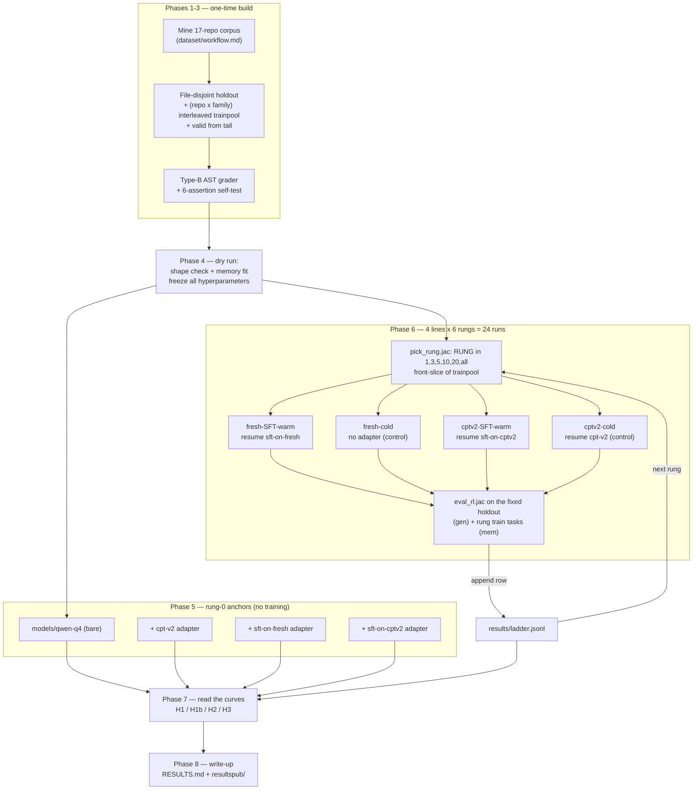

# 05-cpt-sft-grpo — Workflow

Operational runbook for the whole phase: corpus → holdout → 24 training runs → eval →
write-up. Strategy is [`strat.md`](strat.md); design of record is [`spec.md`](spec.md);
the corpus half is [`dataset/spec.md`](dataset/spec.md) +
[`dataset/workflow.md`](dataset/workflow.md).

Harness code lives in `02-rl-grpo/rl/` and is extended in place. Every command below is a
*future* invocation — nothing in this phase runs.

---

## Phase 1 — Mine the corpus

**Does:** builds the multi-source RL task set from the 17 pinned repos.

**Full detail:** [`dataset/workflow.md`](dataset/workflow.md) Phases 1–4. Summarized
here so this runbook is readable end to end:

1. Re-materialize the 17 code repos at the SHAs pinned in
   `03-cpt-only/dataset/cpt/manifest.json`; read each `LICENSE`.
2. Inventory and rank candidate `.jac` files (741 seen / 707 parse-gated in the CPT
   build; 669 / 635 excluding `this_is_jac`).
3. Author HOLE-marker drivers into `02-rl-grpo/rl/drivers/<repo>/`.
4. `jac run 02-rl-grpo/rl/build_tasks.jac` → `05-cpt-sft-grpo/dataset/rl/{tasks.jsonl,
   templates/, refbodies/}`.

**Outputs:** the task set, plus per-repo yield figures for the manifest.

**Checklist:**
- [ ] All repos at pinned SHAs; `licenses` map populated
- [ ] Per-repo driver counts recorded against the sampling strategy set in advance
- [ ] `tasks.jsonl` built; `grade_mode` histogram recorded; no `source: "unknown"` rows

---

## Phase 2 — Reserve the holdout

**Does:** carves holdout / trainpool / valid **before any task is assigned to training**.

**Command (future):** `jac run 02-rl-grpo/rl/build_rl_splits.jac`

**Full detail:** `dataset/workflow.md` Phase 5. The properties that must hold:
file-disjoint holdout, per-file **and** per-repo caps, both decontam layers run
(14-gram shingle ≥0.5 containment; `difflib` ≥0.85 body pass), `valid ∩ holdout = ∅`,
and a (repo × family) round-robin trainpool so every `pick_rung` prefix-N is balanced
and a strict superset of the previous rung.

**Outputs:** `dataset/rl/{holdout,trainpool,train,valid}.jsonl`.

**Checklist:**
- [ ] Holdout file-disjoint from trainpool, asserted not assumed
- [ ] Holdout spans ≥2 families and ≥4 repos; no repo above ~⅓
- [ ] `valid ∩ holdout = ∅`
- [ ] Prefix-N balanced and superset-monotone at N = 1, 3, 5, 10, 20
- [ ] Decontam drop counts + dropped paths recorded
- [ ] Holdout's minimum detectable effect computed and written down **now**, before any
      number exists to be disappointed by

---

## Phase 3 — Build and self-test the Type-B grader

**Does:** implements AST-equivalence grading in the shared reward/eval surface and proves
it is not lying.

**Files touched:** `02-rl-grpo/rl/reward_logic.jac` (AST tier + `ast_sim` term),
`02-rl-grpo/rl/eval_rl.jac` (AST-equivalence headline metric + the
`ast_only`/`stdout_only`/`both` split), plus the self-test.

**Design:** `dataset/spec.md` §4. **Self-test assertions:** `dataset/workflow.md`
Phase 6 — gold scores 1.0; mutation detected; α-renaming free; interface identifiers not
free; `ast_sim` defined for non-parsing garbage; grade cost measured at matrix group
size.

This phase gates everything downstream. `02-rl-grpo`'s Era-2 extractor bug lived in
exactly this surface and faked a flat ladder for three weeks; the cost of catching it
here is one afternoon, and the cost of catching it after 24 runs is 24 runs.

**Checklist:**
- [ ] All six assertions pass over the full corpus
- [ ] Reward tiers verified monotone (no tier's ceiling reaches the next tier's floor)
- [ ] `unwrap_unit` + brace-matched `unit_body` extraction still in the path (scars #1/#2)
- [ ] Grade cost acceptable at the real group size; cache enabled if not
- [ ] Corpus frozen and hashed; `jaclang_version` recorded

---

## Phase 4 — Dry run: shape check and memory fit

**Does:** proves each line can actually resume its adapter, at the right LoRA geometry,
inside 48GB — before committing to 24 runs.

**Why this is its own phase:** `run_grpo.sh` defaults to `--num-layers 8`, while both 04
SFT adapters were written at `num_layers: 16`, `rank: 16`, `scale: 2.0`
(`sft_{fresh,cptv2}_probe/configs/sft.yaml`). A GRPO run at 8 layers cannot faithfully
continue a 16-layer adapter. The memory budget behind the 8-layer default (~38GB peak;
its own comment records `group6/comp512` OOMing Metal at ~iteration 2) has to be re-fit
at 16 layers by moving `--group-size` / `--max-completion-length` / `--max-seq-length`
instead. See `spec.md` §4.3–4.4.

**Steps:**
1. Read `03-cpt-only/adapters/cpt-v2/adapter_config.json` and both SFT adapters'
   `adapter_config.json` — confirm layer count, rank, scale, and target modules. Do not
   assume the CPT-v2 adapter matches the SFT config.
2. Short GRPO run (single-digit iterations) per line, at `--num-layers 16`, with
   `--resume-adapter-file` pointed at that line's seed, against raw `models/qwen-q4`.
   **No fuse step anywhere** (`spec.md` §2.2).
3. Confirm the resumed policy still generates Jac — generate on one holdout prompt before
   and after the dry iterations. This is the direct check for 04's fuse failure mode,
   whose signature was the model emitting plain React/JSX instead of Jac.
4. Record peak memory; adjust group size / completion length / sequence length until all
   four lines fit; **freeze those values for all 24 runs.**
5. Confirm `--max-seq-length` covers the longest mined template plus completion —
   multi-repo templates are larger than `this_is_jac`'s, and a truncated template
   silently changes the task.

**Checklist:**
- [ ] Adapter geometries read and matched per line
- [ ] All four lines resume without a shape error
- [ ] Post-resume generation is Jac, not base-model output (fuse-bug canary)
- [ ] No `mlx_lm.fuse` invocation anywhere in the pipeline
- [ ] Peak memory measured; hyperparameters frozen and written into `spec.md` §4.4
- [ ] Longest template + completion fits `--max-seq-length`

---

## Phase 5 — Rung-0 anchors (no training)

**Does:** measures the four starting points on the new holdout, so every GRPO delta has
something to be a delta *from*.

**Command (future):**
`JAC_EVAL_MODEL=models/qwen-q4 [JAC_EVAL_ADAPTER=<path>] jac run 02-rl-grpo/rl/eval_rl.jac`

| anchor | adapter | role |
|---|---|---|
| base | *(none)* | the floor for `fresh-cold` |
| CPT-v2 base | `03-cpt-only/adapters/cpt-v2/adapters.safetensors` | the floor for `cptv2-cold` |
| fresh SFT | `04-cpt-sft/sft_fresh_probe/adapters/sft-on-fresh/adapters.safetensors` | the start for `fresh-SFT-warm` |
| CPT-v2 SFT | `04-cpt-sft/sft_cptv2_probe/adapters/sft-on-cptv2/adapters.safetensors` | the start for `cptv2-SFT-warm` |

The first two are the base references named in the committed spec; the last two are
required by H2, which asks whether GRPO moves a line above **its own** starting point
(`spec.md` §5).

**Checklist:**
- [ ] Four anchor rows in `results/ladder.jsonl` with `rung: 0`
- [ ] The base-vs-CPT-v2 anchor gap noted — it is this holdout's analogue of 04's +37.0pp
      base-stage gap, and its size calibrates how much room H1b has
- [ ] Anchor generations spot-read by eye, not just scored (the fuse-bug canary again)

---

## Phase 6 — The 24-run training matrix

**Does:** 4 lines × 6 rungs, full ladder, no early stop.

**Per cell, in order:**

1. **Pick the rung.** `RUNG=<1|3|5|10|20|all> jac run 02-rl-grpo/rl/pick_rung.jac` —
   front-slices `trainpool.jsonl` into `train.jsonl`. Superset-monotone by construction.
2. **Train.** `RL_BASE=models/qwen-q4 ./02-rl-grpo/rl/run_grpo.sh <line>-r<rung>` with the
   Phase-4-frozen hyperparameters, `--num-layers 16`, and this line's
   `--resume-adapter-file` (omitted for `fresh-cold`). Adapter →
   `05-cpt-sft-grpo/adapters/<line>-r<rung>/`.
3. **Eval, twice.**
   - **gen** — the fixed holdout. The headline. `JAC_EVAL_ADAPTER=<this cell's adapter>`.
   - **mem** — the rung's own train tasks. Overfit check; at rung 1 it is the plumbing
     check (does one task move at all?).
4. **Record** one row in `05-cpt-sft-grpo/results/ladder.jsonl`:
   `{line, rung, checkpoint, ast_pass, stdout_pass, both_pass, graded, near_pass,
   ast_sim_mean, idiom, n}` — mirroring `02-rl-grpo/results/rl_ladder.jsonl`'s
   row-per-cell convention.

**Order of execution:** rung-major (all four lines at rung 1, then rung 3, …). Two
reasons: an early rung exposes a harness problem across all four lines at once rather
than after six runs of one line; and if the phase is ever interrupted, a rung-major
partial matrix is still readable as a comparison, while a line-major one is not.

**Discipline:**
- **No early stop.** The sweet spot is read off the finished curve. 04 reinforced this
  from both directions: its SFT peaks *tied* their own final checkpoints in both arms,
  and its DPO curve had no recoverable sweet spot anywhere across 13 checkpoints.
- **No hyperparameter changes mid-matrix.** A knob that varies between cells invalidates
  cross-rung comparison. If a change is genuinely forced, restart the affected line's
  full ladder and say so.
- **Never fuse.** Every eval loads base + adapter (`eval_rl.jac`'s `JAC_EVAL_ADAPTER`
  path), never a fused checkpoint.

**Checklist (per cell):**
- [ ] Rung picked; `train.jsonl` size matches the rung and is a superset of the previous
- [ ] Correct `--resume-adapter-file` for this line (or deliberately none)
- [ ] Training log kept; peak memory and any OOM retry recorded
- [ ] gen + mem evals both run and recorded
- [ ] Row appended to `results/ladder.jsonl`
- [ ] Adapter landed at `adapters/<line>-r<rung>/adapters.safetensors`

---

## Phase 7 — Read the curves

**Does:** turns 28 measurement points (24 cells + 4 anchors) into verdicts on the four
pre-registered hypotheses. No new measurements are invented here.

**Reads, in order:**

1. **Per line: GRPO vs its own anchor, per rung.** This is H2 — the "did GRPO move
   anything at all" question, and the headline if the answer is yes.
2. **Warm vs warm across rungs** (`cptv2-SFT-warm` − `fresh-SFT-warm`). H1.
3. **Cold vs cold across rungs** (`cptv2-cold` − `fresh-cold`). H1b.
4. **Cold vs its anchor.** H3 — the cold-start control. `02-rl-grpo`'s raw-base GRPO
   landed exactly on base; note whether that reproduces on the new corpus/grader.
5. **The pass-route split** (`ast_only` / `stdout_only` / `both`). Not a hypothesis, but
   a direct measurement of how much the grader change actually changed — and the honest
   way to report whether any movement is real capability or a grader artifact.

**Statistics:** paired over holdout items (McNemar / paired bootstrap) — every line
answers the same items, and pairing roughly halves the detectable effect versus
comparing marginal rates. Wilson intervals on every raw rate. Thresholds are the ones
pre-registered in `strat.md`; do not re-choose them after seeing the curves.

**Honest caveats that must appear in the write-up regardless of outcome:**
- One run per cell — per-cell deltas are not separable from LoRA training stochasticity
  (`spec.md` §8). The readable result is the *shape across six rungs*, not any one cell.
- The corpus and the grader changed together. A positive H2 cannot attribute the move to
  one or the other; that would need a third condition (old grader on the new corpus)
  which is not in this matrix.
- Holdout size caps the minimum detectable effect. State the number computed in Phase 2
  next to every "no significant difference" claim.

**Checklist:**
- [ ] All 28 points present in `results/ladder.jsonl`
- [ ] Paired tests + Wilson intervals computed for each of the four reads
- [ ] Each of H1 / H1b / H2 / H3 marked CONFIRMED / REFUTED / PARTIAL with the number
      that decided it, in `strat.md`'s verdict style
- [ ] Pass-route split reported per cell
- [ ] Every caveat above written into the report, not just the deltas

---

## Phase 8 — Write-up

**Does:** produces the phase's durable artifacts.

**Outputs:**
- `05-cpt-sft-grpo/RESULTS.md` — consolidated results in `04-cpt-sft/RESULTS.md`'s shape:
  the question, the bottom line, per-line tables, the cross-line comparison, an artifact
  index.
- `05-cpt-sft-grpo/docs/reports/<date>-grpo-ladder.md` — the full statistical write-up
  with honest caveats and a verbatim verdict sentence, following
  `04-cpt-sft/docs/reports/2026-07-cpt-vs-fresh-comparison.md`'s structure.
- `05-cpt-sft-grpo/resultspub/` — published graphs and summaries (matching `02-rl-grpo`'s
  convention).
- Verdict lines added to `strat.md`'s hypotheses (H1/H1b/H2/H3), in the same
  CONFIRMED/REFUTED/PARTIAL style `02-rl-grpo/docs/rl/strat.md` uses.

**Curves worth plotting** (one figure each, no compound charts):
1. Holdout AST-pass vs rung, four lines, anchors as horizontal reference lines.
2. Per-line delta-from-anchor vs rung, with paired CIs.
3. Warm-vs-warm and cold-vs-cold deltas vs rung, with paired CIs.
4. Pass-route composition per cell (`ast_only` / `stdout_only` / `both`).

**Checklist:**
- [ ] `RESULTS.md` written; every number traceable to a row in `results/ladder.jsonl`
- [ ] Report includes the caveats from Phase 7 verbatim, not softened
- [ ] `strat.md` hypotheses carry verdicts
- [ ] Figures in `resultspub/`, generator script committed alongside (04's lesson: an
      orphaned figure with no surviving generator produced numbers that later turned out
      to be wrong and unreproducible — `2026-07-cpt-vs-fresh-comparison.md` §4)
- [ ] Adapters, dataset, and results left in place — never deleted, single-copy artifacts
