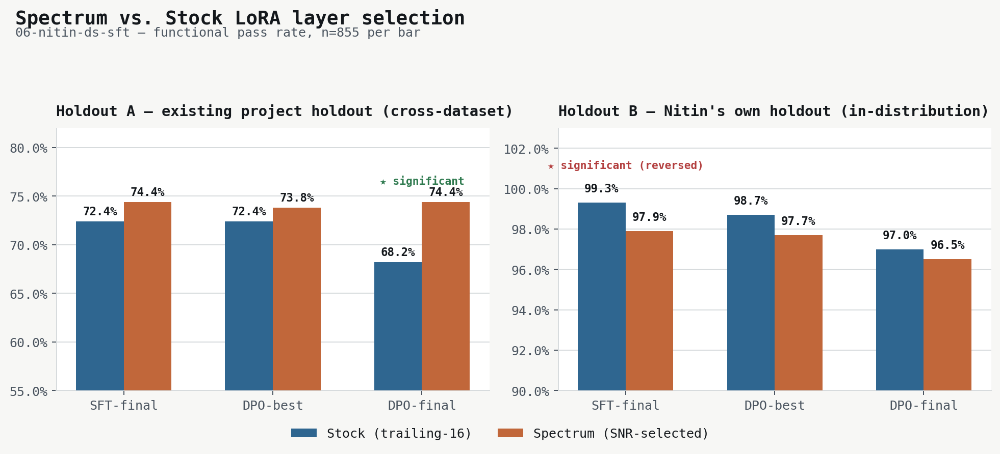
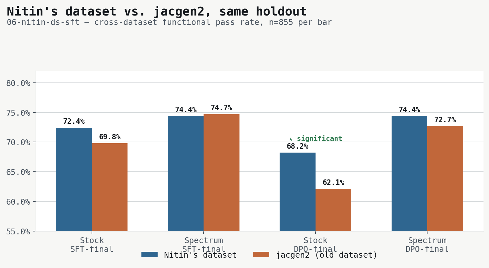

# 06-nitin-ds-sft — Final Comparison Report

**Question 1:** Does Spectrum (SNR/Marchenko-Pastur layer selection) replicate its win over
stock trailing-16 LoRA targeting on a new, independently-sourced dataset?
**Question 2:** Is this new dataset ("Nitin's" — `chess10kp/jac-data-gen`,
commit `7c25aff3`) actually better than the existing jacgen2-derived dataset used
throughout `04-cpt-sft`?

**Bottom line, stated directly:**
- **RQ1 — Spectrum does NOT cleanly replicate on this dataset.** One
  significant win (DPO-final, holdout A, +6.2pp), one significant **loss**
  (SFT-final, holdout B, −1.4pp), four non-significant. The original
  fresh-arm finding (`2026-08-spectrum-vs-stock-comparison.md`) was
  significant at every one of 3 stages on the old dataset; this replication
  clears the ≥4-of-6-significant-wins-no-losses bar on **neither** holdout.
- **RQ2 — Weak, inconsistent evidence Nitin's dataset is better.** One
  significant win out of four cross-dataset comparisons (stock DPO-final,
  +6.1pp), no significant losses, three non-significant. Not a clean "yes."

**Direct call on RQ2, if forced to pick one dataset to train on: Nitin's.**
3 of 4 head-to-head comparisons favor it (the 4th, spectrum SFT-final, is a
statistical coin-flip at −0.4pp, not a real loss); the one significant result
of the four favors it (p=0.0083); zero comparisons favor the old dataset
significantly. The size confound (§3) cuts *in Nitin's favor*, not against
it — his training pool is 32% smaller (5,474 vs 8,100 rows) and still
matches-or-beats the old dataset everywhere but that one tie. Matching a
larger dataset's results with less data is itself a real point in its
favor. This isn't an overwhelming landslide — only 1 of 4 comparisons clears
significance individually, so treat it as a real but modest edge, not proof
— but asked to choose, the honest answer is Nitin's.

Both verdicts are honest nulls-or-mixed, not the clean stories a shorter
write-up might prefer — see §5 for why the evidence doesn't support forcing
a stronger conclusion either way.

---

## 1. Headline table — Holdout A (existing `04-cpt-sft` holdout, cross-dataset)

All n=855, two-proportion z-test, same method as `2026-08-spectrum-vs-stock-comparison.md`.

| Stage | Stock | Spectrum | Δ | z | p | Significant? |
|---|---|---|---|---|---|---|
| Base (untrained) | 10.5% (90/855) | 10.5% (90/855) | 0 | — | — | (shared, sanity-check only) |
| SFT-final | 72.4% (619/855) | 74.4% (636/855) | +2.0pp | 0.930 | 0.352 | No |
| DPO-best | 72.4% (619/855) | 73.8% (631/855) | +1.4pp | 0.654 | 0.513 | No |
| DPO-final | 68.2% (583/855) | 74.4% (636/855) | **+6.2pp** | 2.833 | **0.0046** | **Yes** |

Stock's DPO-best is byte-identical to its own SFT-final (619/855) — DPO's
best checkpoint landed at step 20 of 250 (see §4), essentially un-trained;
DPO barely touched the model before its own overfitting made things worse.
Spectrum's DPO held up across all three stages.

## 2. Headline table — Holdout B (Nitin's own corpus, in-distribution)

Same 855-row size (matched deliberately at holdout-carve time), single
category (`conversion`/`python_to_jac_function`), `compile_only` gate only —
structurally easier and more homogeneous than holdout A's mixed categories
and behavioral gates. **Not directly comparable in difficulty to holdout A —
only within-holdout stock-vs-spectrum comparisons are apples-to-apples.**

| Stage | Stock | Spectrum | Δ | z | p | Significant? |
|---|---|---|---|---|---|---|
| Base (untrained) | 0.0% (0/855) | 0.0% (0/855) | 0 | — | — | (shared) |
| SFT-final | 99.3% (849/855) | 97.9% (837/855) | **−1.4pp** | −2.467 | **0.0136** | **Yes (stock wins)** |
| DPO-best | 98.7% (844/855) | 97.7% (835/855) | −1.1pp | −1.631 | 0.103 | No |
| DPO-final | 97.0% (829/855) | 96.5% (825/855) | −0.5pp | −0.543 | 0.587 | No |

Base near-zero for both arms makes sense: raw Qwen has never seen Jac's
curly-brace/semicolon syntax, so it can't compile Jac at all pre-training.
Both arms converge near-ceiling (96-99%) once trained — this holdout is
essentially the same distribution as its own training pool (minus the 855
held-out rows), so once the model learns Jac syntax the remaining task is
close to trivial. The ceiling leaves little room to differentiate the two
arms; the one significant result here (SFT-final, stock wins) should be read
with that ceiling-compression caveat in mind, not as a strong claim that
Spectrum is worse in general.

## 3. Cross-dataset comparison — is Nitin's data better than jacgen2's?

Nitin's numbers vs the existing fresh-arm's own numbers, **same holdout A**,
same base checkpoint, same recipe:

| Comparison | Nitin | Old (jacgen2) | Δ | z | p | Significant? |
|---|---|---|---|---|---|---|
| Stock SFT-final | 72.4% (619/855) | 69.8% (597/855) | +2.6pp | 1.174 | 0.240 | No |
| Spectrum SFT-final | 74.4% (636/855) | 74.7% (639/855) | −0.4pp | −0.167 | 0.868 | No |
| Stock DPO-final | 68.2% (583/855) | 62.1% (531/855) | **+6.1pp** | 2.639 | **0.0083** | **Yes** |
| Spectrum DPO-final | 74.4% (636/855) | 72.7% (622/855) | +1.6pp | 0.768 | 0.443 | No |

One real win (stock DPO-final — Nitin's dataset held up much better through
DPO than jacgen2's did on the old fresh-arm run, where stock DPO-final
famously collapsed to 62.1%). Three non-significant, all directionally mixed
(spectrum SFT-final is the only one that goes slightly negative). Not enough
here to call Nitin's dataset unambiguously better — the DPO-final win is real
but isolated.

**Known confound, stated plainly (from `corpus-triage-report.md`):** Nitin's
training pool is 5,474 rows vs the old fresh-arm's 8,100 (0.68×). A smaller
training set makes the DPO-final win *more* impressive if real (less data,
still better DPO robustness) but also means this comparison isn't a clean
dataset-quality isolation — dataset size and dataset content both differ at
once. Not fixable after the fact; flagged as a limitation, not swept under.

## 4. Real problems hit and how they were resolved

This ran end-to-end once, hit four genuine failures, none silently absorbed:

1. **External drive disconnected mid-training** (spectrum DPO, step 200/250).
   `/Volumes/ExtremePro` dropped off the bus entirely (`tee: ...: Input/output
   error`). Verified every artifact survived once remounted (dataset files,
   both stock checkpoints, spectrum SFT checkpoint, spectrum DPO progress
   file all present and correct) before resuming.
2. **Resume-then-resumed run's best-checkpoint tracker reset.** The DPO
   watchdog correctly resumed training from step 200, but its "best" snapshot
   comparison did NOT persist across the disconnect — it found "step 220
   (54.0%)" as *its own* best, unaware the pre-crash run had already scored
   step 60 at 58.0%, the true best across the whole 250-iter run. Caught by
   diffing `runs_pct` across both halves of the log, fixed by manually
   overwriting the `-best` adapter directory and `.best_step` file with
   step 60's actual weights (MD5-verified against the archived snapshot).
   Every spectrum DPO-best number in this report reflects the corrected
   checkpoint, not the silently-wrong one.
3. **Bus error crash during stock DPO** (unrelated earlier incident, same
   external-drive flakiness manifesting as an mmap read failure instead of a
   write failure). Retried clean on the second attempt, no data implicated.
4. **`nitin_holdout.jsonl` had no `messages` field** — it was frozen from the
   candidate pool *before* the SFT reverse-instruction-authoring phase, so it
   carried only raw `jac_code`+`docstring`, not the prompt/completion pairs
   `eval_functional.jac` needs to actually query the model. This made the
   first pass at holdout-B evaluation fail fast (looked like it "completed"
   in under 30 seconds — it never ran). Fixed by reverse-authoring
   instructions for all 855 holdout rows (same process as the 5,474-row
   training pool, 3 parallel Opus shards, zero drops) into
   `nitin_holdout_eval.jsonl`, then rerunning all 4 holdout-B evals for real.

## 5. Reading both verdicts honestly

**RQ1.** The original Spectrum finding was clean because it was a genuinely
uncontested test — a fresh base with no prior adaptation, one dataset, one
set of hyperparameters, significant at every stage. This replication adds a
second, independently-sourced dataset and gets a mixed result: a real win
where Spectrum's DPO run didn't collapse the way stock's did (holdout A,
DPO-final), and a real, if narrow, loss on the in-distribution holdout's SFT
stage. The honest reading is that Spectrum's advantage from the original
finding is **not dataset-invariant** — it may depend on properties of the
specific training corpus (composition, difficulty mix, category diversity)
in ways this project doesn't yet have a mechanistic account of. Worth a
third replication before treating either direction as settled.

**RQ2.** The one significant result (stock DPO-final) is a real, useful
signal — Nitin's dataset's DPO stage was meaningfully more robust than
jacgen2's on this exact comparison. But it's one comparison out of four, the
training-set-size confound is real and unresolved, and the SFT-stage
comparisons go in opposite directions for the two arms (stock +2.6pp not
sig, spectrum −0.4pp not sig). This does not support a claim that Nitin's
dataset is broadly better — it supports a narrower, more defensible claim:
*this specific DPO recipe is more robust to Nitin's data than to jacgen2's,
for the stock arm, on this holdout.*

## 6. Live graphs

Loss curves + eval-subset pass-rate curves were generated during training
via `scripts/plot_progress.py`, refreshed periodically by the orchestrating
session's monitor loop. Located at:

- `stock_probe/results/sft/plots/loss.png`
- `stock_probe/results/dpo-nofuse/plots/loss.png`
- `spectrum_probe/results/sft-spectrum/plots/loss.png`
- `spectrum_probe/results/dpo-spectrum/plots/loss.png`

## 7. Data quality notes carried over from generation (not re-litigated here)

From `corpus-triage-report.md` and the SFT/DPO batch-fill agents: several
source functions in the corpus have code that contradicts their own
docstring (pre-existing in the upstream `jac-data-gen` repo, not introduced
by this pipeline). Fill agents resolved these inconsistently — some wrote
instructions matching the documented *intent*, others matching the actual
*code* — a real, acknowledged source of label noise in both the training set
and (to a lesser extent, since holdout instructions were authored by 3 of
the same-style agents) the Nitin holdout. Not something this report's
numbers correct for; flagged for anyone reusing this dataset.

## 8. Artifacts

- `dataset/{candidate_pool,nitin_holdout,nitin_holdout_eval,sft_train,dpo_train}.jsonl`
- `stock_probe/`, `spectrum_probe/` — full training + eval trees, all
  checkpoints (including archived intermediate ones where the archival step
  completed), all raw eval logs
- `docs/reports/corpus-triage-report.md` — corpus funnel numbers
- `CONTEXT_BRIEF.md` — design decisions and corrections made during the run
