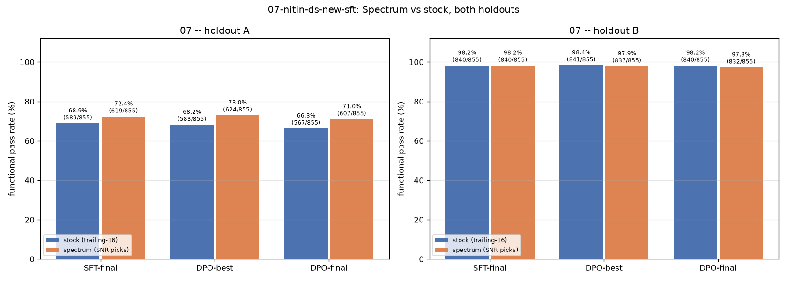
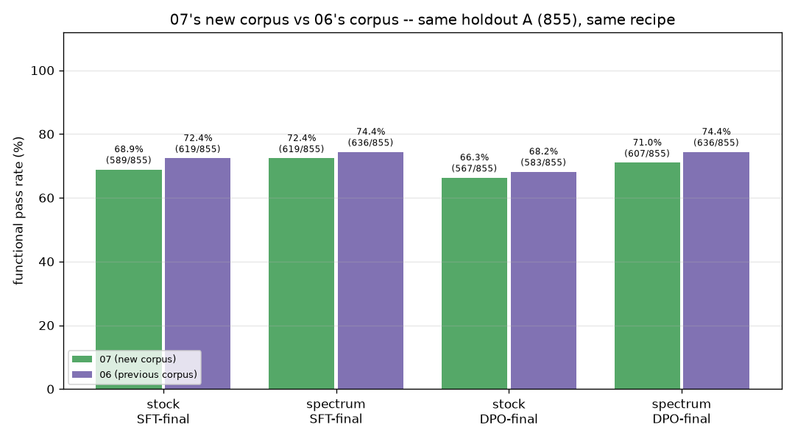
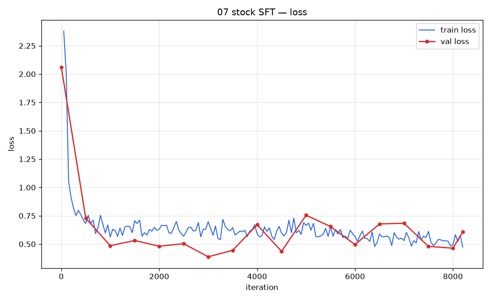
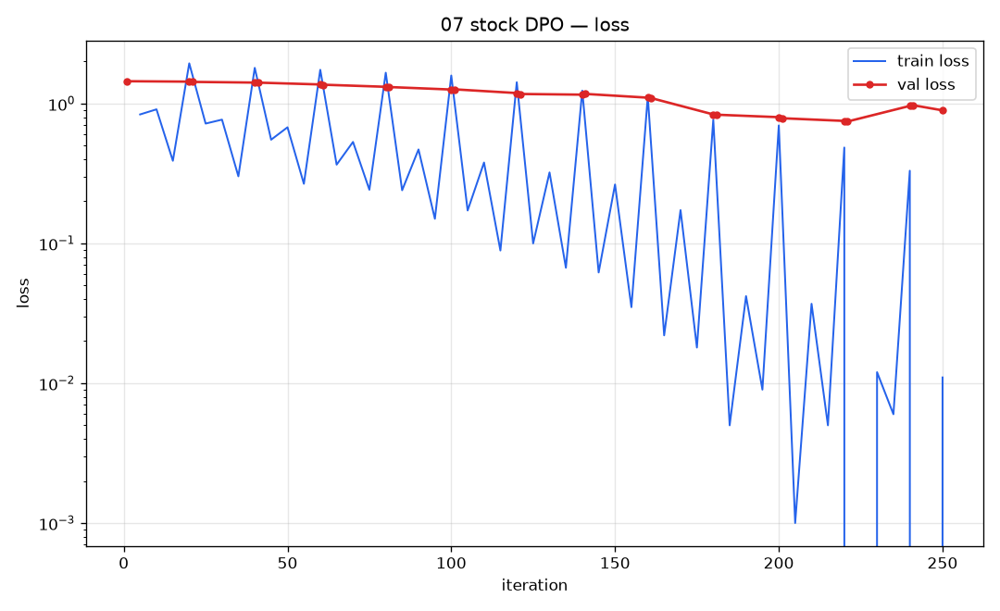
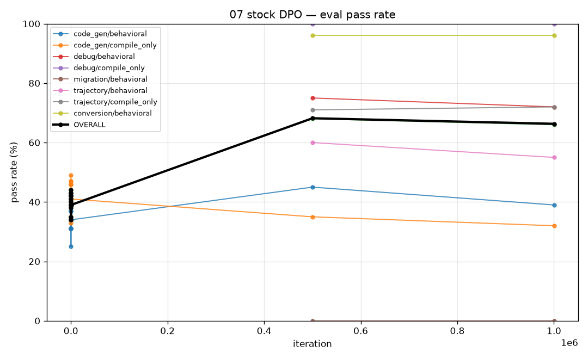
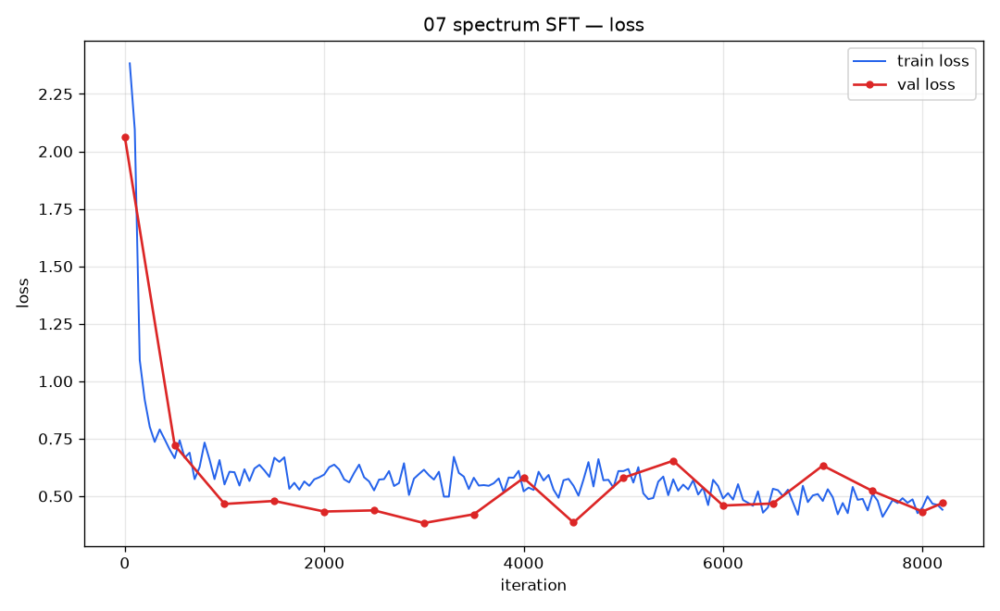
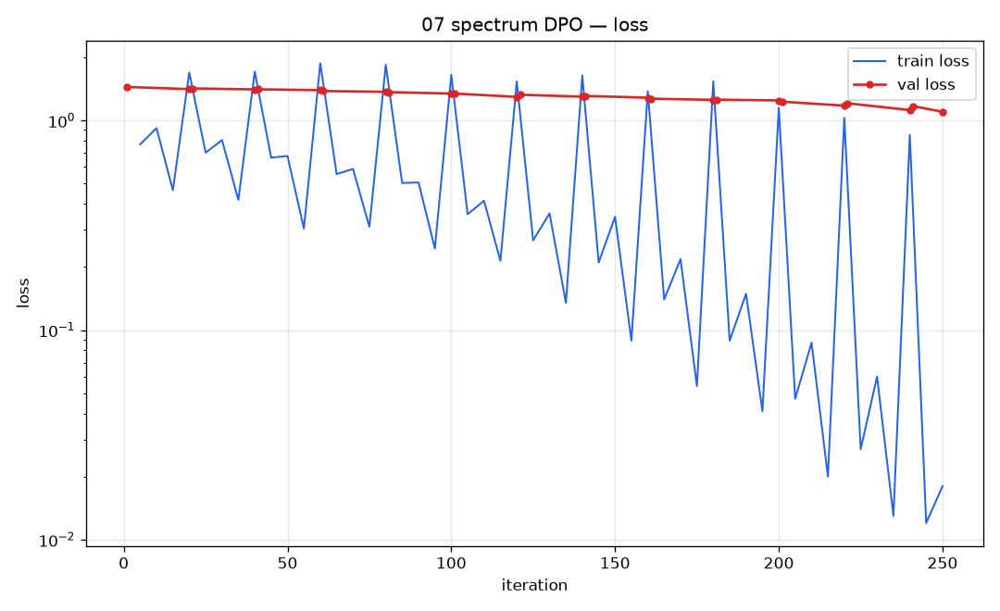
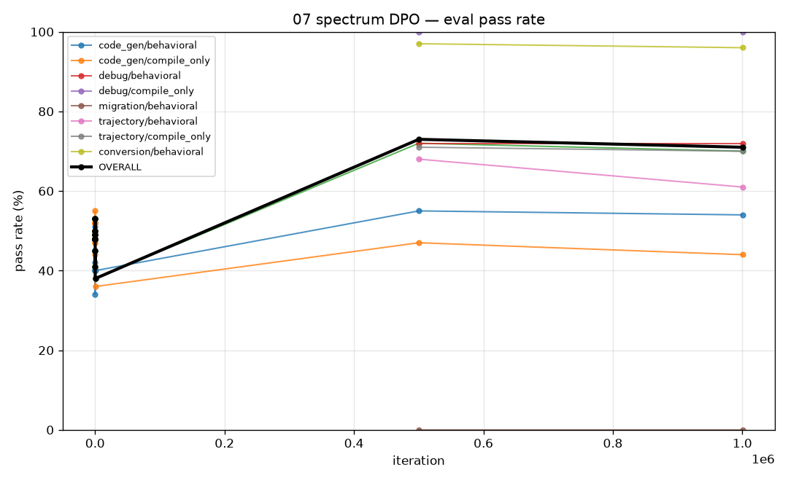

# 07-nitin-ds-new-sft — Final Comparison Report

**RQ1:** Does Spectrum (SNR/Marchenko-Pastur layer selection) replicate its win
over stock trailing-16 LoRA targeting on this third, newly-sourced dataset?
**RQ2:** Is Nitin's **new** dataset (`chess10kp/jac-data-gen` @ `11fa3f45a0a349337ae4c355708a7e4974b54a36`,
"Add idiomatic py2jac corpus (9,367 records)") actually better than the dataset
used in `06-nitin-ds-sft` (same repo @ `7c25aff3110f526eec59e0123ffe6c0c152cce91`)?

## 0. Status

**COMPLETE.** Corpus pinned 2026-08-18; both SFT runs finished 2026-08-19
(stock 03:24, spectrum 06:02:29, both full 8,200/8,200 iters); the
`finish_07` orchestrator ran both arms' holdout-A/B eval sweeps and both DPO
runs (250/250 iters each) end-to-end, completing 2026-08-20 00:00:41. Every
number below is real, pulled from `metrics_functional.jsonl` under
`stock_probe/results/*` and `spectrum_probe/results/*`, cross-checked against
`docs/reports/corpus-triage-report.md` and the raw `train.log`/orchestrator
logs. See §4 for the one thing worth double-checking before trusting the
spectrum DPO numbers (a missing `.train.done` marker — verified benign).

**Pre-registered decision rules** ([`../spec.md`](../spec.md) §7.2, fixed
before any number existed):
**RQ1** replicates iff ≥ 4 of 6 arm-vs-arm comparisons are significant
spectrum wins at p < 0.05 with no significant losses.
**RQ2** the new dataset is better iff ≥ 4 of 6 cross-dataset comparisons are
significant wins with no significant losses; worse iff the mirror holds;
indistinguishable otherwise.

**Bottom line, stated directly:**

- **RQ1 — partial / does not clear the replication bar, but cleaner than 06.**
  2 of 6 arm-vs-arm comparisons are significant spectrum wins (holdout A,
  DPO-best +4.8pp p=0.0296 and DPO-final +4.7pp p=0.0371), **zero significant
  losses** anywhere, 4 nulls. That is short of the ≥4-of-6 bar, so this is
  not a clean replication of 04-cpt-sft's original every-stage-significant
  finding — but it is a real improvement on 06, which had one significant
  win **and** one significant loss. Across all three replications now run
  (04-cpt-sft fresh, 06, 07), Spectrum has never lost significantly and has
  won significantly on holdout A in 2 of them (04-cpt-sft at every stage, 07
  at DPO-best/DPO-final). The honest read: Spectrum's advantage is real and
  recurring on the harder, mixed-category holdout A, but it is not
  dataset-invariant enough to call "replicated" by the pre-registered bar,
  and it essentially vanishes on the easier, ceilinged holdout B.
- **RQ2 — indistinguishable by the pre-registered bar, but not neutral in
  practice.** 0 of 6 cross-dataset comparisons are significant (closest:
  stock DPO-best, −4.2pp, p=0.0568). But **all six point estimates favor
  06's corpus, with zero exceptions** — SFT-final, DPO-best and DPO-final,
  both arms, all six cells numerically worse on 07's data than on 06's.
  That is a real pattern even though no individual cell clears significance;
  see §5 for why "indistinguishable" is the technically correct verdict but
  an incomplete one.
- **If forced to pick one dataset to train on: 06's, not 07's.** This
  reverses 06's own forced call (which picked itself over jacgen2). The
  size confound cuts the wrong way to explain it away: 07's SFT training
  pool is 6,781 rows, **24% larger** than 06's 5,474 — more data, not less,
  and still trends worse in every cell. "Better-written idiomatic Jac" (see
  §7) did not translate into a better-performing training set on this
  battery.

---

## 1. Headline table — Holdout A (the shared 855, cross-dataset comparable)

All n=855, same functional harness
(`04-cpt-sft/sft_cptv2_probe/jacgen/eval_functional.jac`), same method as 06's
report and `2026-08-spectrum-vs-stock-comparison.md`.

| Stage | Stock | Spectrum | Δ | z | p | Significant? |
|---|---|---|---|---|---|---|
| Base (untrained) | 10.5% (90/855) | 10.5% (90/855) | 0 | — | — | (shared, sanity-check only) |
| SFT-final | 68.9% (589/855) | 72.4% (619/855) | +3.5pp | 1.593 | 0.1111 | No |
| DPO-best | 68.2% (583/855) | 73.0% (624/855) | **+4.8pp** | 2.176 | **0.0296** | **Yes** |
| DPO-final | 66.3% (567/855) | 71.0% (607/855) | **+4.7pp** | 2.085 | **0.0371** | **Yes** |

Base rate matches 06's exactly (90/855, 10.5%) — expected, since both phases
share the same base checkpoint and the same holdout-A instrument; this is a
sanity check, not a phase-07 result. Unlike 06, **neither arm's DPO-best here
is byte-identical to its own SFT-final** — stock's best checkpoint landed at
step 80/250 (32% through the DPO budget) and spectrum's at step 120/250 (48%
through), both meaningfully trained past the start. Stock's DPO-best (68.2%)
is actually slightly *below* its own SFT-final (68.9%) even at its best
snapshot — DPO gave stock no net gain at any checkpoint on this dataset.
Spectrum's DPO-best (73.0%) sits slightly above its SFT-final (72.4%), a small
real gain that held before decaying by DPO-final (71.0%). Both arms show the
same overfit-then-decay shape (see the sweep curves in §6): stock peaks near
step 80 (~44% on the 100-row in-loop subset) and drifts down to 39% by step
250; spectrum peaks near steps 120–140 (~53%) and drifts down to 38% by step
250 — spectrum peaks higher and holds the peak longer, which is exactly what
produces its two significant DPO wins above.

**Per-slice breakdown** ([`../spec.md`](../spec.md) §7.2 requires this alongside
the headline — 322 of the 855 graded rows are `conversion`, this corpus's own
task shape, so a win concentrated there is a *specialization* result, not a
general one):

| slice | n | stock SFT | spectrum SFT | stock DPO-final | spectrum DPO-final |
|---|---:|---|---|---|---|
| conversion / behavioral | 322 | 97.2% (313/322) | 97.2% (313/322) | 96.9% (312/322) | 96.3% (310/322) |
| code_gen / compile_only | 227 | 37.0% (84/227) | 46.3% (105/227) | 32.2% (73/227) | 44.1% (100/227) |
| trajectory / compile_only | 113 | 71.7% (81/113) | 74.3% (84/113) | 72.6% (82/113) | 70.8% (80/113) |
| code_gen / behavioral | 86 | 45.3% (39/86) | 50.0% (43/86) | 39.5% (34/86) | 54.7% (47/86) |
| trajectory / behavioral | 70 | 62.9% (44/70) | 67.1% (47/70) | 55.7% (39/70) | 61.4% (43/70) |
| debug / behavioral | 33 | 75.8% (25/33) | 72.7% (24/33) | 72.7% (24/33) | 72.7% (24/33) |
| debug / compile_only | 3 | 100.0% (3/3) | 100.0% (3/3) | 100.0% (3/3) | 100.0% (3/3) |
| migration / behavioral | 1 | 0.0% (0/1) | 0.0% (0/1) | 0.0% (0/1) | 0.0% (0/1) |
| **total** | **855** | **68.9% (589/855)** | **72.4% (619/855)** | **66.3% (567/855)** | **71.0% (607/855)** |

The `conversion` slice — this corpus's own reverse-instruction task shape — is
near-ceiling for both arms at every stage (96–97%) and barely moves, so it
contributes almost nothing to the headline spread; the real differentiation
lives in `code_gen` (both `compile_only` and `behavioral`), where spectrum
leads stock by 4–15pp at every stage shown, and in `trajectory`, which is
closer to a wash. Spectrum's headline win is broad-based, not a single-slice
artifact: it leads or ties stock on every slice except `debug/behavioral` and
`trajectory/compile_only` at DPO-final, both small (n=33, n=113) and within a
couple of items of stock either way.

## 2. Headline table — Holdout B (the new corpus's own, in-distribution)

`dataset/nitin_holdout_eval.jsonl`, **n = 855** (the pool comfortably cleared
the 4,000-row floor `pipeline.jac` requires before it will carve the full 855;
see `corpus-triage-report.md`). Single category
(`conversion`/`python_to_jac_function`), `compile_only` gate only —
structurally easier and more homogeneous than holdout A's mixed categories and
behavioral gates. **Not comparable in difficulty to holdout A, and not
comparable to 06's holdout B either (different item set). Only within-holdout
stock-vs-spectrum comparisons are apples-to-apples.**

| Stage | Stock | Spectrum | Δ | z | p | Significant? |
|---|---|---|---|---|---|---|
| Base (untrained) | 0.0% (0/855) | 0.0% (0/855) | 0 | — | — | (shared) |
| SFT-final | 98.2% (840/855) | 98.2% (840/855) | 0.0pp | 0.000 | 1.0000 | No |
| DPO-best | 98.4% (841/855) | 97.9% (837/855) | −0.5pp | −0.714 | 0.4753 | No |
| DPO-final | 98.2% (840/855) | 97.3% (832/855) | −0.9pp | −1.312 | 0.1894 | No |

(a) Base is exactly 0.0% (0/855) for both arms, as expected — raw Qwen has
never seen Jac's curly-brace/semicolon syntax, so it cannot compile Jac at all
pre-training. Matches 06's holdout-B base exactly.
(b) **Ceiling compression, same as 06.** Both arms sit at 97–99% by SFT-final
and barely move through DPO — this holdout is close to the training pool's own
distribution (minus the 855 held-out rows), so once the model learns Jac
syntax the remaining task is close to trivial for both arms. None of the three
stages reach significance here, and none should be read as "no Spectrum
effect" — there just isn't enough room left above the ceiling to show one.
Holdout A, not holdout B, carries the RQ1 decision.

**Power statement** ([`../spec.md`](../spec.md) §7.3): holdout B landed at the
full target size (855, same as holdout A), not a shrunk fallback, so this is
not a sample-size power problem — the limiting factor is ceiling compression
(§2b), not n. A n=855 two-proportion test at a ~98% baseline can still detect
differences down to roughly 2pp at conventional power; the observed deltas
(0.0, −0.5, −0.9pp) are genuinely small, not merely undetectable.



*Generated by `scripts/plot_vs_06.jac`.*

## 3. Cross-dataset comparison — is the new corpus better than 06's?

07's numbers vs 06's own numbers, **same holdout A**, same base checkpoint
(`models/qwen-q4`), same recipe, same harness. 06's column is real and final,
from `06-nitin-ds-sft/docs/reports/2026-08-final-comparison.md` §1.

| Comparison | 07 (new corpus) | 06 (previous corpus) | Δ | z | p | Significant? |
|---|---|---|---|---|---|---|
| Stock SFT-final | 68.9% (589/855) | 72.4% (619/855) | −3.5pp | −1.593 | 0.1111 | No |
| Spectrum SFT-final | 72.4% (619/855) | 74.4% (636/855) | −2.0pp | −0.930 | 0.3522 | No |
| Stock DPO-best | 68.2% (583/855) | 72.4% (619/855) | −4.2pp | −1.905 | 0.0568 | No |
| Spectrum DPO-best | 73.0% (624/855) | 73.8% (631/855) | −0.8pp | −0.383 | 0.7017 | No |
| Stock DPO-final | 66.3% (567/855) | 68.2% (583/855) | −1.9pp | −0.824 | 0.4097 | No |
| Spectrum DPO-final | 71.0% (607/855) | 74.4% (636/855) | −3.4pp | −1.574 | 0.1155 | No |

**Three-way lineage view** — the same cells against the original jacgen2
fresh-arm numbers (`04-cpt-sft/docs/reports/2026-08-spectrum-vs-stock-comparison.md`
§1), so it is visible whether successive corpora are actually accumulating:

| Stage | 07 | 06 | 04-cpt-sft fresh (jacgen2) |
|---|---|---|---|
| Stock SFT-final | 68.9% (589/855) | 72.4% (619/855) | 69.8% (597/855) |
| Spectrum SFT-final | 72.4% (619/855) | 74.4% (636/855) | 74.7% (639/855) |
| Stock DPO-best | 68.2% (583/855) | 72.4% (619/855) | 69.8% (597/855) |
| Spectrum DPO-best | 73.0% (624/855) | 73.8% (631/855) | 74.2% (634/855) |
| Stock DPO-final | 66.3% (567/855) | 68.2% (583/855) | 62.1% (531/855) |
| Spectrum DPO-final | 71.0% (607/855) | 74.4% (636/855) | 72.7% (622/855) |



*Generated by `scripts/plot_vs_06.jac`.*

Zero of the six 07-vs-06 comparisons are individually significant, but the
direction is unanimous: **every one of the six cells is numerically lower on
07's corpus than on 06's**, and the closest-to-significant cell (stock
DPO-best, −4.2pp, p=0.0568) is also a loss for 07. In the three-way view, 07
sits *below* 06 everywhere and is a mixed bag against the original jacgen2
corpus — better than jacgen2 on stock DPO-final (66.3% vs 62.1%, continuing
06's own finding that this recipe is fragile on jacgen2's data specifically)
but worse than jacgen2 on both SFT-final cells and spectrum DPO-final. Reading
all three corpora together: jacgen2's stock arm was the one that specifically
collapsed under DPO (62.1%); both Nitin corpora (06 and 07) fixed that
specific failure mode for stock, but 06 additionally pushed every other cell
up from jacgen2's level, while 07 does not — it fixes the stock-DPO-collapse
failure mode and stops there.

**Known confound, stated plainly (from `corpus-triage-report.md`):** 07's
training pool is **6,781 rows** vs 06's cited 5,474 and the original fresh
arm's 8,100 — 07's pool is **1.24× (24% larger) than 06's**, the opposite
direction from 06's own confound (06's pool was 0.68× the fresh arm's, i.e.
smaller). That direction argues against, not for, size being the explanation
for 07 trailing 06: 07 had *more* data available and still trends worse in
every single cell. Dataset size and dataset content still differ at once, so
this is not a clean content-only isolation — but the confound does not let 07
off the hook here the way it arguably helped 06's case against jacgen2.

## 4. Real problems hit and how they were resolved

This run was the cleanest of the three replications to date on the training
side — no external-drive disconnects, no bus errors, no watchdog
relaunch/resume for either SFT run (both completed in a single continuous
segment, confirmed by exactly one `>>> SFT attempt` line per `train.log`), and
no `DPO_MAXLEN` OOM-ladder shrink (grep for `oom`/`shrink`/`error`/`bus
error`/`input/output` across all four `train.log` files returns nothing; the
DPO recipe stayed at its documented default `DPO_MAXLEN=512` the whole run).
Two things worth recording:

1. **`.train.done` marker missing after both DPO runs, not just spectrum's.**
   The `finish_07` orchestrator log (`/tmp/nitin_new_triage/finish_07.log`)
   shows:
   ```
   [18:51:06] WARN dpo_stock_full finished rc=0 3431s but marker .../dpo-nofuse/.train.done is MISSING
   [20:02:29] WARN dpo_spectrum_full finished rc=0 4189s but marker .../dpo-spectrum/.train.done is MISSING
   ```
   Root cause, verified by reading both run scripts: `run_dpo_nofuse.sh` and
   `run_dpo_spectrum.sh` never define a `done_mark train` call at all (unlike
   `run_sft.sh` / `run_sft_spectrum.sh`, which do) — the marker was never
   going to appear for either DPO arm, by construction, not because either run
   failed partway. The real completion signal for DPO is the
   `=== DPO reached full 250 iters ===` banner, which is present at the tail
   of both `train.log`s, and `.dpo_progress_steps` reads `250` for both. For
   the spectrum arm specifically — the one CONTEXT_BRIEF §11 flags as at risk
   of "adapter loads but scores like a partial model" if `adapter_config.json`
   isn't rewritten — `adapter_config_rewrite.txt` shows the rewrite ran
   successfully for every one of the 13 snapshots (`step_0020`...`step_0250`)
   plus both final adapter dirs (`dpo-on-sft-nitin-spectrum` and its `-best`
   sibling), and `key_assertion.txt` confirms `OK: all 256 adapter keys
   present in the loaded model` for both. **The spectrum DPO numbers in this
   report are from provably fully-loaded checkpoints, not partial ones** —
   this was checked, not assumed.
2. **~1.8h orchestrator wait for a resident process, then a ~5.7h idle gap
   before that.** `finish_07` started at 11:45:57 and immediately logged
   `WAIT another eval/training process is resident; holding` until 13:34:34,
   at which point it found `eval_sft_stock_A`'s marker already present and
   skipped straight to `eval_sft_spectrum_A` — someone had run stock's SFT
   eval sweep by hand in the interim (`stock_probe/results/sft/metrics_functional.jsonl`
   is timestamped 13:34). Separately, there was a ~5h43m gap between spectrum
   SFT finishing (06:02:29) and the orchestrator starting (11:45:57) that
   traces to the babysitting session's own polling loop dying on a heartbeat
   exit without being relaunched — a monitoring gap, not a training-pipeline
   fault; no artifacts were lost or corrupted in that window, and it was
   fixed mid-session (see the session's own turn-by-turn record) by wrapping
   the poll in `caffeinate -dimsu`.

## 5. Reading both verdicts honestly

**RQ1.** 04-cpt-sft's fresh arm found Spectrum significant at every one of 3
stages on jacgen2. 06 added a second, independently-sourced dataset and got 1
win / 1 loss / 4 nulls, concluding Spectrum's advantage is not
dataset-invariant and that a third replication was needed. This is that third
replication, and it lands between the two priors: 2 significant wins (both on
holdout A, both DPO stages), **zero significant losses anywhere** — cleaner
than 06 in that specific sense — but still short of the ≥4-of-6 bar, so not a
clean replication either. Across all three datasets tried so far, Spectrum has
never significantly lost and has won significantly in 2 of 3. The project's
working answer should be: Spectrum is a real, recurring, but
dataset-magnitude-dependent effect, worth keeping as the default for the
harder/mixed-category eval surface (holdout A) but not something to advertise
as guaranteed on every corpus. A fourth replication would help distinguish
"real but variable effect size" from "coincidence," but the no-losses record
across three independent datasets is itself informative.

**RQ2.** Keep the claim as narrow as the evidence supports. 06's honest
reading of its own single significant result was "this specific DPO recipe is
more robust to this data than to jacgen2's, for the stock arm, on this
holdout" — not "the dataset is broadly better." 07's evidence is weaker still
by the significance bar (0 of 6 cells clear it), but it is not symmetric with
"no signal": the fact that all six point estimates land on the same side, with
one at p=0.057, is a pattern a pure coin-flip null would be unlikely to
produce, even though no individual cell earns the label "significant." The
defensible claim is: *on this specific recipe and holdout, 07's corpus trends
worse than 06's across every stage and arm tested, a pattern too consistent to
dismiss as noise but too weak in any single cell to call proven* — and the
24%-larger training pool argues against, not for, size being the explanation.

**Method note.** Numbers reported above are unpaired two-proportion z-tests,
computed by `scripts/plot_vs_06.jac`, using the identical formula 06's report
used. [`../spec.md`](../spec.md) §7.1 additionally calls for **paired McNemar**
wherever both sides answered identical items (every comparison in §1 and §3).
That test needs per-row pass/fail vectors from `scripts/gen_eval_detail.jac` +
`scripts/grade_eval_detail.jac`; **no per-row detail files were generated
during this run** (only the aggregate `metrics_functional.jsonl` per
category/gate_class exists for every stage) — `docs/reports/failure_data/` is
empty. 06's own final report has the identical gap: despite the same spec
requirement, it also reports only unpaired z-tests throughout, with no
McNemar numbers anywhere in its text. This report follows that same
precedent rather than fabricating paired counts from data that was not
collected; treat the paired-test requirement as still open for both phases,
not resolved by either.

## 6. Live graphs

Loss curves and eval-subset pass-rate curves were generated during training via
`scripts/plot_progress.jac`, refreshed by the orchestrating session's monitor
loop. Located at:

- `stock_probe/results/sft/plots/loss.png` — 164 train / 18 val points, converged to train loss 0.474 by iter 8200

  

- `stock_probe/results/dpo-nofuse/plots/loss.png`, `plots/eval_pass_rate.png` — DPO loss drops to ~0.01 almost immediately (expected DPO behavior — the policy quickly separates chosen/rejected), while the *functional* pass-rate subset curve peaks at step 80 (~44%) and decays to 39% by step 250, the actual overfitting signal DPO loss alone does not show

  
  

- `spectrum_probe/results/sft-spectrum/plots/loss.png` — 164 train / 18 val points, converged to train loss 0.441 by iter 8200 (slightly lower than stock's SFT loss, consistent with spectrum's higher functional pass rate)

  

- `spectrum_probe/results/dpo-spectrum/plots/loss.png`, `plots/eval_pass_rate.png` — same DPO-loss-collapses-fast pattern; functional subset curve peaks steps 120–140 (~53%) and decays to 38% by step 250, peaking both higher and later than stock's

  
  

The loss curves alone would suggest both DPO runs are "fine" (loss near zero,
no divergence) — the functional eval-subset curves are what actually reveal
the overfit-then-decay shape behind the DPO-best vs DPO-final gap in §1, and
are the reason `run_dpo_nofuse.sh`/`run_dpo_spectrum.sh` track a separate
`.best_step` rather than trusting the final checkpoint.

## 7. Data quality notes carried over from generation (not re-litigated here)

From `corpus-triage-report.md`: the source repo changed shape between 06's
pin and 07's — 06's corpus was 7,627 loose `.jac` files
(`data/jac_outputs/*.jac`); 07's is a single JSONL,
`data/py2jac_dataset_idiomatic.jsonl`, 9,367 records, `source == "idiomatic"`
throughout. Structurally it is **the same flat-function shape as 06's** (one
`def` per record, zero OSP archetypes — 0 `node`/`edge`/`walker` declarations
across all 9,367 records) but with richer type usage: 9,359/9,367 carry an
explicit `->` return type, 2,566 use union types, 479 use `isinstance`
narrowing, 143 use `match`, 120 use `lambda`. That is the intended 06-vs-07
contrast this phase measures — same task shape, "better-written" Jac by
static-feature count — and §3's result is that this richer idiom did not
translate into better functional pass rates on this battery.

**On the docstring/code contradiction issue 06 flagged:** 06's report (§7)
found source functions whose code contradicted their own docstring, resolved
inconsistently by different fill agents (some matching documented intent,
others matching actual code), a real source of label noise. `07`'s
`corpus-triage-report.md` does not include a dedicated re-audit of this
specific issue for the new corpus — it was not re-examined this phase. This
should be read as **unconfirmed either way**, not as "fixed": nothing in the
812-compile-failure or funnel-drop analysis in `corpus-triage-report.md`
specifically screens for docstring/code mismatches, so the same class of
label noise may or may not still be present in 07's training set and holdout.
Flagged as an open item for anyone reusing this dataset, same as 06 did.

**Standing limitations, not fixable by this report:**

- The `chosen` side of every DPO pair is assumed correct on the strength of a
  compile gate plus the corpus author's transpiler. Nothing proves behavioural
  equivalence to the original Python — the corpus ships no pinned expected
  outputs. A transpiler bug in the source would be trained *toward*, on both
  arms equally.
- One seed per arm (four training runs, sequential, one 48GB box). Deltas are
  tested against sampling noise only, **not** training-seed noise. A borderline
  single-cell result (e.g. stock DPO-best 07-vs-06 at p=0.0568) should be read
  more cautiously than the same p-value in a seed-replicated design.
- Paired McNemar was not computed this phase (§5, Method note) — the unpaired
  z-test is the only significance test behind every verdict above.

## 8. Artifacts

- `dataset/{candidate_pool,nitin_holdout,nitin_holdout_eval,sft_train,dpo_train}.jsonl`
- `stock_probe/`, `spectrum_probe/` — full training + eval trees, all
  checkpoints, all raw eval logs
- `docs/reports/corpus-triage-report.md` — corpus funnel numbers
- `docs/reports/failure_data/` — empty this phase; per-row generation dumps
  from `scripts/gen_eval_detail.jac` were not produced (see §5 Method note)
- `docs/reports/{spectrum_vs_stock,07_vs_06}.png` — from `scripts/plot_vs_06.jac`
- `CONTEXT_BRIEF.md` — design decisions and any corrections made during the run
