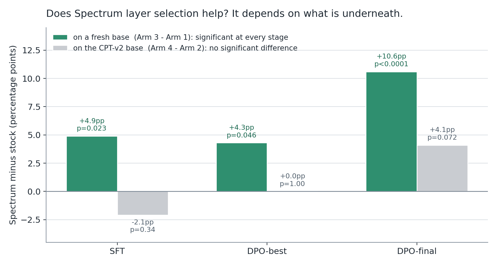

# Does it matter *which* layers you fine-tune?

*Blog 2 of 4 on our Jac code-model experiments.*

Here is a default almost nobody looks at.

When you fine-tune a large language model with LoRA (the cheap technique where, instead of retraining all 30 billion weights, you bolt small trainable matrices onto a handful of them and leave the rest frozen), you have to tell the library how many layers to touch. Our model has 48 decoder blocks. We told `mlx_lm` to use 16, because 16 is what fits.

What we did not know for months is what `num_layers: 16` resolves to. One line decides it:

```python
for l in model.layers[-max(num_layers, 0):]:     # trailing 16 -> blocks 32-47
```

*`mlx_lm/tuner/utils.py:103`, as quoted in `sft_fresh_probe/spectrum/spectrum_lora_layers.py:8`*

The *last* sixteen, blocks 32 to 47, because slicing off the end of a list is the simplest thing a library can do. Every pass rate we had published in this phase sat on that slice.

So we ran the experiment. Same model, same dataset, same hyperparameters, same holdout. Change one thing: *which* sixteen.

## Picking layers by signal, not by position

Arcee AI published a method called [Spectrum](https://github.com/cognitivecomputations/spectrum) that answers the "which sixteen" question by measuring instead of guessing.

Think of a multitrack recording where some tracks are real instruments and some are tape hiss. If you only have time to remix sixteen of them, you want the ones carrying actual music, and the track numbers will not tell you which is which. You have to listen.

Spectrum listens to each weight matrix. Every matrix has a *singular-value spectrum*, a list of numbers describing how much structure it holds along each direction. Pure random noise has a spectrum too, and random matrix theory (specifically Marchenko-Pastur) predicts exactly what it looks like for a matrix of a given shape and scale. That is your hiss floor. Anything above it is structure the model actually learned.

Score each block by how much of its spectral energy sits above the noise floor, rank them, take the top sixteen. On our base model, a 4-bit local copy of Qwen3-Coder-30B-A3B-Instruct, that produces this:

```
[0, 22, 23, 27, 30, 34, 36, 37, 38, 39, 41, 42, 43, 44, 45, 47]
```

Eleven of those sixteen also appear in the trailing slice, so the two sets are not wildly different. The disagreements are the interesting part. Spectrum wants block 0, the very first one, sitting right next to the embeddings, plus blocks 22, 23, 27 and 30 from the middle of the stack the default never touches.

Feeding that list into the trainer comes down to one statement. We wrote a driver that reuses every other line of `mlx_lm`'s function verbatim, so a future upstream change surfaces as a diff instead of being silently overridden:

```python
        # THE ONE CHANGED STATEMENT: explicit indices, not model.layers[-n:]
        for i in ids:
            l = model.layers[i]
            lora_layers = [(k, to_lora(m)) for k, m in l.named_modules() if k in keys]
            if lora_layers:
                l.update_modules(tree_unflatten(lora_layers))
```

*`model-experiments/04-cpt-sft/sft_fresh_probe/spectrum/spectrum_lora_layers.py:271`*

That is the entire intervention. Everything else stayed frozen between the two runs: rank 16, scale 2.0, dropout 0.05, batch size 1, 8200 SFT iterations, learning rate 2e-5, the same 8100-row training set, and the same frozen 855-row holdout, where a task counts as passed only if the generated code runs and produces the right output. Both configurations train exactly 281,837,568 parameters. Placement moves, capacity does not.

## On a fresh base, it wins, and it keeps winning

The first arm took the raw base model with no prior training and ran the full pipeline twice: supervised fine-tuning (SFT, showing the model thousands of correct examples), then DPO (preference tuning, showing it pairs of better and worse answers so it learns which to prefer).


*An ordinary curve, which is the point. Nothing here was won or lost by luck.*

The scores, all on the same 855-row holdout, two-proportion z-test throughout:

| Stage | Spectrum | Trailing-16 default | Δ | p |
|---|---|---|---|---|
| SFT | 74.7% (639/855) | 69.8% (597/855) | +4.9pp | 0.023 |
| DPO, best checkpoint | 74.2% (634/855) | 69.8% (597/855) | +4.3pp | 0.046 |
| DPO, final checkpoint | 72.7% (622/855) | 62.1% (531/855) | +10.6pp | <0.0001 |

Significant at every stage, and the gap *widens* as training goes on. The final-checkpoint number is the loudest: by the end of DPO the default-layer model has degraded ten and a half points below the Spectrum model, on identical preference data and step counts. The only difference was which blocks carried the update.

If you run LoRA on defaults, go find out what your library's slice actually is. It takes five minutes.

## Then we tried it on a base that had already been trained

Blog 1 covers our continual-pretraining experiment (CPT, feeding the model a large pile of raw domain text before any instruction tuning). The short version: CPT-v2 gave a large boost at the base stage that mostly washed out after SFT. We kept the checkpoint.

Layering Spectrum on top of it turned out to be awkward. CPT-v2 was trained on the trailing sixteen; Spectrum wants a different sixteen that overlaps only eleven ways. You cannot load one into the other.

The workaround we built is called union-convert-and-freeze. Attach LoRA adapters to the *union* of both sets, 21 blocks. Load CPT-v2's weights into the five blocks only it cares about and freeze them, so they keep contributing to the forward pass without being retrained, and train only Spectrum's sixteen. Afterwards, merge the frozen five back into every saved artifact so downstream tools see a complete adapter.

It worked. It just didn't help.



| Stage | Spectrum | Trailing-16 default | Δ | p |
|---|---|---|---|---|
| SFT | 70.5% (603/855) | 72.6% (621/855) | -2.1pp | 0.335 |
| DPO, best checkpoint | 71.7% (613/855) | 71.7% (613/855) | 0.0pp | 1.000 |
| DPO, final checkpoint | 69.0% (590/855) | 64.9% (555/855) | +4.1pp | 0.072 |

Slightly negative at SFT and nowhere near significant. An exact tie at DPO-best, the same 613 passing rows on both sides, which was a startling thing to read off two independently trained models. A positive lean at DPO-final that misses the conventional 0.05 bar.


*Four arms, one holdout. The green Spectrum bars beat the grey default bars on the fresh base at every stage. On the CPT-v2 base (orange versus blue), the pattern disappears.*

We have a hypothesis, not a finding. CPT-v2 left a measurable imprint across blocks 32 to 47; our own earlier probe of the adapter weight geometry showed its fingerprint surviving SFT structurally, even after it stopped showing up in the pass rate. Spectrum's non-contiguous picks then have to negotiate with that pre-existing, position-specific adaptation rather than starting clean. Plausible, untested, and flagged as speculation in the internal report too.

## Two bugs worth telling you about

### The model that trained perfectly and came back empty

The first full CPT-v2 Spectrum SFT run (8200 iterations, exit code 0, a completely normal loss curve) produced an adapter where all sixteen trained blocks' weights were *exactly zero*, bit for bit, with no error anywhere.

Our first suspect was `mlx_lm`'s gradient checkpointing, which monkeypatches a method at the class level, suspicious-looking for a converted-then-refrozen setup like ours. An isolated diagnostic run said no: the weights came out fine. We shrugged, called it environmental, and retrained.

The retry reproduced it, but at a different point, which is what cracked it. All ten raw checkpoints written by the trainer were verified nonzero, including the last. The zeros only appeared *after* the post-training merge step. And the eighty frozen keys, which came from CPT-v2's separate adapter file, were perfectly intact. Trained keys dead, frozen keys alive, both in the same output file.

That asymmetry pointed straight at the merge script. `mx.load()` on a safetensors file in MLX returns a *lazy memory map*: the arrays are file handles, not data, until something forces them to materialize. Our script was called with `--in FILE --out FILE`, the same path. Writing the output truncated the very file the loaded arrays were still lazily reading from, so every trained key silently read back as zero. The frozen keys survived because they were mapped from a different file the write never touched.

The fix is one line, and it now carries the longest comment in the file:

```python
    trained = dict(mx.load(str(trained_file)))
    mx.eval(list(trained.values()))  # force materialization NOW: mx.load is a lazy
    # mmap of trained_file, and merge()'s --in/--out are the same path in normal
    # use (in-place merge). Writing out_file before these arrays are evaluated
    # truncates the very mmap they lazily read from -- every trained key comes
    # back as all-zero. This is the actual cause of the cptv2-arm corruption
    # incident (2026-08-02/03): frozen keys, loaded from a *different* file,
    # were always correct; only trained keys -- read from the file being
    # overwritten -- went to zero. Root-caused by comparing an untouched
    # numbered checkpoint (always correct) against the post-merge adapters.safetensors
    # (always zero on trained keys, byte-identical to CPT-v2 source on frozen keys).
```

*`model-experiments/04-cpt-sft/sft_cptv2_probe/spectrum/merge_frozen_keys.py:67`*

If you have a script anywhere that reads a safetensors file with `mlx.core` and writes back over the same path, go check it now.

### DPO ran out of GPU memory on a machine with 37GB free

The preference-tuning dry run died at iteration 7 of 8 with a Metal out-of-memory error while `vm_stat` reported 37GB of free system RAM. DPO holds two full copies of the model at once: the one being trained, and a frozen reference copy it compares against to measure how far preferences have moved. Add roughly 1.9GB of overhead from this arm's 21-block union conversion, and the total cleared macOS's GPU wired-memory ceiling, a separate limit from free RAM that sits near 70-75% of physical memory. Raising it needs `sudo`. Shortening the max sequence length from 512 to 384 does not, so we did that, and the full 250-iteration run finished across all 13 segments with no further OOMs at a 39.8GB peak.

The runner now does that shrinking on its own. Segment size gets halved twice, and only if OOMs survive both does it touch the sequence length, because that is the knob that changes the recipe:

```bash
      if [ "$oom_shrinks" -lt 3 ]; then
        oom_shrinks=$(( oom_shrinks + 1 ))
        if [ "$oom_shrinks" -le 2 ]; then
          SEGMENT_ITERS=$(( SEGMENT_ITERS / 2 )); [ "$SEGMENT_ITERS" -lt 5 ] && SEGMENT_ITERS=5
          echo "!!! OOM-recovery ${oom_shrinks}/3: shrinking DPO_SEGMENT_ITERS to ${SEGMENT_ITERS}" | tee -a "$RDIR/train.log"
        else
          DPO_MAXLEN=384
          echo "!!! OOM-recovery 3/3: dropping DPO_MAXLEN to ${DPO_MAXLEN} (last resort -- flag this deviation in the final report)" | tee -a "$RDIR/train.log"
        fi
```

*`model-experiments/04-cpt-sft/sft_cptv2_probe/run_dpo_spectrum.sh:277`*

Consider this the flag that log line asks for. The CPT-v2 arm's DPO numbers ran at 384 against the fresh arm's 512. Some longer training pairs may have been truncated, and we did not check pair by pair. That is a known limitation of the comparison, stated here rather than buried.

## The open question

We never actually tested "Spectrum plus CPT." We tested "Spectrum bolted onto a CPT run trained on the *other* sixteen blocks, held together by a union and a freeze." The confound and the finding are tangled together.

So there is a fifth arm: re-run continual pretraining itself on Spectrum's picks, then SFT and DPO on the same picks. One continuous sixteen-block lineage from base to CPT to SFT to DPO, with no union, no freeze, and no merge step anywhere, which incidentally removes the whole bug class from the first story rather than one instance of it.

It is built, and it is paused. As of 22:07 EDT on 2026-08-03 it sits one minute into leg 1 of 12, stopped deliberately to free the machine, not by a crash. No checkpoint had been written yet, and the loop re-derives its resume point from disk. All three pre-flight gates passed on the real 30B model first: the layer-rebinding self-test, a two-iteration dry leg peaking at 30.058GB against a ceiling near 36GB, and an end-to-end catastrophic-forgetting check at 16/16.

The reason it is paused is boring. It is slow. Spectrum's picks include block 0, so backpropagation has to traverse all 48 decoder blocks instead of only the trailing 16, measured at 1.59 times slower per iteration than the original CPT run. That is 26 to 30 hours for the pretraining stage alone and 37 to 41 end to end, on one laptop with other work to do.

Until it finishes, what we have is an asymmetry we can state confidently and cannot yet explain. Choosing your LoRA layers by signal-to-noise beats taking the last sixteen, repeatedly and by a growing margin, when there is nothing underneath. Once a continual-pretraining stage is already in the chain, the advantage vanishes. Whether that is because CPT genuinely eats the benefit, or only because our workaround for stacking two different layer sets was never going to work, is what arm 5 exists to find out.
