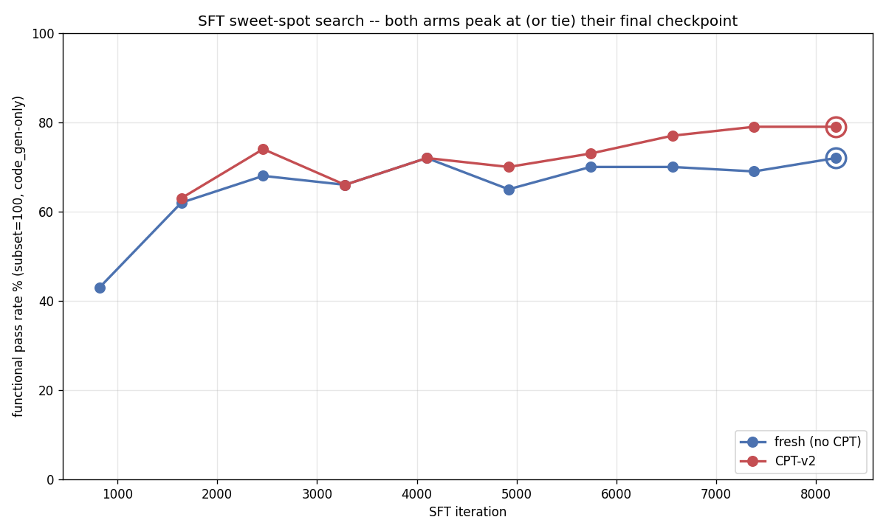
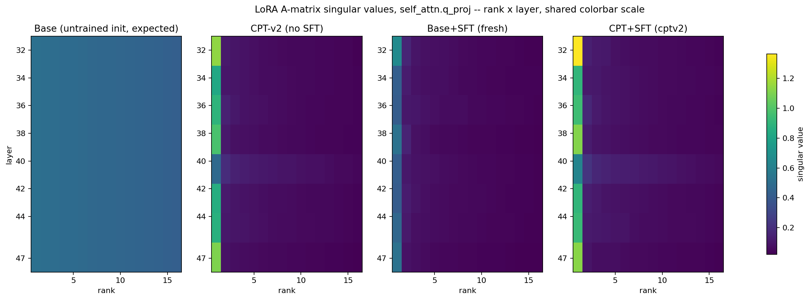

# Does teaching a model your docs first actually help? We ran the control arm

*Blog 1 of 4 on the model work behind Jac Model Studio.*

We maintain Jac, a programming language that no off-the-shelf coding model has ever seen much of. Ask a stock 30B code model to write a Jac component and it writes React. It has read a million TypeScript files and approximately zero Jac files, so it pattern-matches to the nearest thing it knows.

The obvious fix is to fine-tune. The less obvious question, and the one this post is about: before you fine-tune, is it worth spending a day of GPU time pushing the model through your documentation first?

We built the control arm to find out. It helps, dramatically, right up until the moment you do the fine-tuning you were going to do anyway.

## The vocabulary, quickly

Skip ahead if you already fine-tune models. Our base model, meaning the pretrained weights we start from, is Qwen3-Coder-30B-A3B-Instruct, quantized to 4 bits so it fits on one Mac. Retraining all 30 billion of its weights takes a datacenter, so we use LoRA (Low-Rank Adaptation): freeze the original weights and train a small side matrix that gets added to them. Ours is rank 16 on the last 16 of the model's 48 decoder blocks, about 282M trainable parameters instead of 30B. That side matrix is a small file called an adapter.

CPT (continual pretraining) means more training on raw text from your domain, using the same predict-the-next-token objective the model was originally pretrained with. No question-answer pairs, no task format, just prose. The pitch is that it teaches vocabulary and concepts so downstream training starts from a better place.

SFT (supervised fine-tuning) trains on explicit input-output pairs: here is a prompt, here is the correct Jac code. That is the step that teaches the task. DPO (direct preference optimization) trains on a better and a worse answer to the same prompt so the model learns to prefer the better one, and usually runs after SFT to polish style and correctness.

The thing we measure is functional pass rate. We hold out 855 prompts whose answers are code, generate an answer for each, and run it. It compiles and executes, or it doesn't. Nothing gets partial credit from a similarity score or an LLM judge.

## The setup

Our CPT run, CPT-v2, finished on 2026-07-18. It trained on a curated 2,406,676-token corpus, mostly Jac documentation, with 235K tokens of general Python folded in as insurance against the model forgetting how to write ordinary code. Twelve epochs, one cosine learning-rate decay spanning all of them, about 16.4 hours of wall clock. Validation loss fell 43%, from 1.371 to 0.783.

We then rejected it. It failed the evaluation it was built to pass, answering conceptual questions about Jac as well as a retrieval-augmented oracle does, with a 9% win-or-tie rate against a required 50%.

But a checkpoint that fails a semantic benchmark can still be a good foundation for the training that comes after it. So we built two arms. Arm 1 is fresh: unmodified base, then SFT, then DPO. Arm 2 is the same base with the CPT-v2 adapter underneath, then the identical SFT and DPO.

The dataset was frozen and MD5-verified byte-identical across both arms. Holdout, hyperparameters, eval harness, and jaclang version were held constant. Exactly one variable differed.

## Result one: a 37-point head start that doesn't survive


Before any task-specific training, CPT-v2 wins by a mile. The fresh base passes 90 of 855 (10.5%). The CPT-v2 base passes 404 of 855 (47.3%). That is +37.0 percentage points, z ≈ 16.75, a gap you don't need statistics to see. Two million tokens of documentation really did teach the model to write Jac that runs.

Then we ran SFT on both, 8200 iterations each, and the gap mostly vanished.

Fresh finished at 69.8% (597/855), CPT-v2 at 72.6% (621/855). A 2.8-point edge in CPT-v2's favor sounds like a win until you test it. A two-proportion z-test at n=855 gives z ≈ 1.28, p ≈ 0.20, which clears no conventional threshold. It is what sampling noise looks like on a holdout of 855.

Maybe SFT overtrained, and an earlier checkpoint still showed the gap? We had interim evaluations every 820 steps, so we checked all of them.



Fresh peaks at 72% on step 4100 and finishes at 72%. CPT-v2 peaks at 79% on step 7380 and finishes at 79%. Each run ends on its own peak. No better stopping point was hiding in either curve.

A 37-point head start, absorbed almost entirely by 8200 iterations of supervised fine-tuning. We can't prove the residual advantage is zero from one run per arm, but we can't show it's real either.

## Result two: the bug that pretended to be a finding

DPO came next, and both arms fell off a cliff, from roughly 70% down to roughly 12%.

Our first reaction was that DPO had eaten the model, a known failure mode when preference data is thin. So we treated it as a real result and characterized it: we removed the early-stopping gate and ran both arms to the full 250 iterations, with an evaluation snapshot every 20 steps, looking for a dip-and-recover pattern.

There was none. Thirteen consecutive checkpoints, step 20 through step 250, produced the same score within each arm every single time. We tried a more conservative preference-loss setting (β from 0.1 to 0.4, learning rate down to 5e-7) and nothing moved.

We did find a real bug along the way. The DPO data loader called `apply_chat_template(..., add_generation_prompt=True)` on already-complete assistant turns, appending a spurious `<|im_start|>assistant` token to every training sequence. We fixed it in a driver script that swaps the dataset class in before training starts. Because a patch against somebody else's installed package rots quietly, the driver refuses to run once the upstream code stops matching what we patched:

```python
# model-experiments/04-cpt-sft/sft_fresh_probe/dpo_fixed_train.py:127-142
def _assert_upstream_still_buggy() -> None:
    """Fail loudly if the installed package no longer matches what we patched."""
    orig = getattr(_ds, "DPODataset", None)
    if orig is None:
        raise RuntimeError(
            "mlx_lm_lora.trainer.datasets.DPODataset is gone -- this driver's "
            "patch target moved. Re-read the installed source before trusting "
            "any DPO run."
        )
    src = "".join(inspect.getsource(orig.__init__).split())  # strip all whitespace
    if "add_generation_prompt=True" not in src:
        raise RuntimeError(
            "Installed DPODataset no longer passes add_generation_prompt=True. "
            "Upstream may have fixed this -- verify, then DELETE this driver "
            "and go back to `python -m mlx_lm_lora.train`."
        )
```

We verified the fix at the token level, reran, and the model collapsed on exactly the same schedule.

That was the tell. A failure this immediate and this indifferent to everything we changed doesn't look like an optimization problem, because optimization problems have texture and this had none. Something was broken before DPO ever started.

On 2026-08-02 we stopped looking at pass/fail counts and read the generated text. The model was emitting plain React and JSX for a prompt whose SFT training example was unambiguous Jac. It wasn't writing bad Jac, it wasn't writing Jac at all. It read like a model nobody had ever fine-tuned.

Three generations from the same prompt made the cause obvious:

| what we ran | what came out |
|---|---|
| 4-bit base + SFT adapter, loaded separately | correct Jac |
| the `mlx_lm.fuse`'d SFT checkpoint, no adapter | plain React/JSX |
| 4-bit base, no adapter, no fusing | plain React/JSX |

`mlx_lm.fuse` bakes a LoRA adapter into base weights by dequantizing the 4-bit weights to full precision, adding the LoRA delta, and requantizing back to 4 bits. Our SFT delta was small and fine-grained relative to the 4-bit quantization grid, so requantization rounded almost all of it away. At the bit level about 15% of packed 4-bit elements changed. In what the model wrote, nothing did.

Our DPO pipeline fused the SFT adapter into the weights before starting DPO. Four lines of setup, run once, before anything interesting happened:

```bash
# model-experiments/04-cpt-sft/sft_fresh_probe/run_dpo_fixed.sh:79-82
echo ">>> fuse SFT adapter -> $SFT_FUSED"
if [ -f "$SFT_FUSED/config.json" ]; then echo "  reuse $SFT_FUSED"; else
  mlx_lm.fuse --model models/qwen-q4 --adapter-path "$SFT_ADAPTER" --save-path "$SFT_FUSED"
fi
```

Every DPO invocation downstream then passed `--model "$SFT_FUSED"`. So every DPO run in that phase, across both arms and every hyperparameter variant including the one with the chat-template fix, had trained on top of an effectively un-fine-tuned base. The "collapse" was DPO doing its job correctly on a policy that had already been wiped.

The fix was to delete the fuse step. We now train DPO directly against the raw quantized base and seed the DPO adapter from the SFT adapter with `--resume-adapter-file`, so the SFT delta stays in float where it survives:

```bash
# model-experiments/04-cpt-sft/sft_fresh_probe/run_dpo_nofuse.sh:138-146
    # First real segment -- seed from the SFT adapter, not from scratch.
    python "$DRIVER" --model "$BASE_MODEL" --train --data model-experiments/04-cpt-sft/sft_fresh_probe/dataset/dpo \
      --train-mode dpo --config model-experiments/04-cpt-sft/sft_fresh_probe/configs/dpo_lora.yaml \
      --adapter-path "$DPO_ADAPTER" --train-type lora --num-layers 16 --grad-checkpoint \
      --batch-size 1 --max-seq-length "$DPO_MAXLEN" --iters "$SEG_ITERS" \
      --resume-adapter-file "$SFT_ADAPTER/adapters.safetensors" \
      --learning-rate "$DPO_LR" --beta "$DPO_BETA" --dpo-cpo-loss-type sigmoid \
      --steps-per-report 5 --steps-per-eval "$SEG_ITERS" --val-batches "$DPO_VAL_BATCHES" --save-every "$SEG_ITERS" \
      > "$RDIR/.segment.log" 2>&1 &
```

`$BASE_MODEL` there is `models/qwen-q4`, the untouched 4-bit base. Corrected numbers:

| Arm | SFT baseline | DPO best | DPO final (step 250) |
|---|---|---|---|
| fresh | 69.8% (597/855) | 69.8% (597/855, step 20) | 62.1% (531/855) |
| CPT-v2 | 72.6% (621/855) | 71.7% (613/855, step 40) | 64.9% (555/855) |

No collapse. DPO's best checkpoint ties SFT exactly in the fresh arm and lands 0.9 points below it in the CPT-v2 arm, both well within noise. Running DPO to its full budget costs about 8 points in both arms, so at this recipe and 654 preference pairs it is mild overfitting rather than catastrophe, and it doesn't beat plain SFT.

The lesson: when a result is too clean, when there's no variance and nothing you change moves it, stop analyzing the numbers and go read what the model actually wrote. Ten days sat between the first "collapse" chart and the root cause.

## Result three: CPT leaves a fingerprint the benchmark can't see

That fix cleared the DPO stage but didn't change the CPT verdict, which never involved a fused checkpoint. So we asked a different question: if SFT erases CPT-v2's behavioral advantage, does it erase CPT-v2 entirely, or does the adapter trained on top of CPT-v2 still look different inside?

We took the singular value decomposition of the LoRA matrices at `self_attn.q_proj` across layers 32-47, for three adapters: CPT-v2 alone, the fresh-base SFT adapter, and the CPT-v2-base SFT adapter. SVD splits a matrix into directions ordered by how much of it they explain. We wanted to know how concentrated each update is, measured as stable rank: near 1 means one direction dominates, near 16 means it spreads evenly across the full rank-16 budget.

The full weight update per layer is a large dense matrix, and we never have to build it. A LoRA update factors as ΔW = P @ Q with P thin, and a QR decomposition of P leaves the singular values untouched, so the SVD runs on a 16-row matrix instead. The probe checks that identity against a dense SVD before it opens a single checkpoint:

```python
# model-experiments/04-cpt-sft/lora_svd_qproj.py:64-75
def lowrank_singular_values(P: np.ndarray, Q: np.ndarray) -> np.ndarray:
    """Singular values of P @ Q, P: (in, r) with in >= r, Q: (r, out)."""
    Qp, R = np.linalg.qr(P)
    return np.linalg.svd(R @ Q, compute_uv=False)


def _selftest():
    rng = np.random.default_rng(0)
    P, Q = rng.normal(size=(64, 5)), rng.normal(size=(5, 40))
    got = lowrank_singular_values(P, Q)
    want = np.linalg.svd(P @ Q, compute_uv=False)[:5]
    assert np.allclose(got, want, atol=1e-8), f"low-rank SVD trick mismatch: {got} vs {want}"
```



All three trained adapters are rank-1 dominated, stable rank 2.7 to 6.0 out of 16, the normal signature of a trained LoRA. An untrained random initialization sits at essentially full stable rank, which is the uniform leftmost panel above and the flat gray line below.


Two patterns hold across all eight sampled layers. The fresh-base SFT adapter is consistently less concentrated (stable rank 4.4 to 6.0) than either adapter with CPT-v2 in its lineage (2.7 to 4.3). And the CPT-v2-base SFT adapter tracks the standalone CPT-v2 adapter closely, while the fresh SFT adapter sits apart from both. At layer 47, stable rank runs 2.70 for CPT-v2 alone, 2.83 for SFT-on-CPT-v2, and 4.42 for SFT-on-fresh. The dominant direction's magnitude splits the same way: 1.10, 1.13, and 0.53.

SFT on top of CPT-v2 produces a weight update shaped like CPT-v2's, not like a from-scratch SFT update. The convergence between the two arms is behavioral, not mechanical: both models reach the same pass rate by different internal routes, and one route was visibly inherited from CPT.

It's an interesting result and, for now, a useless one. We have no evidence the fingerprint predicts anything, and we only checked one projection type out of eight, at one stage of training.

## What we do with this

For our pipeline, the recommendation is to skip CPT. A fresh base run through the identical SFT recipe lands statistically indistinguishable from the CPT arm, and CPT-v2 cost 6528 training iterations over roughly 16 hours, plus a corpus curation pass and twelve per-leg regression checks, to produce an advantage that SFT reproduces on its own. If you have curated domain text and are choosing where to spend, spend it on SFT data.

That verdict is scoped to this recipe and this dataset size. 9608 SFT examples is a lot of supervision for a language as small as Jac. With a tenth of that, CPT's head start might well still be visible at the end. We didn't test it.

The next post changes a different variable: which layers the LoRA trains on. That one produced a result we did not expect.

---

*All numbers come from `model-experiments/04-cpt-sft/` in our repo: `RESULTS.md` for the consolidated table, `docs/reports/2026-07-cpt-vs-fresh-comparison.md` for the statistical write-up, the fuse-bug investigation, and the SVD probe.*
