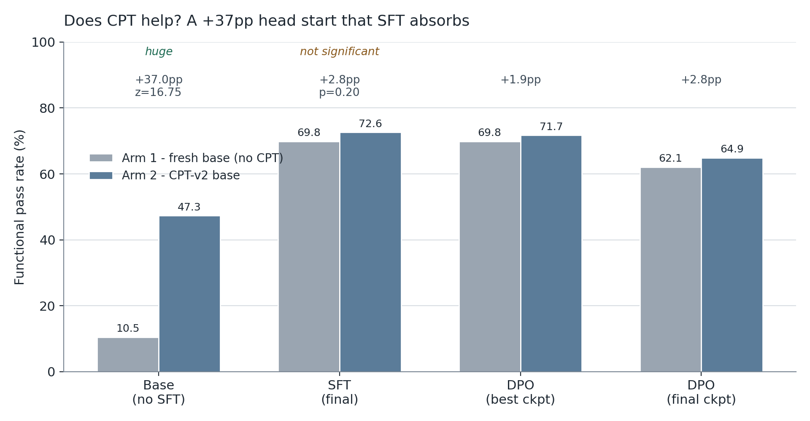
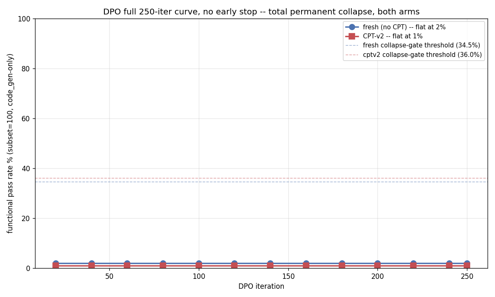
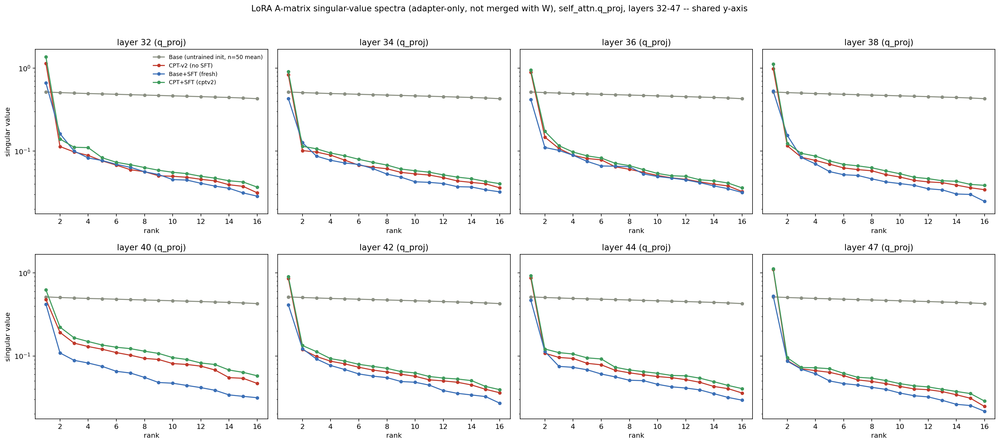
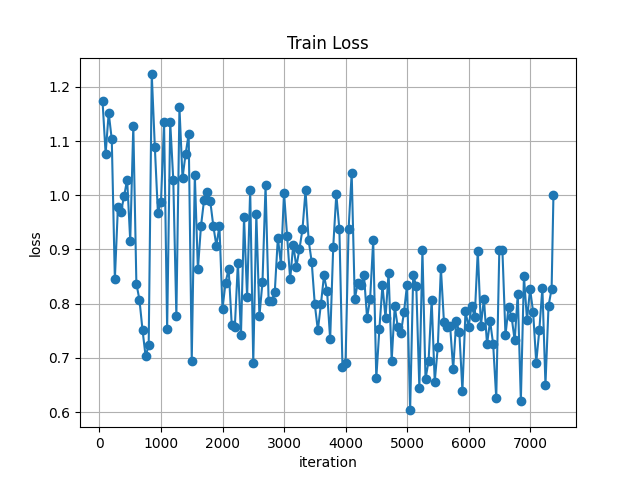
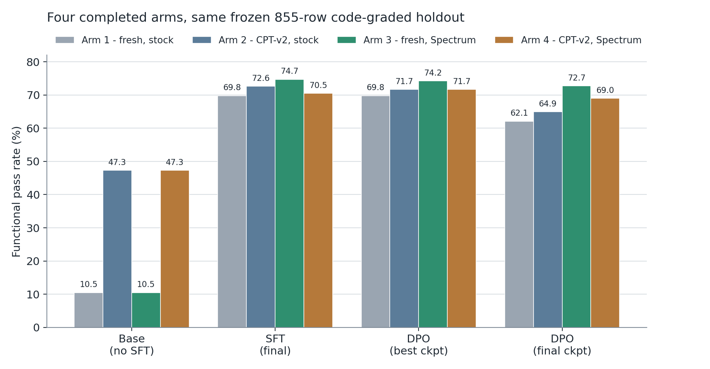
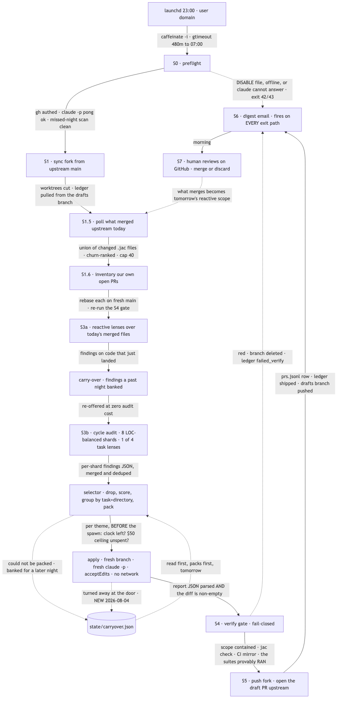
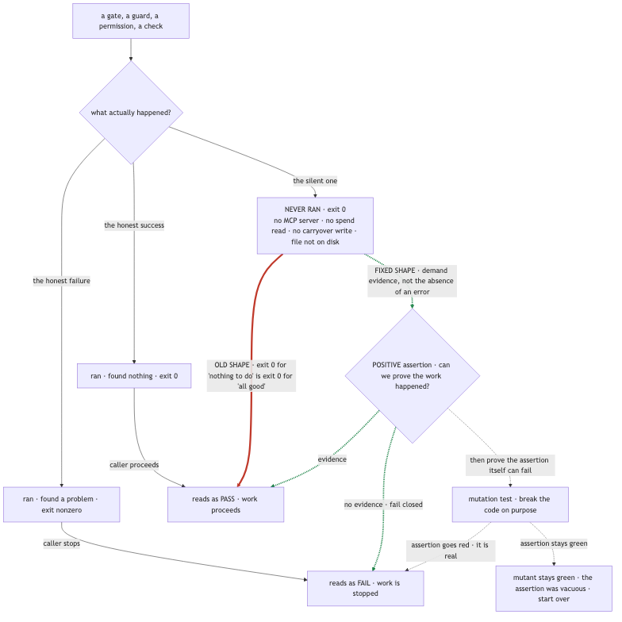
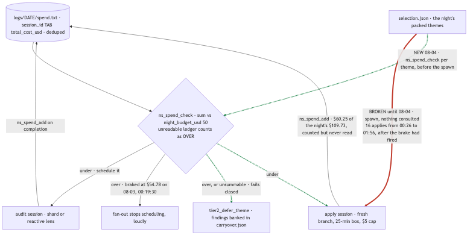
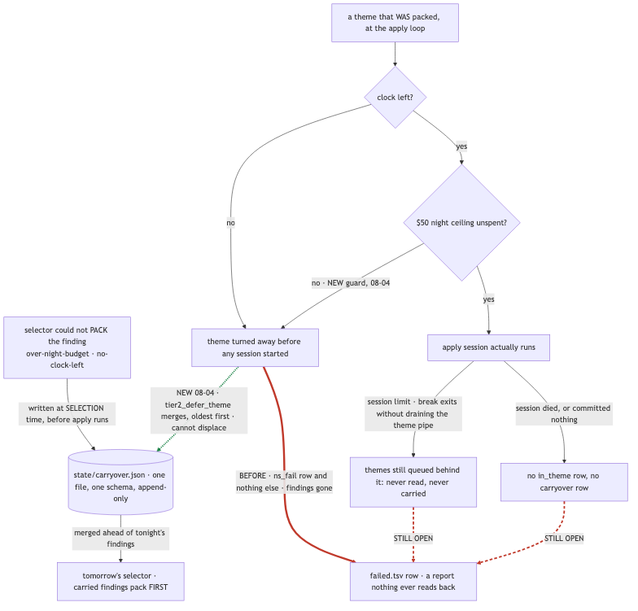

# Teaching a 30B Model to Write Jac

**CPT → SFT → DPO, and where the LoRA should live**

Ayush · Jaseci Labs · August 2026
Base model: Qwen3-Coder-30B-A3B-Instruct · Apple Silicon · MLX

> This is the readable companion to `slides.tex` / `slides.pdf`. One section per slide,
> same order, with every figure inlined. Every number traces to a file in this repo —
> primary sources are listed at the bottom.

---

## Slide 1: Title

Teaching a 30B model to write Jac — a language with essentially no presence in any
pretraining corpus.

Two halves to this work:

1. **The experiments** — a controlled study of the fine-tuning pipeline (CPT → SFT → DPO)
   and of one unexamined default inside it (which layers the LoRA adapter targets).
2. **The product** — Jac Model Studio (JMS), the desktop workbench the experiments run through.

---

## Slide 2: Agenda

**Part 1 — the experiments**

- What we are training, and how
- Does continual pretraining (CPT) help?
- Two engineering incidents worth the retelling
- Does smarter LoRA layer selection help?
- Five arms, one table — and the open question

**Part 2 — the product**

- Jac Model Studio (JMS): what is built
- Recent work and what is next

**Close**

- Takeaways and next steps

---

## Slide 3: The setup

*One model, one frozen dataset, one frozen holdout.*

**Model**

- **Qwen3-Coder-30B-A3B-Instruct** — a 30-billion-parameter mixture-of-experts model with
  roughly 3B parameters active per token.
- 4-bit quantized, ~16 GB on disk. Trained with LoRA adapters on a single 48 GB Apple
  Silicon machine — LoRA is the only reason a 30B model trains here at all.

**Goal**

- Generate **Jac**. Because Jac barely appears in any pretraining corpus, the untrained
  base model scores **10.5%** on our holdout — this is close to a from-scratch problem.

**Data (generated once, then frozen)**

- 9,608 SFT rows / 826 DPO preference pairs, built by an earlier datagen phase with 0%
  contamination against the holdout.
- Every experimental arm trains on MD5-identical copies, so cross-arm comparisons are exact.

**Metric**

- **Functional pass rate**: the generated code actually compiles *and* runs. No LLM-as-judge,
  no BLEU — a row passes only if the Jac compiler and runtime agree.
- Same frozen **855-row** code-graded holdout for every arm at every stage.

---

## Slide 4: The pipeline

*Three stages, each answering a different question.*

- **CPT — continual pretraining.** Keep pretraining the base model on raw Jac docs, papers
  and blogs. Teaches the model the *language*, not the task. No prompts, no answers — just
  more reading.
- **SFT — supervised fine-tuning.** Show it prompt/answer pairs. Teaches the *task*: given
  this request, produce this Jac.
- **DPO — direct preference optimization.** Show it good-vs-bad answer pairs. Teaches *taste*
  — prefer this output over that one.

SFT is the workhorse: on its own it moves the model from single digits to ~70–75%.


---

## Slide 5: Two variables, five arms

Two independent variables, five arms covering the combinations that matter:

|                                     | **Trailing-16** (blocks 32–47) | **Spectrum picks** (SNR-chosen) |
|-------------------------------------|--------------------------------|----------------------------------|
| **No CPT** (fresh base)             | Arm 1                          | Arm 3                            |
| **CPT-v2** (trained on trailing-16) | Arm 2 (incumbent)              | Arm 4 (union/freeze)             |
| **CPT on Spectrum's picks**         | —                              | **Arm 5 (paused)**               |

- LoRA only adapts **16 of the model's 48 decoder blocks**. `mlx_lm`'s default silently takes
  the *last* 16 — a default nobody in this project had ever measured.
- Everything else is held byte-identical: rank 16, scale 2.0, dropout 0.05, 281,837,568
  trainable parameters. **Placement changes; capacity does not.**

---

## Slide 6: Question 1 — does CPT help?



| Stage           | Arm 1 (fresh) | Arm 2 (CPT-v2) | Δ        | Significant?          |
|-----------------|---------------|----------------|----------|-----------------------|
| Base (no SFT)   | 10.5% (90)    | 47.3% (404)    | **+37.0pp** | Yes, overwhelmingly (z≈16.75) |
| SFT (final)     | 69.8% (597)   | 72.6% (621)    | +2.8pp   | **No** — z≈1.28, p≈0.20 |
| DPO (best ckpt) | 69.8% (597)   | 71.7% (613)    | +1.9pp   | No                    |
| DPO (final)     | 62.1% (531)   | 64.9% (555)    | +2.8pp   | No                    |

Reading it honestly:

- The three deltas are **not the same kind of fact**. +37pp is a fact; +2.8pp is a direction.
- p≈0.20 does not mean "no effect" — it means a single holdout at n=855 cannot distinguish
  a small real effect from sampling noise. Repeated seeds were explicitly out of scope.
- CPT-v2 had already been **rejected** on its own acceptance bar before this phase started:
  12 training legs, all passing catastrophic-forgetting checks 16/16, but the semantic
  ceiling it was built to move never moved.
- Practically: if the deliverable is *base → SFT*, CPT is not earning its upstream cost.

Statistical convention throughout this project: the two-proportion z-test,
z = (p₁−p₂) / √(p_pool·(1−p_pool)·(1/n₁+1/n₂)), p_pool = (x₁+x₂)/(n₁+n₂).

---

## Slide 7: Incident 1 — `mlx_lm.fuse` was quietly deleting the training

**The symptom.** Every DPO run "collapsed" to ~12%. Immediate, total, identical across two
independent arms, and flat across all 13 checkpoints of a 250-iteration run.



**The tell.** A failure that uniform, that immediate, and that immune to hyperparameter
changes (β, learning rate, a separate chat-template fix) is not a hard optimization problem.
Reading raw generations confirmed it: the model was not writing *bad* Jac — it was writing
plain React/JSX, indistinguishable from the untouched base model.

**Root cause.** The pipeline fused the SFT LoRA delta into the 4-bit base before DPO.
`mlx_lm.fuse` dequantizes the int4 weights, adds the delta, then **re-quantizes** — and
re-quantization rounded the fine-grained SFT delta away almost entirely. Every DPO run in
that phase had been training on top of an effectively un-SFT'd base.

**Fix.** Never fuse. Train DPO directly against the raw quantized model, seeding the DPO LoRA
from the SFT adapter via `--resume-adapter-file`.

**Corrected result.** DPO does not collapse. At this recipe (β=0.1, lr=1e-6, 654 pairs) its
best checkpoint ties SFT in the fresh arm exactly (597/855) and lands 0.9pp below it in the
CPT arm — and running to the full 250-iteration budget regresses both arms by ~8pp. So DPO
caps out at SFT parity here; more preference data is the leading hypothesis for why.

---

## Slide 8: Structural vs. functional — CPT's fingerprint survives

If SFT erases CPT *behaviourally*, does it erase it *mechanically*? A singular-value probe on
the `q_proj` LoRA updates says no.


- **CPT+SFT** tracks the standalone **CPT** adapter closely — same rank-1 dominance, same
  magnitude.
- **Fresh SFT** sits clearly apart: its update is more spread across the rank budget, with
  roughly half the rank-1 magnitude.
- Stable rank at layer 47: **2.70** (CPT-v2 alone) / **2.83** (CPT+SFT) / **4.42** (fresh SFT).
  Rank-1 magnitude: 1.10 / 1.13 / 0.53.
- The untrained reference sits at essentially full stable rank (~16, flat spectrum), exactly
  as random noise should.



**Reading:** two differently-shaped weight updates reach a statistically indistinguishable
pass rate. The convergence is behavioural, not mechanistic — CPT-v2's structural fingerprint
is still measurable after SFT even though its functional advantage is not.

---

## Slide 9: What is "Spectrum"?

Arcee AI's signal-to-noise layer selection, in plain terms:

1. Take a weight matrix. Look at its singular values — how much "structure" it carries in each
   direction.
2. Random matrix theory (the **Marchenko-Pastur** law) tells you exactly what that spectrum
   would look like if the matrix were **pure noise** of the same shape and scale: a bulk
   supported on a known interval.
3. Anything *above* that noise floor cannot be explained by chance. It is learned structure.
   The ratio of above-edge energy to in-bulk energy is the per-matrix signal-to-noise ratio.
4. Rank every decoder block by that ratio and train the top ones.

**The intuition:** instead of *guessing* that the last 16 blocks matter most, *measure* which
16 actually carry signal.

Spectrum's picks for this model (computed once, then frozen):

```
[0, 22, 23, 27, 30, 34, 36, 37, 38, 39, 41, 42, 43, 44, 45, 47]
```

Only **11 of 16** overlap the trailing slice — and it includes **block 0**, right next to the
embeddings. That single fact drives the whole cost story for Arm 5.

One deliberate deviation: Arcee's published results come from full-parameter unfreezing of
high-SNR modules. This probe reuses only the *selection signal* and keeps the existing LoRA
recipe, so exactly one variable changes.

---

## Slide 10: Question 2a — Spectrum on a fresh base (a clean win)

| Stage     | Spectrum (Arm 3) | Stock (Arm 1) | Δ          | p        | Significant? |
|-----------|------------------|---------------|------------|----------|--------------|
| SFT       | **74.7%** (639)  | 69.8% (597)   | **+4.9pp** | 0.023    | **Yes**      |
| DPO-best  | **74.2%** (634)  | 69.8% (597)   | **+4.3pp** | 0.046    | **Yes**      |
| DPO-final | **72.7%** (622)  | 62.1% (531)   | **+10.6pp**| <0.0001  | **Yes**      |

- Significant at **every** stage, and the margin **grows** as training proceeds.
- Same capacity, same recipe, same data — only *where* the adapter sits changed.
- The trailing-16 default was leaving real capability on the table across this whole phase.



---

## Slide 11: Question 2b — Spectrum on top of CPT (an honest null)

| Stage     | Spectrum (Arm 4) | Stock (Arm 2) | Δ       | p        | Significant? |
|-----------|------------------|---------------|---------|----------|--------------|
| SFT       | 70.5% (603)      | 72.6% (621)   | −2.1pp  | 0.335    | No           |
| DPO-best  | 71.7% (613)      | 71.7% (613)   | 0.0pp   | 1.000    | No (exact tie) |
| DPO-final | 69.0% (590)      | 64.9% (555)   | +4.1pp  | 0.072    | Marginal, not <0.05 |

No stage clears p<0.05. One stage is even mildly negative. Reported as-is rather than spun.

**Why this arm is not a fair test.** CPT-v2 had trained blocks 32–47. Spectrum wants a
*different*, non-contiguous 16. Bolting one onto the other required a workaround: convert the
21-block **union** of the two sets, load CPT-v2 into all of them, **freeze** the 5 CPT-only
blocks, train the 16 Spectrum picks, then merge the frozen 5 back into every saved artifact.

That union/freeze machinery is a **confound**, not just added complexity — CPT trained on one
layer set while SFT/DPO trained on a different, only-11/16-overlapping set. It is exactly what
Arm 5 exists to remove. (It also cost ~1.9 GB of extra conversion overhead, which pushed DPO
over this machine's GPU wired-memory ceiling and forced a shorter max sequence length of 384
instead of 512 — a recipe deviation worth flagging honestly.)

---

## Slide 12: The asymmetry, in one picture


Spectrum is a real lever **when there is no prior adaptation to work around**. On this
evidence it is not a reliable lever once a CPT stage has already reshaped the same layer range.

One plausible (unproven) explanation: on a fresh base, Spectrum's 16 picks are the *only*
adaptation happening, so a better-chosen set has clean room to matter. On the CPT-v2 base, the
model already carries a real, block-position-specific CPT delta across 32–47 — which the
non-contiguous picks then have to interact with rather than starting from a blank slate.
That is flagged as a hypothesis for a future probe, not a conclusion this comparison tests.

---

## Slide 13: Incident 2 — a lazy memory-map silently zeroed a trained adapter

**The symptom.** An 8,200-iteration training run finished clean: exit 0, normal loss curve,
all ten numbered checkpoints written. Every trainable LoRA weight then loaded back as
**exactly zero** — both `lora_a` and `lora_b`, bit for bit. No exception, no warning.

**A false lead, ruled out.** The first hypothesis was `mlx_lm`'s gradient-checkpointing
monkeypatch, which rebinds `__call__` at the class level. An isolated diagnostic with identical
code and config did not reproduce the zeros. Hypothesis dead; the retry reproduced the bug
anyway, but at a different point.

**The diagnostic that cracked it.** The raw per-checkpoint files were individually verified
*nonzero* at all ten checkpoints. Only after the post-training merge step did the merged
adapter come back zeroed — and only its **trained** keys. The 80 **frozen** CPT-v2 keys were
fine. Frozen keys were loaded from a different file; trained keys came from the file the merge
step overwrote in place.

**Root cause.** `mx.load()` on a safetensors file returns a **lazy memory map** — the arrays
are not materialized until something reads them. The merge script was called with
`--in FILE --out FILE`: writing the output truncated the very mmap the loaded arrays were
still lazily reading from.

**The fix — one line:**

```python
trained = dict(mx.load(str(trained_file)))
mx.eval(list(trained.values()))   # materialize BEFORE any write can truncate the mmap
# ...then write
```

All ten archived checkpoints were re-merged from the clean raw files and verified. The DPO run
later exercised the same code path and came back clean first try.

**Generalizable MLX gotcha:** never read a safetensors file with `mx.load()` and overwrite the
same path without an `mx.eval()` in between.

---

## Slide 14: Four completed arms, side by side



| # | Arm                          | CPT           | SFT/DPO layers        | Base  | SFT   | DPO-best | DPO-final | Status |
|---|------------------------------|---------------|-----------------------|-------|-------|----------|-----------|--------|
| 1 | fresh, stock                 | none          | trailing-16           | 10.5% | 69.8% | 69.8%    | 62.1%     | Done   |
| 2 | CPT-v2, stock (incumbent)    | trailing-16   | trailing-16           | 47.3% | 72.6% | 71.7%    | 64.9%     | Done   |
| 3 | fresh, Spectrum              | none          | Spectrum picks        | 10.5% | **74.7%** | **74.2%** | **72.7%** | Done   |
| 4 | CPT-v2, Spectrum             | trailing-16   | picks (union + freeze)| 47.3% | 70.5% | 71.7%    | 69.0%     | Done   |
| 5 | CPT-Spectrum, clean chain    | Spectrum picks| Spectrum picks        | TBD   | TBD   | TBD      | TBD       | **Paused** |

Best result to date: **Arm 3 — fresh base + Spectrum layer selection, 74.7% after SFT.**
All arms scored on the identical frozen holdout, so every number is directly comparable.

---

## Slide 15: What is ahead — Arm 5

**The open question.** Was Arm 4's null caused by the union/freeze **confound** — CPT trained
on one layer set, SFT/DPO on another — or does Spectrum genuinely stop helping once *any*
CPT-style adaptation is in the chain?

**The design.** Re-run CPT itself on Spectrum's exact picks, so CPT → SFT → DPO is one
continuous 16-block lineage. No union, no freeze, **no merge step anywhere** — which removes
the entire Incident-2 bug class rather than just that one instance of it.

**Current status: paused, cleanly, resumable.** Not a crash — an intentional stop to write up
the phase and free the GPU.

- Driver tree and downstream tree fully built; 5 pre-existing bugs found and fixed in the old
  CPT orchestration code (stale paths, an off-by-one root resolution, and a hardcoded output
  dir that would have silently overwritten CPT-v2's own historical evidence). All 65 existing
  plus 5 new tests pass.
- All three pre-flight gates passed on the real 30B model: layer verification (48
  `LoRASwitchLinear`, exact 281.838M trainable params), a 2-iteration dry leg at **30.058 GB**
  peak memory (~6 GB under this machine's ceiling — the single biggest risk in the plan), and
  an end-to-end forgetting check at 16/16.
- The real run was launched, leg 1 of 12 started cleanly, then stopped ~1 minute in, before
  any checkpoint was written.

**Honest budget.** Spectrum's picks include block 0, so backprop must traverse all 48 decoder
blocks instead of the trailing 16 — a measured **1.59× slowdown**. That is ~26–30 hours for the
12-leg CPT stage alone, ~37–41 hours end to end including SFT, DPO and evals. The loop is
resumable by construction: an interruption costs at most the in-flight leg (~2.2h).

If the forgetting-check stop-loss gate fires before leg 12, that is a **reportable finding**,
not a failure to work around — CPT-v2 never triggered it, and block 0 sits right next to the
embeddings.

---

## Slide 16: Jac Model Studio (JMS)

*The other half: a local ML workbench, written entirely in Jac.*


- **Full-stack Jac** — 34 server modules (`.sv.jac`), 65 client components (`.cl.jac`),
  ~29k lines total. Runs as a native desktop webview with the API in-process; no browser
  required. It replaced a deleted FastAPI + Next.js app.
- **Two surfaces** behind one router: the *Experiments* lab (chat, data, train, evals,
  results, cloud, plus CPT and RL sections) and the *JMS* product pipeline —
  **sources → generate → curate → train → eval/chat**.
- **Job engine** (`jobs.sv.jac`): detached subprocesses, a heavy-GPU lock, and job state
  written to disk as the source of truth so runs survive a server restart.
- **Grounded AI assistant** (`assistant.sv.jac`, the second-largest server module): unified
  MLX / Claude / OpenAI provider listing, encrypted per-user API keys, a full-app-state
  context bundle (workspaces, projects, runs, evals, cloud digest), SSE streaming, and
  agentic navigate/train/eval/settings actions. A local Gemma 3 4B (4-bit) slot loads in ~3s.
- Graph-persistent (object-spatial nodes/edges → SQLite), per-user roots, JWT auth, plus a
  full Spheron cloud-GPU lifecycle (search offers, deploy, SSH keys, terminate).

---

## Slide 17: JMS — recent work and what is next

**Recent (July–August 2026)**

- One design system replacing 5 dormant themes and a dead 7-theme switcher: light/dark only,
  glass overlays, a single accent colour. (The July mesh-gradient glass look was deliberately
  flattened in late July.)
- **Workspaces** group projects; the Experiments side seeds one per research phase
  (01 SFT/DPO, 02 RL/GRPO, 03 CPT, 04 CPT-SFT).
- Assistant matured: streaming, persistent history, markdown with GFM tables, agentic actions.
- Accessibility and robustness pass: command palette (⌘K), keyboard shortcuts, focus traps,
  toasts, job watch.

**The live verification sweep (August 2026)**

- ~20 scripted headless-browser sessions: 48 experiment screens (4 workspaces × 6 tabs × 2
  themes), the JMS landing plus 5 pipeline stages in both themes, 6 overlays, 4
  destructive-confirm sites, 8 cold starts, and a 234-action endurance run per theme.
- **Zero console errors, zero uncaught page errors, zero 4xx/5xx** across the whole sweep.
- Cold start **336–347 ms** to interactive across 8 fresh contexts.
- Focus traps held on 5 overlays with zero escapes (24–98 tab presses each). 11 of 13 tracked
  fixes fully verified.

**Next**

- Wire the confirm-reset hook into the irreversible cloud-VM terminate action; finish the
  remaining ARIA disable-reason hints.
- Exercise the deliberately-untested paths end to end: a real local model load (file-descriptor
  recovery plus lock release), the Claude-dependent success paths, and a provisioned cloud VM.
- Longer horizon: cloud dispatch and real log parsers for non-MLX backends, a dynamic section
  registry, and per-user workspace isolation.

---

## Slide 18: Takeaways

- **SFT is the workhorse.** It takes this model from 10.5% to ~70–75%. Everything else is a
  modest edit on top of that.
- **CPT's gift gets absorbed.** A +37pp head start on the raw model becomes a statistically
  invisible +2.8pp once SFT lands — though its *structural* fingerprint is still measurable in
  the weight geometry.
- **Unexamined defaults cost real points.** Simply moving the LoRA to SNR-chosen blocks bought
  +4.9pp at SFT and +10.6pp at DPO-final, at zero extra capacity or training cost.
- **But the same lever failed on a different base.** Reported as a null rather than buried —
  and Arm 5 is designed specifically to find out why.
- **Two silent-failure bugs, both in the measurement path, not the science.** A re-quantization
  that erased a trained delta, and a lazy memory-map that zeroed an entire adapter. Neither
  raised an error. Both changed conclusions.
- **Design out the bug class, not the bug.** Arm 5 has no merge step at all, so Incident 2
  cannot recur there.

---

## Slide 19: Next steps

**Experiments**

1. Resume Arm 5's 12-leg CPT run (~26–30h, resumable in chunks across sessions).
2. Run its SFT (~3.3h) and DPO (~1.2h) stages plus their evals.
3. Publish the three-way report: six z-tests, Arm 5 vs Arms 2 and 4 at each of SFT, DPO-best
   and DPO-final — with the conclusions pre-committed in the plan *before* the numbers land,
   so the reading is not chosen after the fact.
4. Open follow-ups: more preference data for DPO (654 training pairs is thin, and higher β has
   already been tested and ruled out as the lever), and whether the SVD fingerprint holds
   beyond `q_proj`.

**JMS**

1. Close the remaining must-fix and should-fix items from the verification sweep.
2. Cover the deliberately-untested paths end to end.
3. Longer horizon: non-MLX training backends, a dynamic section registry, per-user workspace
   isolation.

---

# Part 2 — NightShift

*An autonomous overnight agent harness — and the night it taught us what a ceiling isn't.*

> A second, separate project. All figures below are measured from the harness's own
> artifacts (`dataset/*.jsonl`, `logs/<date>/spend.txt`) unless stated otherwise, as of
> 2026-08-04.

---

## Slide 20: Part 2 divider — NightShift

The deck switches projects here. Part 1 was a controlled fine-tuning study; Part 2 is an
autonomous coding-agent harness that runs unattended overnight against a large Jac codebase.

The two halves share one habit of mind — distrust of measurements that cannot fail — but
nothing else. Nothing in Part 2 depends on Part 1.

---

## Slide 21: What NightShift is, and why it exists

**The problem.** `jaseci-labs/jac` is roughly **365,000 lines** of Jac across eleven packages,
with a compiler written in the language it compiles. A codebase that size accumulates a
specific kind of debt nobody is ever paid to fix: dead code with no remaining caller,
abstractions that were right two refactors ago, public archetypes with no test touching them,
small maintenance rot every reviewer notices and nobody files. It is real work, it is
unglamorous, and it loses every prioritisation argument it is ever in.

It is also, unusually, work an agent can do well: each item is small, local, mechanically
verifiable, and independently shippable as its own pull request. What it is *not* is work
anyone wants to supervise turn by turn.

**What NightShift does.** It runs a fleet of headless Claude Code sessions against the target
repository between **23:00 and 07:00**, unattended, and leaves draft pull requests open
upstream by morning. It audits the repo through one of four rotating lenses, selects which
findings are worth spending a session on, gives each selected group its own branch and its own
fresh agent, then puts every resulting branch through a **local replica of the project's CI**
— the CI a fork PR cannot actually reach — and throws away anything that does not go green.

What survives is pushed and opened as a **draft** PR. It never marks a PR ready for review and
never merges: `ns_gh_write` refuses `pr ready` and `pr merge` outright. A human merges, or
nobody does. The morning job is review, not dispatch.

**The design constraint that shapes everything downstream:** the harness is unsupervised, so
every stage has to be safe when it is wrong — and, the thing this half of the deck is really
about, every stage has to be *honest about not having run*.

---

## Slide 22: The pipeline, end to end



Stages `S0`–`S6` run nightly and unattended; `S7` is the human loop. There is deliberately no
`S2`: the tier-1 deterministic autofix stage was retired 2026-07-30 (a formatting-only PR was
noise, and a repo-wide one was unmergeable against ~259 pre-existing violations on main). The
numbering keeps the gap so that every log line and spec reference written before that date
still reads true.

**Entry.** `launchd` fires at 23:00 in the user domain and directly executes
`bin/nightshift.sh run`. `caffeinate -i` keeps the machine awake; `gtimeout 480m` is a hard
wall-clock ceiling in lockstep with `[budgets].wallclock_min = 480`, so the 23:00–07:00 window
is enforced twice by two mechanisms that cannot silently disagree.

**S0 — Preflight.** Takes a `mkdir` lock, checks for the `~/.nightshift/DISABLE` kill file,
resolves every binary it will need by absolute path (`jac`, the target repo's dev `jac`,
`claude`, `gh`, `git`), confirms `gh` auth and network, and proves Claude answers by sending a
literal `pong` probe. It also scans for missed nights, distinguishing "launchd fired and the
run died" from "launchd never fired at all" — two very different failures that used to look
identical.

**S1 — Sync.** Syncs the fork from upstream main, refuses to proceed if main has diverged, cuts
the worktrees, prunes shipped or rejected branches older than 14 days, and pulls the finding
ledger down from the drafts branch.

**S1.5 — Merge poll (agent-free).** Asks `gh` which of our PRs merged upstream since the last
successful poll, and builds the union of files they changed — `.jac` only, protected globs
dropped, churn-ranked, capped at 40. If the query *fails*, it says so and produces no reactive
scope; it does not report an empty answer.

**S1.6 — PR inventory (agent-free, before any new work).** Lists our own open PRs, rebases each
on fresh main, and re-runs the S4 gate on it. **Existing PRs outrank fresh findings** — there
is no point in generating a twelfth PR while three are rotting. A red re-gate never demotes an
already-open PR; it records the fact and moves on.

---

## Slide 23: S3 → S7 — audit, select, apply, gate, ship

**S3 — the agentic tier**, in strict priority order:

- **S3a · Reactive.** Runs the task lenses over the files that merged upstream *today*, so code
  gets cleaned the same night it lands. Three of the four lenses share an empty write-permission
  set and are merged into one session (`reactive_single_session = true`) so the merged files are
  read twice instead of four times; coverage keeps its own session because it is the only task
  carrying a write exemption.
- **Carry-over.** Findings a past night paid to discover but had no clock or budget to apply are
  re-offered here at zero audit cost. **103 findings are in that queue** as of this morning.
- **S3b · Cycle.** Tonight's *one* task — the cycle rotates dead-code → abstraction →
  maintenance → coverage — audited across 8 LOC-balanced shards of the whole repo, concurrency
  2, each session read-only (`--permission-mode dontAsk`, no Edit/Write in the allow-list), 130
  turns, a 30-minute box and an $8 cap. An audit session that *died* is treated as a dead lens
  and is never salvaged into "zero findings".
- **Selection.** `scripts/selector.jac` is a pure, unit-tested function: it drops findings that
  are ledger-known, protected, `file-gone`, blocked by a protected test, or twice-failed; scores
  the rest; groups them by **task + directory** (not by the agent's free-text `theme_hint`,
  which on 2026-07-31 produced 105 groups from 112 findings, 99 of them singletons); and packs
  at most 15 themes of at most 10 files and 600 LOC each, shed to fit the clock.
- **Apply.** One theme, one fresh branch, one fresh `claude -p` session at `acceptEdits` with a
  narrow tool allow-list and **no push, no `gh`, no network**. Attempt 1's model routes on the
  theme's complexity tag — trivial and mechanical to Sonnet, judgement to Opus — and escalation
  is one-way. A theme sharing a file with one already applied tonight is *stacked* on that
  branch rather than cut from main.

**S4 — Verify gate**, fail-closed, cheap jobs first. Resolve the base (a deleted parent cascades
red) → scope containment (the diff must be a subset of the theme's own files plus its
release-note fragment; anything else is treated as possible prompt injection) → `jac check`
baseline-diff, new errors only → CI-mirror fast jobs (fmt diff-scoped, check, jir) → the
mirrored CI suites with one retry each → **a positive assertion that the suites actually ran**
→ pre-commit → contribution rules (AI co-author trailer, no `.py` files, bun lockstep, docs,
fragment). Anything red deletes the branch and increments `failed_verify`.

**S5 — Ship.** Push to the fork on an explicit `nightshift/*` refspec, never forced. Render the
draft. Open the PR upstream as a **draft**, asserting on both a zero return code *and* a
URL-shaped result — either alone can lie. A stacked child's PR is *held* until its parent
merges, because GitHub's `--base` must name a branch in the repo the PR is opened on.

**S6 — Digest.** A multipart/alternative email, assembled from the night's own artifacts, fired
from an EXIT trap on every exit path including TERM and INT — and written so that a failure
inside the digest never aborts the trap.

**S7 — Human loop.** Review the draft PRs on GitHub. Merge, discard, or leave them; anything
left open gets rebased and re-gated by S1.6 every night until it is dealt with. What merges
becomes tomorrow's reactive scope, closing the loop.

**Implementation note, stated once:** bash sequences processes and Jac owns every data and logic
transformation. There are **no Python files** — a standing project rule, enforced by the S4
contribution job on every branch the harness produces.

---

## Slide 24: The cost model

An unattended fleet of Opus sessions is, in the most literal sense, a machine for spending
money while you sleep. NightShift bounds that in three layers.

**Layer 1 — per-session caps.** `max_budget_usd = 5` per apply session,
`audit_max_budget_usd = 8` per cycle shard, `reactive_audit_max_budget_usd = 8` per reactive
lens. These are separate numbers for an arithmetic reason, not a tidiness one: measured on
2026-07-31, the reactive lenses cost **$0.139/turn** against the cycle shards' **$0.0638/turn**
— a **2.2×** difference. A single shared cap would quietly move money from the shards that
produced 95 findings for $38.36 to the lenses that produced 5 for $28.72.

**Layer 2 — the night ceiling.** `night_budget_usd = 50`. This is the only number that actually
bounds spend, because *a per-session cap times fifty sessions is not a brake*. The motivating
measurement: on 2026-07-31 one unattended night spent **$76.55 in 97 minutes** of a 480-minute
window across 27 unique sessions — $67.36 of it audits, and only $9.19 on the eleven applies
that produced all six shipped branches.

**Layer 3 — how spend is tracked.** `logs/<date>/spend.txt`, one
`session_id<TAB>total_cost_usd` row per session, appended *at the session* rather than
reconstructed from envelopes afterwards. Both halves of that sentence are scar tissue:

- The first attempt to total a night read the envelopes on disk and got **$152.82 across "50
  sessions"** — exactly double, because every `meta-<name>.json` is a byte-twin of the
  `<name>.json` it was projected from. Hence the `session_id` dedupe.
- And `audit-<name>.json` is *overwritten in place* by its own retry, so two real attempt-1 Opus
  sessions survive in no file at all and would be missing from any envelope-derived total.

`ns_spend_check` sums that ledger and returns non-zero to mean *stop scheduling*. It **fails
closed**: a missing ledger is legitimately $0.00, but a junk ledger, a `jac` error, or an unset
ceiling all come back non-zero and stop the work. Hold that property — Slide 29 is about the one
place that was not wired to it.

---

## Slide 25: The carry-over loop

The unit of memory in this system is the **finding**, and its identity is
`fingerprint = sha1(file + rule)` — stable across nights and across both phases. Everything the
harness knows about a piece of work is keyed on that.

The economics are what make carry-over load-bearing rather than a nicety. On 2026-08-03 the
night surfaced **182 findings** — 79 fresh, **103 carried** from prior nights — packed **26
themes**, and deferred **105 findings**. Every deferred finding has *already been paid for*:
audit money is spent at discovery, and a finding that is discovered and then forgotten is money
burned twice, because the next audit will rediscover it and charge again. Carry-over is what
converts audit spend into shipped PRs across nights instead of within one.

The lifecycle, as `WORKFLOW.md` §3 states it:

- `new` → `in_theme` — selected and applied. Recorded since 2026-08-02, which is what stops the
  cycle phase re-buying a finding the reactive pass already has a branch for.
- `new` → `deferred` — did not fit the theme, night, or clock budget at selection **or** (since
  2026-08-04) its theme was turned away at apply time. Same `carryover.json`, same schema,
  either way.
- `deferred` → `in_theme` — re-packed on a later night at zero audit cost. Carried findings sort
  first in `pack_themes`, and merging them *ahead* of tonight's findings makes the carried copy
  win the `(file, rule)` dedupe, so a rediscovered finding keeps its carry flag.
- `in_theme` → `drafted` → `shipped`, or → `failed_verify` → (retry once) → `rejected`.
- `new` → `blocked` when the only referencing file is a protected test; `new` → `file_gone` when
  upstream renamed or deleted the file — terminal, and deliberately not carried.

One constraint governs where carry-over may be written: **RECONCILIATION B7**. Carry-over
belongs to the *cycle* phase only. The reactive pass runs first; if it also consumed the
carry-over it would pack yesterday's deferrals into the reactive phase — the spec says reactive
*outranks* carry-over, not that it absorbs it — and then overwrite `carryover.json` with its own
deferrals, spending yesterday's carry-over twice in one night and losing it. B7 forbids
*displacement*. It matters again on Slide 30.

---

## Slide 26: The one defect class this whole design is shaped around

> **"Did not run" scoring as "passed."**



Thirteen-plus instances have been found in this harness. Every one was in a gate or a guard.
**None of them was caught by a failing test** — they were all found by reading, or by an
expensive night.

The cause is always the same shape: a command exits 0 for *nothing to do* and exits 0 for *all
good*, and the caller cannot tell the two apart.

The countermeasure is always the same too: **a positive assertion that the work happened**, not
merely that it did not fail.

---

## Slide 27: The catalogue — and the sibling class

A sample of the catalogue, because the pattern only becomes convincing when you see the range of
places it hides:

- `ledger prunable` demanded five argv where the caller passed four, so from 2026-07-30 to
  2026-08-02 every call printed usage, **exited 0**, and pruned nothing.
- `selector`'s usage arm also exited 0 — and `tier2_select` reads it on stdout. Any arity drift
  would have produced an empty selection, a log line reading "no themes tonight", and a night
  reporting success having shipped nothing. It exits **2** now, like `check_scope`.
- A `for shard in $(ns_jac shards list ...)` loop: `set -e` does not fire on `for x in $(false)`,
  so a malformed shard table made the loop iterate **zero times** — no session ever started —
  and the night logged "every shard failed or produced nothing", blaming the audit for a config
  error.
- `upsert_theme` hard-indexed `est_loc_saved`, which a coverage finding does not carry. It raised
  KeyError under `errexit` and killed the **first live night** at S3: **$17.42 spent, two
  finished branches thrown away**, nothing gated, nothing shipped. Broken since the task registry
  landed, and invisible for four days because no coverage theme had ever survived an apply.

**The countermeasure, everywhere.** `assert_suite_ran` and `assert_check_ran` in S4, with a
collection floor on the test counts. S1.6 distinguishing "queried, zero PRs" from "the query
failed". S5 creating `prs.jsonl` *before* its early return, so an absent file proves S5 never
ran. `ship_open_pr` demanding rc 0 **and** a URL-shaped result.

**And the sibling class — assertions that cannot fail.** `( set -e; … ) || fail` is vacuous. A
`grep -q` can match the comment instead of the code. A regression test can contain the bug it
guards. This is why **every tripwire in `bin/test-harness.sh` is paired with a mutation that
must turn it red**, and that discipline keeps earning its keep: section 39's mutation caught that
section 39's own `grep -A2` was looking *past* the line it checked; section 40's caught that
section 38's mutant was written to a dot-prefixed file that `jac run` cannot load at all — so
the mutant emitted nothing and "the mutant did not produce the bad output" was true for the
wrong reason.

All four of the 2026-08-04 fixes that follow are instances of this frame: a permission that
silently resolves to nothing, a ceiling that watches one of two spending paths, a memory that
remembers one of several ways to fail, and a validator that checks the wrong set of files.

---

## Slide 28: Fix 1 — a tool grant that granted nothing

**Problem.** Both the audit and the apply allow-lists end with `mcp__jac__*` — the Jac language
server's MCP tools, which are how a session gets structural answers about Jac code instead of
grepping for them. The `jac` MCP server had never been registered against the live repo path.

**Root cause.** The registration is *local* — it lives in `~/.claude.json`, keyed by directory —
not a `.mcp.json` committed inside the target repo. The move to `~/nightshift` cut a fresh clone
at `work/repo`, and a fresh clone inherits nothing. An allow-list entry naming a server that
does not exist does not error; it simply matches no tool. Every session ran without the tools it
was granted, and reported success. **Textbook instance of the class:** the grant "did not run",
and scored as granted.

**Fix.** `cd work/repo && claude mcp add jac -- jac mcp`. And it is now written down in
`WORKFLOW.md` §4 as the one piece of per-machine setup a fresh deploy needs — because the
failure is silent, the documentation *is* the tripwire here.

**Second finding, same session, unrelated blast radius.** The user's global Claude Code settings
carried a machine-wide `bypassPermissions` default. **NightShift's own sessions were never
affected by it** — `lib/tier2.sh` names `--permission-mode dontAsk` for audits and
`--permission-mode acceptEdits` for applies on every single invocation, with an explicit
`--allowedTools` list, so a session's permissions are whatever the harness passes and nothing
else. But it was a standing safety hole for *every other* session on that machine. Removed.
`WORKFLOW.md` §4 now asserts the property explicitly.

**Verification.** `claude mcp list` from `work/repo` returns `jac: jac mcp - ✔ Connected`.
`~/.claude/settings.json` has no `bypassPermissions` and no `defaultMode`.

---

## Slide 29: Fix 2 — the budget ceiling was a brake on one of two wheels



**Problem.** `night_budget_usd = 50`. On the night of **2026-08-03** the harness spent
**$109.73 across 37 sessions** — 2.2× its own ceiling — and every assertion about the ceiling
stayed green.

**Root cause.** `ns_spend_check` was only ever called from the two audit fan-outs
(`tier2_audit_all` and `reactive_main`). `tier2_apply` never consulted it. That was not an
oversight; it was a *deliberate, documented and wrong* decision, justified in a config comment
by the 2026-07-31 data: audits were 88% of the bill, eleven applies were $9.19 of $76.55, and
"refusing to spend $0.80 shipping work the night already paid $50 to find would be the expensive
kind of thrift."

The 2026-08-03 numbers killed that premise:

| | |
|---|---|
| Cycle fan-out braked itself | **$54.78 of $50.00, at 00:19:30** |
| Apply sessions spawned *after* that brake fired | **16, between 00:26 and 01:56** |
| Apply spend | **$60.25 across 26 sessions — 55% of the bill** |
| Audit spend (incl. one $0.43 repair) | **$44.44 across 10 sessions** |
| Night total | **$109.73 across 37 sessions** |

The exempting comment assumed applies were 12% of spend. They were 55%. The premise had inverted
and nothing noticed, because the *shape* of the assertion never changed: harness section 27
proved the ceiling was summed from real envelopes, that it failed closed, and that it stopped the
audit fan-out. All true. All still true on the night it let $109.73 through. **A ceiling that
governs one of two spending paths is not a ceiling** — and an assertion that covers one of the
two paths an invariant runs on is the most expensive variant of "did not run scored as passed"
found in this project to date.

**Fix.** `tier2_apply` now calls `ns_spend_check` **per theme, before every apply spawn**,
sitting directly beside the pre-existing clock guard because it is the same kind of guard and
defers to the same place. It **fails closed**: an unreadable, malformed, or unsummable spend
ledger stops the theme exactly as a genuinely-over-budget one does. The honest residual is stated
in the code rather than hidden: the check is per theme, so a theme that passes it and then
retries can straddle the ceiling by one more session, bounded by `max_budget_usd`. It cannot
*start* a theme that is already over the line.

**Verification — and this is the part that matters.** Section 27 was extended to drive **the real
`tier2_apply`** against a stub `claude` in a sandboxed repo, not just the fan-out. Four arms:

1. **The defect itself:** ledger seeded at $99.00 → the stub is never called; `run.log` must
   contain the literal `NIGHT COST CEILING reached (99.00 of 50.00` (the numbers, not just the
   words), and the deferred theme must appear in `failed.tsv`.
2. **Fails closed:** ledger seeded with `no-session-id-column` → still no session. Without this
   arm the guard could have been written as `[ -s spend.txt ] && …` and every other assertion
   would still pass.
3. **The positive control:** ledger seeded at $1.00 → the stub **must** be called, and the brake
   must *not* have logged. Without this, "no session was started" is satisfied by a `tier2_apply`
   that never spawns anything at all — the vacuous-assertion trap.
4. The theme slug is read off the live selection rather than hardcoded, so the day `group_key`
   changes, the assertions naming it fail loudly instead of passing vacuously.

**What was deliberately not changed:** the number 50 itself. See Slide 33.

---

## Slide 30: Fix 3 — carry-over remembered one way to fail, out of several



**Problem.** `state/carryover.json` is the system's memory for work it paid to find but could not
do. It only ever contained findings the selector **could not pack in the first place**. A theme
that *was* packed, *was* selected, and was then turned away at the apply loop's door left no
memory at all.

**Root cause.** Three places remember work, and an apply-time deferral fell outside all three:

- **No `in_theme` ledger row** — `ledger upsert-theme` runs only *after* a session succeeds.
- **Nothing in `carryover.json`** — `tier2_select` writes that file from `selection.json`'s
  `carryover` field, and that field only ever describes findings that were never packed
  (`over-theme-budget`, `over-night-budget`, `no-clock-left`). It is written *before* the apply
  loop ever runs.
- **Only an `ns_fail` row in `failed.tsv`** — which the digest reports, and which **nothing ever
  reads back**. It is a report, not memory.

So the findings behind that theme were neither retried nor rediscovered. They were gone. This
looked harmless while the only apply-time guard was the clock, which fires at the *tail* of a
night on themes tomorrow's audit would probably re-find anyway. **Fix 2 made it not harmless at
all**: the cost ceiling defers themes from the *front* of the loop, and on 2026-08-03's numbers
that is most of the selection. Shipping the budget brake without this fix would have converted a
money leak into a silent work-deletion machine.

**Fix.** A new helper, `tier2_defer_theme <theme.json> <label> <why>`, called from **both**
apply-time guards. It writes the `ns_fail` row exactly as before, then projects the theme's
findings back into the carry-over stream via a new `selector.jac` verb, `carryover`, backed by
`carry_findings()`. Three properties make this the *same* mechanism rather than a parallel one:

- **Same file, same schema.** `carry_findings` sets `carry = True` and adds nothing else — the
  findings already carry `fingerprint` and `score`, stamped by `select()` before they were ever
  packed. A reader genuinely cannot tell an apply-time entry from a selection-time one.
- **Append-only.** It is a `parse_result merge` over the existing file, oldest first, so the
  carried copy still wins the `(file, rule)` dedupe. **This is what keeps it inside RECONCILIATION
  B7** — B7 forbids the reactive pass *displacing* the cycle phase's carry-over file, and a merge
  cannot displace anything.
- **Never fatal, and loud when it fails.** It runs inside the apply loop under `errexit`; losing
  one carry-over row must not also lose the themes queued behind it.

And one deliberate refusal at the bottom: `carry_findings` **raises on an empty theme** rather
than returning `[]`. `pack_themes` only ever builds a theme from a non-empty bucket, so a theme
with no findings is malformed — and returning `[]` would let the caller merge nothing and log
success, which is the exact silent vanishing the function exists to stop, one layer down.

---

## Slide 31: Fix 3 — how it is proved, and what was left open

**The strongest assertion in the day's work is a byte comparison.** Section 27 puts one finding
through the *real* selector twice: once with a full clock (it packs into a theme, which
`tier2_apply` then turns away) and once with no clock (the *selector* defers it, which is the
shape `carryover.json` has always had). The two outputs must be `cmp -s` identical. A parallel
mechanism that merely looks similar — a different key set, a missing carry flag, a lost
fingerprint — cannot pass that. Around it:

- **It appends, it does not replace.** Yesterday's carry-over is seeded before every probe and
  must still be there afterwards. Deferring one theme must not destroy the rest of the backlog.
- **Tomorrow can actually use it.** The written file is fed back through `selector select` and
  `selector slots`, and the deferred file must come out packed into a theme. Existing in the file
  is not the same as being usable.
- **The false-positive arm, which is the one that matters.** A theme that *reached* its session
  must **not** appear in `carryover.json`, and the seed file must be byte-unchanged. Without
  this, "it appears in carryover.json" is satisfied by a `tier2_apply` that carries everything it
  touches — and every finding the night actually shipped would be re-bought tomorrow.
- The control itself is checked for non-emptiness first, so the byte comparison cannot pass by
  comparing two empty lists.

**Two holes of the same shape are known and explicitly NOT fixed** — named in the code, in
`WORKFLOW.md` §7, and in the diagram on the previous slide:

1. The **session-limit `break`** in `tier2_apply` exits the loop without draining the
   `selector split` pipe. The themes queued behind it are never *read*, so there is nothing to
   hand to `tier2_defer_theme`.
2. A theme whose **session dies or commits nothing** still gets only an `ns_fail` row.

Both are the same defect class, both are real, and both were left alone rather than bundled into
a fix that was already touching two guards. The project's standing rule: a known hole gets
written down where the next person will trip over it, not filed elsewhere.

---

## Slide 32: Fix 4 — the selector validated the paths it guessed


**Problem.** A finding pointing at a file upstream had renamed or deleted sailed through
selection, packed a theme, got a branch, got a model call, and burned a 25-minute apply box to
report "no changes made."

**Root cause.** `selector.jac`'s `drop_reason()` had an existence check — but it was in
`impl_siblings()`, which existence-checks the `X.impl.jac` **candidates it derives itself**. It
never checked the finding's own `file` field. The old docstring even argued the sibling check was
the important one because "only findings' own files ever drive an edit," which is exactly
backwards: a derived guess and a stale input are the same failure with different provenance. And
the input goes stale by *design* — the audit reads a clone, the clone is refreshed before the
next night, and upstream renames files in between. Measured on the 2026-07-31 replay:
`jac/jaclang/runtimelib/planner.jac` was audited, upstream renamed it to `query_planner.jac`, and
the finding still packed a theme naming a path that is not on disk.

This is the defect class at the file level. The check "passed" because it was never run against
the thing that mattered, and the failure surfaced downstream, expensively, as a session that did
nothing.

**Fix.** `drop_reason()` now takes `repo_dir` and checks the finding's own file, returning a new
drop reason: **`file-gone`**. Two design decisions inside it:

- **Terminal, and deliberately not carried.** `select()` carries only `over-night-budget` and
  `no-clock-left`, and nothing about tomorrow puts a deleted path back. The finding does not
  *need* carrying — the next audit over the refreshed clone either re-finds the issue at its new
  path (a new fingerprint, since `fingerprint()` is keyed on the file) or does not find it at
  all. Carrying the dead path would re-drop it for the same reason every night, forever.
- **It stands down when there is no tree to check against** — when `repo_dir/jac` is not a
  directory, which covers a failed clone and the unit tests' `/nonexistent-repo` — on the same
  guard `vestigial_test_files` and `blocking_test_files` already use. Dropping the night's
  *entire* selection because the clone is missing, and then reporting a clean night, is a far
  more expensive failure than the one this catches.

**Verification.** A Jac unit test built on the real 2026-07-31 shape — a temp repo containing
`query_planner.jac` and not `planner.jac` — with three arms:

1. The stale finding is dropped, its reason is exactly `file-gone`, and it produces **no**
   carry-over entry (terminality is asserted, not assumed).
2. **The false-positive arm:** the finding naming the file that *is* on disk still packs, and
   drops nothing. A rule that drops everything satisfies arm 1 perfectly and costs the harness
   its entire output.
3. **The stand-down arm:** with `/nonexistent-repo` as the tree, the same stale finding still
   packs — proving a missing clone cannot silently empty the night.

`dataset/README.md` was updated in the same change: `file-gone` is now a documented `status`
value, with an explicit note that rows before 2026-08-04 carry the finding under whatever reason
it drew instead — usually `applied`, since the theme packed and the session then found nothing to
change.

---

## Slide 33: What is still open

**The budget sizing decision — deliberately deferred, not forgotten.** `night_budget_usd` is
still 50. Fix 2 makes the number *mean* something; it does not claim the number is right. Three
options, none taken yet:

- **Raise the cap.** The 08-03 night produced real work at $109.73. If that work is worth it, the
  ceiling should say so rather than being routinely blown through.
- **Cut audit spend.** $44.44 of audit produced 79 fresh findings against a queue that already
  held 103 unapplied ones. The bottleneck is not discovery.
- **Accept audit-only nights.** With the brake now real, a night that spends its ceiling auditing
  ships nothing — it banks findings into carry-over and applies them tomorrow. That is coherent,
  and it is what will actually happen tonight unless something changes, so it should be a decision
  rather than a discovery.

The data to decide this exists: `sessions.jsonl` carries per-session cost, model, phase and
`findings_out`, so "findings per dollar, by model, by shard" is a query rather than an argument.

**The two remaining carry-over holes** (Slide 31): the session-limit `break` that never drains
the theme pipe, and the theme whose session dies or commits nothing. Both are the same defect
class. Both are named in `WORKFLOW.md` §7 and in `tier2.sh`'s own comments.

**A reporting gap that follows from fix 3.** `nights.jsonl`'s `themes_deferred` counts
*selection-time* deferrals only. A theme that packed and was then turned away by `tier2_apply` is
correctly carried in `state/carryover.json` but is not counted in that field, so on a night whose
apply loop hits the cost ceiling the row **undercounts the real backlog**. Documented in
`dataset/README.md` today rather than papered over; the other half of the number is
`themes_selected` minus the branches that reached S4.

**Readiness state, honestly.** The system is armed and running unattended, and it is still young:
the v2 cutover was 2026-08-02, and the first live night after it died at S3 on a `KeyError`. Two
of the last four nights found a real defect in the harness rather than in the target repo. That
ratio is expected to keep falling, and it is *measured*, not asserted — every night writes its
own row.

---

## Slide 34: Where the system stands tonight

- **`bin/test-harness.sh`: 41 of 41 sections green**, up from red at section 32 when today's
  session started. Section 27 now drives the real apply loop, with a positive control, a
  fail-closed arm, and a byte comparison against a selection-time carry-over control.
- **Every fix landed today was mutation-tested** — the new assertion was verified to go *red*
  against the broken behaviour, not merely green against the fix. That is the project's standing
  countermeasure to its own dominant defect class, and it is the reason these four fixes are
  believable at all.
- **The night ceiling is now a ceiling.** Both spending paths — audit fan-out and apply loop —
  consult the same `ns_spend_check` against the same `spend.txt`, and both fail closed when it
  cannot be read.
- **The carry-over queue holds 103 findings**, all already paid for, and now fed by both the
  selection-time and apply-time deferral paths through one file, one schema, and one reader.
- **The `jac` MCP server is registered and connected**, so the tool grants in both allow-lists
  finally resolve to real tools; the machine-wide `bypassPermissions` default is gone.
- **Nights are armed**: `com.nightshift` is loaded in launchd, there is no `DISABLE` file, and
  the window is 23:00–07:00 with a 480-minute hard ceiling.

**The through-line, one sentence:** every defect closed today was the same defect — something
that did not run, and read as something that passed — and the only reliable defence this project
has found is to demand positive evidence that work happened, and then to break the code on
purpose.

---

---

## Slide 35: Thank you

Questions?

Ayush · Jaseci Labs · August 2026

## Sources

Every number above traces to one of these files (paths relative to the repo root):

- `model-experiments/04-cpt-sft/docs/five-arms-overview.md` — the five-arm master index,
  Arm 5's exact paused status and resume instructions.
- `model-experiments/04-cpt-sft/RESULTS.md` — consolidated results, the fuse-bug callout,
  the historical pre-fix numbers kept verbatim as a record.
- `model-experiments/04-cpt-sft/docs/reports/2026-07-cpt-vs-fresh-comparison.md` — Arms 1 vs 2,
  the `mlx_lm.fuse` discovery (§3) and the q_proj SVD probe (§4).
- `model-experiments/04-cpt-sft/docs/reports/2026-08-spectrum-vs-stock-comparison.md` —
  Arms 3 and 4, the lazy-mmap incident (§3.1) and the DPO OOM (§3.2).
- `model-experiments/04-cpt-sft/docs/spectrum-plan.md` — what Spectrum is and what this probe
  deliberately changed (§2, §3).
- `model-experiments/04-cpt-sft/docs/cpt-spectrum-plan.md` — Arm 5's design, gates and budget.
- `model-experiments/03-cpt-only/docs/cpt-2/results.md` — CPT-v2's corpus, its 12 training legs
  and its rejection verdict.
- `jms/README.md`, `jms/fixes.md`, and `git log -- jms/` — the JMS state, sweep results and dates.

**Part 2 (NightShift)** figures come from the harness's own artifacts, not from this repo:
`dataset/*.jsonl` (per-session cost, model, phase, findings), `logs/<date>/spend.txt` (the
authoritative spend ledger), `bin/test-harness.sh` (the 41 tripwire sections and their
mutations), and `WORKFLOW.md` §§3, 4 and 7 (finding lifecycle, per-machine setup, known holes).
The five NightShift diagrams (`pipeline-overview.png`, `defect-class.png`,
`budget-guard-before-after.png`, `carryover-before-after.png`, `selector-file-check.png`) are
copied verbatim from `nightshift/presentation/images/`, where they are generated from `.mmd`
sources.

Charts under `presentation/images/` are either copied verbatim from
`model-experiments/04-cpt-sft/results/images/` and the per-arm results directories, or generated
for this deck from the tables above (`four_arms_summary.png`, `spectrum_delta_asymmetry.png`,
`cpt_vs_fresh_corrected.png`).
